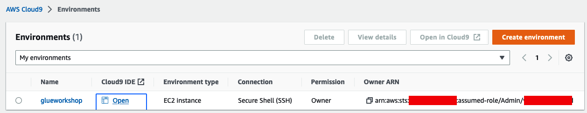
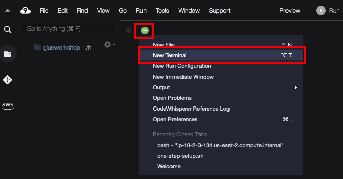

### 1. Cloud9 생성 : [Cloud9 바로가기](https://console.aws.amazon.com/cloud9/)
- AWS Cloud9 콘솔로 이동 후 "환경생성" 버튼을 누릅니다.
- 이름은 "general_immersion_day"을 입력합니다.
- 시간제한은 "4시간"으로 설정합니다.
- 나머지 설정은 유지하고 "생성"버튼을 눌러 합니다.
- 약 1~2분 후 Cloud9 IDE 환경으로 진입하려면 'Open IDE' 버튼을 클릭하여 접근합니다.

- Cloud9이 열리면 + 버튼을 눌러 New Terminal을 열고 이후 실습을 진행합니다. 


### 2. aws.png 파일 S3에 업로드 

- Github에서 필요한 소스&데이터 clone 
```code
git clone https://github.com/nuno1111/AWS-Workshop.git
cd AWS-Workshop/GIMD_GSH/
```
- aws.png 파일을 s3로 업로드
```code
chmod +x ./upload_01.sh 
./upload_01.sh
```
- 잠시 후 S3 콘솔로 이동합니다. [클릭하세요](https://s3.console.aws.amazon.com/s3/home) 
- 이동 : immersion-day-yourname
- aws.png 파일을 확인합니다.
- 이후 워크샵으로 돌아간 뒤 설명에 따르고, index.html 파일 생성 및 변경시 이어서 cloud9에서 진행합니다.

### 3. index.html 파일 생성 및 S3에 업로드 

- cloud9 좌측 index.html 파일을 열고 <img_url> 부분을 수정합니다.
- s3 업로드 된 aws.png 파일을 선택한 후, 우측에 나오는 상세 정보에서 Object URL 정보를 복사합니다.
- index.html에 이미지의 URL 부분에 복사해둔 Object URL 을 붙여 넣고 저장합니다.
- index.html 파일을 s3로 업로드
```code
chmod +x ./upload_02.sh 
./upload_02.sh
```
- 잠시 후 S3 콘솔로 이동합니다. [클릭하세요](https://s3.console.aws.amazon.com/s3/home) 
- 이동 : immersion-day-yourname
- index.html 파일을 확인합니다.
- 이후 워크샵으로 돌아간 뒤 설명에 따릅니다.