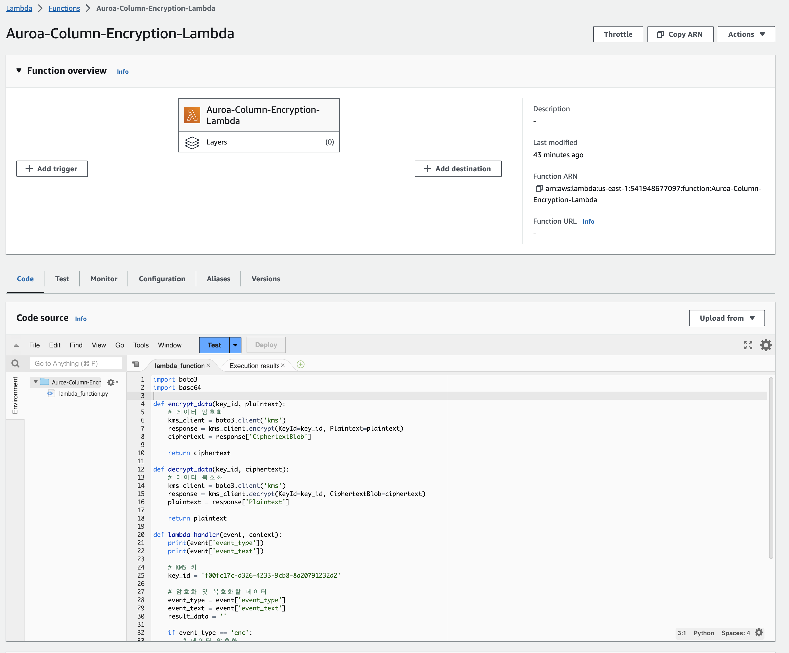

# Aurora PG 컬럼 암호화 방안
- 해당 가이드는 KMS와 Lambda를 Aurora PG와 연동하여 DB 컬럼암호화를 PostgreSQL Function으로 구현하기 위한 가이드입니다.

## 0. Lambda Role 설정 - KMS 접근 용도
### 0-1. Lambda를 위한 Role 생성
- Service를 Lambda 선택


### 0-2. Lambda를 위한 Role 이름 입력 
- Role Name 입력 입력하고, Next 버튼 누른 후 생성


## 1. KMS 양방향 암호화 설정
### 1-1. KMS Configure Key - 양방향 암호화이므로 Symmettic 선택


### 1-2. Key Alias 입력


### 1-3. Key Admin으로 KMS 생성 AWS ADMIN-USER 입력 


### 1-4. Key User로 Lambda Role 입력 후 생성


### 1-5. KMS 생성 후 Key users에 Lambda Role 정상 등록 여부 확인


## 2. Lambada 환경 구성
### 2-1. KMS 호출하는 Lambda Function 생성
- lambda 생성 시 하단에 Excution Role에 0단계에 생성한 Lambda Role 셋팅


### 2-2. KMS 호출하는 소스 작성
- 소스는 src/lambda_src.py 파일 참조
- 소스 작성 후 Deploy 수행


## 3. Aurora PG 환경 구성
### 3-1. Lambda Connection 확인
- Aurora PG Cluster에서 AWS Lambda로 통신 가능한지 확인 필요
- Public Subnet이면 특별히 조치 할 사항 없음 (현 예제는 public으로 테스트 함)
- Private Subnet이면 Nat G/W 혹은 VPC Enpoint필요함 (VPC Endpoint 권고, 셋팅은 생략)

### 3-2. DB Cluster Role 셋팅 - Aurora PG Cluster가 Lambda를 호출 할 수 있도록 권한 설정

- Role 생성시 RDS - Add Role to Database 선택


- Role 생성 후 아래 Policy 입력 - Add permissions > Attach policies ( ARN은 이전 생성한 lambda 확인 ) 
```json
{
    "Version": "2012-10-17",
    "Statement": [
        {
            "Sid": "AllowAccessToExampleFunction",
            "Effect": "Allow",
            "Action": "lambda:InvokeFunction",
            "Resource": "arn:aws:lambda:us-east-1:541948677097:function:Auroa-Column-Encryption-Lambda"
        }
    ]
}
```
- Policy Attatch 이후 아래과 같이 결과 확인


- RDS Cluster로 이동 하여 Manage IAM roles에 조금 전 생성한 DB Role 셋팅 (Feature에 Lambda 셋팅)


### 3-3. aws_lambda extension 인스톨
- rds_superuser 로 db editor에 접속하여 아래 명령어 실행

```sql
CREATE EXTENSION IF NOT EXISTS aws_lambda CASCADE;
```

### 3-4. aws_lambda 호출 결과 확인
```sql
SELECT * from 
aws_lambda.invoke(
aws_commons.create_lambda_function_arn(
    'arn:aws:lambda:us-east-1:541948677097:function:Auroa-Column-Encryption-Lambda', 'us-east-1'), 
    '{ 
        "event_type": "enc", 
        "event_text": "Hello~ Lambda~"
    }'::json 
);

SELECT * from 
aws_lambda.invoke(
	aws_commons.create_lambda_function_arn(
		'arn:aws:lambda:us-east-1:541948677097:function:Auroa-Column-Encryption-Lambda', 'us-east-1'), 
		'{
		  "event_type": "dec",
		  "event_text": "AQICAHhKvEAh12f84XmCAZHVpIcTK+97wOcLaUD0M91TRvpzpQHSim+UlUMFEKFBf/r3fwFgAAAAbDBqBgkqhkiG9w0BBwagXTBbAgEAMFYGCSqGSIb3DQEHATAeBglghkgBZQMEAS4wEQQMbLGyjv2eJjQ1/SEaAgEQgCks1iUTq8/Y2E+Idn1hRMfAnIkl92BYdnEQc3S9aCmshTytDzNNfu+f6w=="
		}'::json 
);

```


