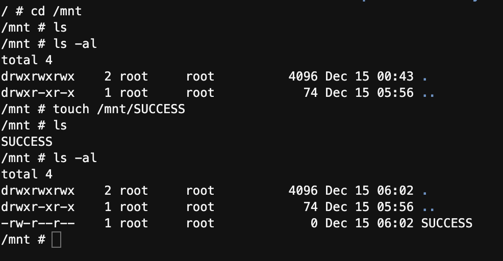
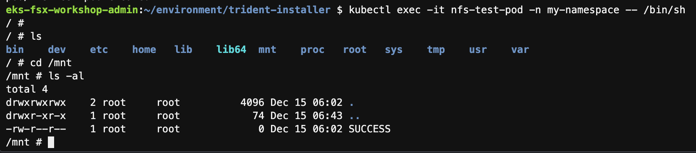

## 해당 가이드는 EKS에서 FSx-OnTAP을 NFS로 연동하는 가이드입니다.

## 1. container deployment에서 바로 NFS 볼륨 마운트를 하는 방법

``` yaml
############
    volumeMounts:
    - name: nfs-share
      mountPath: /mnt
  volumes:
  - name: nfs-share
    nfs:
      server: svm-0d6035b48c972322a.fs-0a1ff38337a397068.fsx.ap-northeast-2.amazonaws.com
      path: /vol1
```

## 2. Trident CSI Driver를 사용하여 PV, PVC 정적 마운팅을 하는 방법
- 해당 가이드에서는 Helm을 통한 Trident CSI Driver 설치 부분은 생략하였습니다.
- FSx - OnTAP 파일시스템 / 볼륨은 이미 생성되어 있다고 가정하고 설명을 생략하였습니다.
- Trdient BackEnd와 StoragClass도 생성되어 있는 것으로 가정하고 해당 부분은 생략되었습니다.

### 2.1 import volume 을 수행을 위한 pvc설정파일을 생성합니다.
- 이 예시에서는 pvc-manual.yaml로 생성하였습니다.
- metadata에 pvc가 생성될 namespace가 필요합니다.
```yaml
kind: PersistentVolumeClaim
apiVersion: v1
metadata:
  name: pvc-manual
  namespace: my-namespace
spec:
  accessModes:
    - ReadWriteMany
  resources:
    requests:
      storage: 10Gi
  storageClassName: trident-csi
```
### 2.2 tridentctl을 사용하여 import volume 을 수행합니다.

```sh
$ tridentctl import volume <backend-name> <volume-name> -f <path-to-pvc-file> -n <trident_namespace>
```

- trident installer 폴더에서 다음과 같이 실행합니다.
```sh
$ ./tridentctl import volume fsx-ontap manual -f pvc-manual.yaml -n trident
```
- import이후에 FSx 콘솔에서 Volume Name이 Trident가 관리하는 이름으로 변경됩니다.
- 참조 1: trident backend-name 다음 명령어로 확인 가능합니다.
```sh
kubectl get tridentbackends -n trident
```

- 참조 2: namespace 생성은 다음과 같습니다.
```sh
kubectl create ns my-namespace
```

### 2.3 임시 Pod 생성하여 정상여부 테스트
- 임시 Pod생성을 위한 설정파일입니다.
```yaml
apiVersion: v1
kind: Pod 
metadata:
  name: test-pod
spec:
  containers:
    - name: test-pod
      image: busybox
      command: 
        - "sleep"
        - "3600"
      volumeMounts:
        - name: ontap-volume
          mountPath: "/mnt"
  volumes:  
    - name: ontap-volume
      persistentVolumeClaim:
        claimName: pvc-manual
```
- test-pod.yaml 적용
```
kubectl apply -f test-pod.yaml -n my-namespace
```

- 이제 이 Pod을 생성한 뒤에 `kubectl exec` 명령을 사용하여 컨테이너 안으로 들어갑니다.

```sh
kubectl exec -it test-pod -n my-namespace -- /bin/sh
```

- mount 결과확인



## 3. 일반 OnTAP이 제공하는 NFS 프로토콜로 PV, PVC, SC 구성하기

### 3-1. PV, PVC, SC yaml 파일 생성
1. StorageClass 생성 : nfs-sc.yaml 
```yaml
apiVersion: storage.k8s.io/v1
kind: StorageClass
metadata: 
  name: nfs-sc
provisioner: kubernetes.io/no-provisioner # NFS의 No-provisioner 지정
volumeBindingMode: Immediate
reclaimPolicy: Retain
```

2. NFS Server 정보 기반 PV 생성 : nfs-pv.yaml
```yaml
apiVersion: v1
kind: PersistentVolume
metadata:
  name: nfs-pv
spec:
  capacity: 
    storage: 5Gi
  accessModes:
    - ReadWriteMany
  storageClassName: nfs-sc # SC 참조 
  nfs:
    server: svm-06b5299c00b98f936.fs-01c1196e7e4122c11.fsx.us-east-1.amazonaws.com # NFS 서버 IP
    path: /manual # Shared 데이터 경로
```

3. PVC 생성 : nfs-pvc.yaml

```yaml
apiVersion: v1 
kind: PersistentVolumeClaim
metadata: 
  name: nfs-pvc
spec:
  accessModes:
    - ReadWriteMany
  storageClassName: nfs-sc
  resources:
    requests:
      storage: 5Gi
  volumeName: nfs-pv
```

### 3-2. PV, PVC, SC 생성
1. StorageClass 생성
```sh
$ kubectl apply -f nfs-sc.yaml -n my-namespace
storageclass.storage.k8s.io/nfs-sc created
```

2. PersistentVolume 생성
```sh
$ kubectl apply -f nfs-pv.yaml -n my-namespace
persistentvolume/nfs-pv created
```

3. PersistentVolumeClaim 생성
```sh
$ kubectl apply -f nfs-pvc.yaml -n my-namespace
persistentvolumeclaim/nfs-pvc created
```

### 3-3. PoD을 생성하여 테스트

- 임시 Pod생성을 위한 설정파일입니다.
```yaml
apiVersion: v1
kind: Pod 
metadata:
  name: nfs-test-pod
spec:
  containers:
    - name: nfs-test-pod
      image: busybox
      command: 
        - "sleep"
        - "3600"
      volumeMounts:
        - name: ontap-volume
          mountPath: "/mnt"
  volumes:  
    - name: ontap-volume
      persistentVolumeClaim:
        claimName: nfs-pvc
```

- nfs-test-pod.yaml 적용
```
kubectl apply -f nfs-test-pod.yaml -n my-namespace
```

- 이제 이 Pod을 생성한 뒤에 `kubectl exec` 명령을 사용하여 컨테이너 안으로 들어갑니다.

```sh
kubectl exec -it nfs-test-pod -n my-namespace -- /bin/sh
```

- mount 결과확인 ( Trident에서 생성한 SUCCESS 파일 정상 조회)
