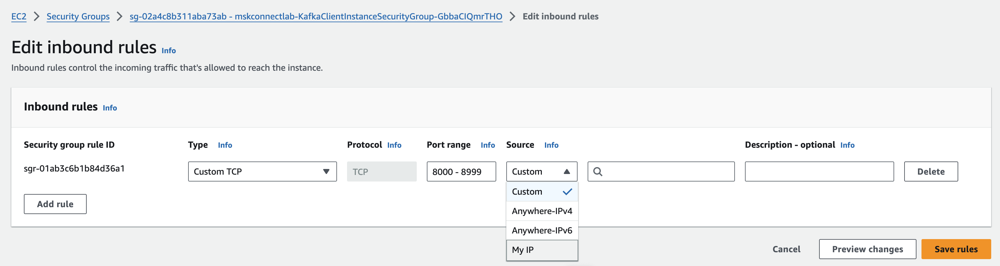
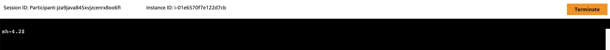
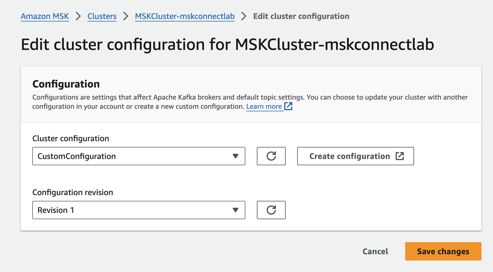
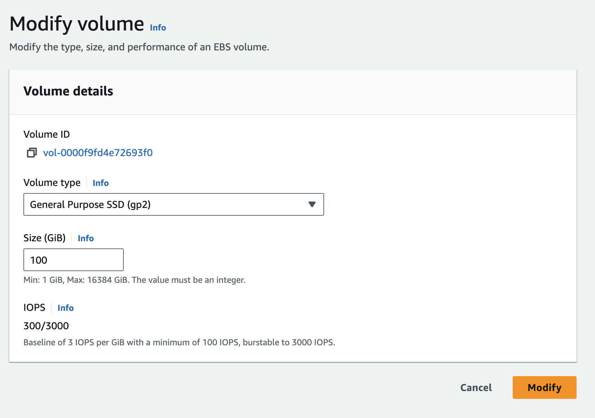

## 1.환경 설정
### 1.1 EC2 Security Group 셋팅
- EC2 서비스 > KafkaClientInstance 인스턴스로 이동
- Security 탭 > Security groups 선택. 
    - ex) mskconnectlab-KafkaClientInstanceSecurityGroup-xxxxxxxxx
- Inbound rules 탭 > "Edit inbound rules" 선택
- "Add rule" 버튼을 눌러 아래 정보 셋팅 후 저장
    - Type : Custom TCP
    - Port range : 8000 - 9999
    - Source : "My IP" 선택




### 1.2 VS-CODE & kafka 기본 환경 변수 설정
- EC2 서비스 > KafkaClientInstance 인스턴스로 이동
- 화면 상단에 "Connect" 버튼 선택 > Session Manager 탭 > "Connect" 버튼 클릭



- 브라우저에 위와 같은 새 탭에 콘솔 입력화면이 나타나면 아래 명령어 설행

```shell
sudo -u ec2-user -i

export AWS_REGION=$(TOKEN=`curl -s -X PUT "http://169.254.169.254/latest/api/token" -H "X-aws-ec2-metadata-token-ttl-seconds: 21600"` \
&& curl -s -H "X-aws-ec2-metadata-token: $TOKEN" http://169.254.169.254/latest/meta-data/placement/availability-zone | sed 's/[a-z]$//')

export ACCOUNT_ID=$(aws sts get-caller-identity --output text --query Account)
test -n "$AWS_REGION" && echo AWS_REGION is "$AWS_REGION" || echo AWS_REGION is not set
export RDS_AURORA_ENDPOINT=$(aws rds describe-db-instances --region ${AWS_REGION} | jq -r '.DBInstances[0] | select(.DBName == "salesdb") | .Endpoint.Address')
echo "export ACCOUNT_ID=${ACCOUNT_ID}" | tee -a ~/.bash_profile
echo "export AWS_REGION=${AWS_REGION}" | tee -a ~/.bash_profile
export CLUSTER_ARN=$(aws kafka list-clusters --region $AWS_REGION | jq -r '.ClusterInfoList[].ClusterArn')
export MSK_BOOTSTRAP_ADDRESS=$(aws kafka  get-bootstrap-brokers --cluster-arn $CLUSTER_ARN --region $AWS_REGION | jq -r '.BootstrapBrokerStringSaslIam')
echo "export CLUSTER_ARN=${CLUSTER_ARN}" | tee -a ~/.bash_profile
echo "export MSK_BOOTSTRAP_ADDRESS=${MSK_BOOTSTRAP_ADDRESS}" | tee -a ~/.bash_profile
echo "export RDS_AURORA_ENDPOINT=${RDS_AURORA_ENDPOINT}" | tee -a ~/.bash_profile

export brokers=$(aws kafka  get-bootstrap-brokers --cluster-arn $CLUSTER_ARN --region $AWS_REGION | jq -r '.BootstrapBrokerString')
echo "export brokers=${brokers}" | tee -a ~/.bash_profile

# AWS CLI 설정
mkdir -p /home/ec2-user/.aws
cat <<EOF > /home/ec2-user/.aws/config
[default]
region = $AWS_REGION
EOF

export ZOO_KEEPER_ADDRESS=$(aws kafka describe-cluster --cluster-arn $CLUSTER_ARN | jq -r '.ClusterInfo.ZookeeperConnectString')
echo "export ZOO_KEEPER_ADDRESS=${ZOO_KEEPER_ADDRESS}" | tee -a ~/.bash_profile

source ~/.bash_profile

exit 

# VS Code Server 설치
cd ~
sudo wget https://github.com/coder/code-server/releases/download/v4.0.1/code-server-4.0.1-linux-amd64.tar.gz
sudo tar -xzf code-server-4.0.1-linux-amd64.tar.gz
sudo mv code-server-4.0.1-linux-amd64 /usr/local/lib/code-server
sudo ln -s /usr/local/lib/code-server/bin/code-server /usr/local/bin/code-server

# VS Code Server 설정
cd ~
sudo mkdir -p /home/ec2-user/workshop
sudo mkdir -p /home/ec2-user/.config/code-server

sudo cat <<EOF > ./README.md
Weolcome~ MSK WorkShop~~
EOF
sudo mv ./README.md /home/ec2-user/workshop/

sudo cat <<EOF > ./config.yaml
bind-addr: 0.0.0.0:8000
auth: none
cert: false
EOF
sudo mv ./config.yaml /home/ec2-user/.config/code-server/

# 권한 부여
sudo chown -R ec2-user:ec2-user /home/ec2-user/.config /home/ec2-user/workshop

# VS Code Server 서비스 구성
cd ~
sudo cat <<EOF > ./code-server.service
[Unit]
Description=VS Code Server
After=network.target
[Service]
Type=simple
User=ec2-user
ExecStart=/usr/local/bin/code-server --config /home/ec2-user/.config/code-server/config.yaml /home/ec2-user
Restart=always
[Install]
WantedBy=multi-user.target
EOF

sudo mv ./code-server.service /etc/systemd/system/

sudo systemctl daemon-reload
sudo systemctl enable code-server
sudo systemctl start code-server


```

### 1.3 VS-CODE 서비스 확인
- EC2 서비스 > KafkaClientInstance 인스턴스로 이동 하여 Public IP 확인
- 브라우저에서 Public IP 에 8000 Port로 접속
    - ex) http://[PublicIP]:8000
- VS-CODE에서 Terminal 열고 설정 확인
    - 좌측 상단 메뉴 버튼 > Terminal > New Terminal

```shell
cat ~/.bash_profile
echo $brokers

```

### 1.4 MSK custum configuration 변경
- debezium에서 수집하는 메시지의 토픽을 자동 생성하기 위한 설정
- VS-CODE 터미널에서 다음을 실행
```shell
cd ~
mkdir kafka-configuration && cd kafka-configuration
cat <<EOF > configuration.txt 
auto.create.topics.enable=true
EOF

aws kafka create-configuration \
    --name "CustomConfiguration" \
    --description "Topic auto-creation enabled" \
    --kafka-versions "3.3.1" \
    --region $AWS_REGION \
    --server-properties file://configuration.txt
 
```

### 1.5 MSK Cluster 설정 변경
- AWS Console에서 MSK 클러스터로 이동하여 다음 단계를 따라주세요
- 'MSKCluster-mskconnectlab' 를 찾아 클러스터 이름을 클릭하세요.
- 오른쪽 상단의 '작업(Action)' 버튼을 클릭한 후 '클러스터 구성 편집(Edit cluster configuration)'을 선택하세요.
- 클러스터 구성(Cluster Configuration) 드롭다운 메뉴에서 'CustomConfiguration'을 선택하세요.
- 구성 수정(Configuration revision) 드롭다운 메뉴에서 'Revision 1'을 선택하세요.



- '변경 사항 저장(Save changes)' 버튼을 클릭하세요.
- 클러스터 상태가 '업데이트 중(Updating)'으로 변경됩니다. 
- 상태가 다시 '활성(Active)'으로 바뀔 때까지 몇 분 정도 기다려주세요. (약 15분 소요)

### 1.6 EBS 파일 크기 100GB로 확장
- EC2 서비스 > KafkaClientInstance 인스턴스로 이동
- Storage 탭 > Volume ID 클릭하여 Volumes 화면으로 이동
    - ex) vol-xxxxxxxxxxxxxx
- Volumes 화면 > Volume ID 클릭하여 Volume 상세화면 이동    
- "Modify" 버튼을 눌러 아래 정보 셋팅 후 "Modify" 버튼 눌러서 저장
    - Size : 100



### 1.7 EC2 재기동
- 워크샵 진행 중 스토리지 용량 오류를 예방하기 위해, EC2 Instance를 재기동해주세요.
    - EC2 서비스 > KafkaClientInstance 인스턴스로 이동
    - 우측 상단 Instance state > Reboot instance 선택
- VS-CODE Terminal에서 접속해서 아래 명령어로 100G 잘 설정되었는지 확인해주세요.
```shell
df -h

```
