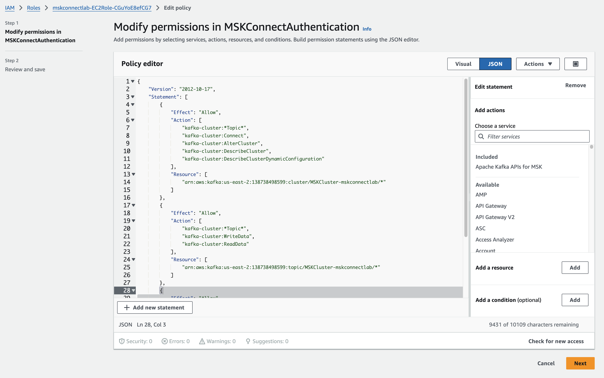

## 2.MSK 보안

### 2.1 보안이 없는 Plain Text 확인

- brokers 환경 변수 확인
```shell
echo $brokers

```
- 보안이 없는 접근으로 Topic 목록 조회

```shell
/home/ec2-user/kafka/bin/kafka-topics.sh --bootstrap-server $brokers --list

```


### 2.2 IAM 접근 확인

- MSK_BOOTSTRAP_ADDRESS 환경 변수 확인
```shell
echo $MSK_BOOTSTRAP_ADDRESS

```

- IAM Java 라이브러리 다운로드 후 CLASSPATH 설정
```shell
cd ~
mkdir iam-auth && cd ./iam-auth
wget https://github.com/aws/aws-msk-iam-auth/releases/download/v2.0.3/aws-msk-iam-auth-2.0.3-all.jar
cd ../

cat <<EOF > /home/ec2-user/kafka/config/client-config.properties
# Sets up TLS for encryption and SASL for authN.
security.protocol = SASL_SSL

# Identifies the SASL mechanism to use.
sasl.mechanism = AWS_MSK_IAM

# Binds SASL client implementation.
sasl.jaas.config = software.amazon.msk.auth.iam.IAMLoginModule required;

# Encapsulates constructing a SigV4 signature based on extracted credentials.
# The SASL client bound by "sasl.jaas.config" invokes this class.
sasl.client.callback.handler.class = software.amazon.msk.auth.iam.IAMClientCallbackHandler
EOF

export CLASSPATH=/home/ec2-user/iam-auth/aws-msk-iam-auth-2.0.3-all.jar
echo "export CLASSPATH=${CLASSPATH}" | tee -a ~/.bash_profile
source ~/.bash_profile
cat ~/.bash_profile
 
```

- IAM Java 라이브러리 다운로드 후 CLASSPATH 설정

```shell
/home/ec2-user/kafka/bin/kafka-topics.sh --bootstrap-server $MSK_BOOTSTRAP_ADDRESS --command-config /home/ec2-user/kafka/config/client-config.properties --list
 
```

### 2.3 EC2 IAM 설정 확인
- EC2 서비스 > KafkaClientInstance 인스턴스로 이동
- Security 탭 > IAM Role 선택. 
    - ex) mskconnectlab-EC2Role-xxxxxxxxx
- Permissions 탭에서 "MSKConnectAuthentication" 정책 클릭 하여 내용 확인


- 정책 변경 반영은 약 1분 소요
    - 참조 URL : https://docs.aws.amazon.com/ko_kr/msk/latest/developerguide/iam-access-control.html


