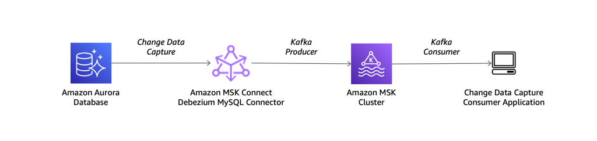

## 3-1. Amazon Aurora와 Debezium 소스 컨넥터 셋팅

MSK Connect를 테스트하기 위해 Amazon Aurora MySQL 데이터베이스(salesdb)에서 Amazon MSK로 데이터 변경 이벤트를 스트리밍합니다. 

이를 위해 Apache Kafka를 기반으로 구축된 변경 데이터 캡처(CDC)를 위한 오픈 소스 분산 플랫폼인 Debezium을 사용합니다.

다음 아키텍처 다이어그램처럼 Amazon Aurora MySQL 데이터베이스를 소스로 사용하고 Debezium MySQL 커넥터를 사용합니다




    **중요**
    이 커넥터는 Community 커넥터이며 Confluent Community License에 따라 제공된다는 점에 유의하세요.


## 3-2. 커스텀 플러그인 생성

MSK Connect를 위한 커스텀 플러그인을 생성합니다. 커스텀 플러그인은 하나 이상의 커넥터, 변환기 또는 컨버터의 구현이 포함된 JAR 파일 세트입니다. Amazon MSK는 커넥터가 실행되는 커넥트 클러스터의 작업자에 플러그인을 설치합니다.

### MySQL 커넥터 플러그인 다운로드

최신 안정 릴리스의 MySQL 커넥터 플러그인을 다운로드하기 위해 다음 명령을 실행합니다. MSK Connect는 ZIP 또는 JAR 형식의 커스텀 플러그인을 허용하므로, 다운로드한 아카이브를 ZIP 형식으로 변환하고 JAR 파일을 메인 디렉토리에 보관합니다:

```bash
cd ~
mkdir debezium && cd debezium
wget https://repo1.maven.org/maven2/io/debezium/debezium-connector-mysql/2.5.2.Final/debezium-connector-mysql-2.5.2.Final-plugin.tar.gz
tar xzf debezium-connector-mysql-2.5.2.Final-plugin.tar.gz
cd debezium-connector-mysql
zip -9 ../debezium-connector-mysql-2.5.2.Final-plugin.zip *
cd ..
aws s3 cp ./debezium-connector-mysql-2.5.2.Final-plugin.zip s3://msk-lab-$ACCOUNT_ID-plugins-bucket/debezium/
 
```

### Amazon MSK 콘솔에서 커스텀 플러그인 생성

1. MSK Connect 섹션에서 'Custom plugins'을 선택합니다.
2. 'Create custom plugin'을 클릭하고 msk-lab-${ACCOUNT_ID}-plugins-bucket S3 버킷을 찾아 방금 업로드한 커스텀 플러그인 ZIP 파일을 선택합니다.


3. 플러그인 이름으로 'debezium-connector-mysql-2-5-2-Final-plugin'을 입력합니다.
4. 'Create custom plugin'을 클릭합니다.


몇 초 후에 플러그인이 생성되고 상태가 '활성'으로 변경되는 것을 확인할 수 있습니다.

## 3-3. Worker configuration 변경

### Offset Storage 토픽

기본적으로 Amazon MSK Connect는 생성하는 각 커넥터에 대해 Kafka 클러스터에 새로운 Offset Storage 토픽을 생성합니다. MSK는 커넥터 ARN의 일부를 사용하여 기본 토픽 이름을 구성합니다.

구성 변경으로 인해 Debezium 커넥터를 삭제하고 다시 생성할 때마다 데이터베이스 스냅샷을 다시 재생하는 것을 방지하려면, 기본 토픽 대신 선택한 오프셋 스토리지 토픽 이름을 제공하십시오.

### Worker configuration 생성

1. MSK Connect 섹션에서 'Worker configurations'을 선택합니다.
2. 'Create Worker configuration' 버튼을 클릭합니다.
3. Name 텍스트 상자에 'SourceAuroraDebeziumConnector'를 입력합니다.
4. 다음 Config Parametest를 Worker configuration 텍스트 상자에 복사하여 붙여넣습니다:

```
key.converter=org.apache.kafka.connect.storage.StringConverter
key.converter.schemas.enable=false
value.converter=org.apache.kafka.connect.json.JsonConverter
value.converter.schemas.enable=false
offset.storage.topic=offsets_my_debezium_source_connector
```

5. 'Create Worker configuration'을 클릭합니다.

## 3-4. MSK 커넥터 생성

1. MSK Connect 메뉴에서 'Connectors'를 선택한 다음 'Create Connector'을 클릭합니다.
2. 커스텀 플러그인 목록에서 'debezium-connector-mysql-2-5-2-Final-plugin'을 선택하고 'Next'를 클릭합니다.
3. Name 텍스트 상자에 'source-debezium-mysql-salesdb-all-tables'를 입력합니다.


4. 나열된 MSK 클러스터에서 'MSKCluster-mskconnectlab'를 선택합니다.
5. Authentication 드롭다운에서 'IAM'을 선택합니다.


6. 다음 구성을 커넥터 구성 텍스트 상자에 붙여넣습니다.

```
connector.class=io.debezium.connector.mysql.MySqlConnector
tasks.max=1
include.schema.changes=true
topic.prefix=salesdb
value.converter=org.apache.kafka.connect.json.JsonConverter
key.converter=org.apache.kafka.connect.storage.StringConverter
database.user=master
database.server.id=123456
database.server.name=salesdb
database.port=3306
key.converter.schemas.enable=false
database.hostname=<Your Aurora MySQL database endpoint>
database.password=S3cretPwd99
value.converter.schemas.enable=false
database.include.list=salesdb
schema.history.internal.kafka.topic=internal.dbhistory.salesdb
schema.history.internal.kafka.bootstrap.servers=<MSK Bootstrap Server Address>

schema.history.internal.producer.sasl.mechanism=AWS_MSK_IAM
schema.history.internal.consumer.sasl.mechanism=AWS_MSK_IAM
schema.history.internal.producer.sasl.jaas.config=software.amazon.msk.auth.iam.IAMLoginModule required;
schema.history.internal.consumer.sasl.jaas.config=software.amazon.msk.auth.iam.IAMLoginModule required;
schema.history.internal.producer.sasl.client.callback.handler.class=software.amazon.msk.auth.iam.IAMClientCallbackHandler
schema.history.internal.consumer.sasl.client.callback.handler.class=software.amazon.msk.auth.iam.IAMClientCallbackHandler
schema.history.internal.consumer.security.protocol=SASL_SSL
schema.history.internal.producer.security.protocol=SASL_SSL
```

7. 아래 명령을 실행하면 "MSK Bootstrap Server Address", "Your Aurora MySQL database endpoint"가 표시됩니다.

```
echo $MSK_BOOTSTRAP_ADDRESS
echo $RDS_AURORA_ENDPOINT
 
```

8. 'MSK_BOOTSTRAP_ADDRESS' 값과 'RDS_AURORA_ENDPOINT'값을 변경합니다.


커넥터의 총 용량은 커넥터에 포함된 작업자 수와 작업자당 MSK 연결 장치(MCU)의 수에 따라 달라집니다. 각 MCU는 1 vCPU의 컴퓨팅과 4기가바이트의 메모리를 나타냅니다. 커넥터를 만들려면 다음 두 가지 용량 모드 중 하나를 선택해야 합니다: Provisioned 혹은 Autoscaled(기본값). 

9. 이 실습에서는 기본 커넥터 용량 설정을 그대로 유지합니다.

10. "Worker configuration"에서 "Use a custom configuration"을 선택하고 워커 구성 드롭다운에서 "SourceAuroraDebeziumConnector"를 선택합니다.


11. Identity and Access Management (IAM) role 드롭다운에서 mskconnectlab-AuroraConnectorIAMRole-*로 시작하는 옵션을 선택합니다.


12. Next 버튼을 클릭하고 모든 기본 Security 설정을 그대로 둡니다.

13. Next 버튼 클릭합니다.

14. "Deliver to Amazon CloudWatch Logs" 선택합니다.

15. "Browse" 버튼을 클릭하고 "/msk-lab-source-aurora-connector" 로그 그룹을 검색하여 "Choose" 버튼을 선택합니다.


16. Next 버튼을 누르고 Review and create에서 마지막 다음을 반드시 확인하고 "Create connector" 버튼을 눌러 생성해주세요.

- Step 1 - Custom plugin 
    - Custom plugin: debezium-connector-mysql-2-5-2-Final-plugin
- Step 2 - Connector properties
    - Connector configuration
        - database.hostname
        - schema.history.internal.kafka.bootstrap.servers
    - Worker configuration: SourceAuroraDebeziumConnector
    - Access permissions: mskconnectlab-AuroraConnectorIAMRole-xxxxxxxxx
- Step 3: Security
    - Access control type: IAM
- Step 4: Security
    - Log group: /msk-lab-source-aurora-connector 

17. 커넥터가 생성되고 상태가 "Running"으로 변경되는 데 최대 15분이 소요될 수 있습니다.

## 3-5. Kafka Cluster에 cdc 진행중 확인

1. VS-Code 터미널에서 Topic 조회

```bash
cd ~
/home/ec2-user/kafka/bin/kafka-topics.sh --bootstrap-server $MSK_BOOTSTRAP_ADDRESS --command-config /home/ec2-user/kafka/config/client-config.properties --list
 
```

2. 터미널 총 3개를 띄워서 위의 두 컨슈머를 실행시켜 놓겠습니다.
- Terminal 우측에 상단에 휴지통 좌측에 "Split Terminal" 이모티콘 클릭


3. salesdb 토픽에 대한 Kafka Consummer를 시작합니다. 이 토픽은 스키마 변경 사항(예: 새 테이블이 생성될 때)을 스트리밍하는 데 Debezium에서 사용됩니다.

```bash
source ~/.bash_profile
/home/ec2-user/kafka/bin/kafka-console-consumer.sh --bootstrap-server $MSK_BOOTSTRAP_ADDRESS --consumer.config /home/ec2-user/kafka/config/client-config.properties --from-beginning --topic salesdb | jq --color-output .
 
```

4. salesdb.salesdb.CUSTOMER( CUSTOMER 테이블에 대한 cdc) 토픽에 대해 다른 Kafka Consummer를 시작합니다. 이 토픽은 테이블의 데이터 변경 사항(예: 새 레코드가 삽입될 때)을 스트리밍하기 위하여 Debezium에서 사용됩니다:
```bash
source ~/.bash_profile
/home/ec2-user/kafka/bin/kafka-console-consumer.sh --bootstrap-server $MSK_BOOTSTRAP_ADDRESS --consumer.config /home/ec2-user/kafka/config/client-config.properties --from-beginning --topic salesdb.salesdb.CUSTOMER | jq --color-output .
  
```

5. MySQL DB에 데이터를 변경하여 메시지가 수집되는지 확인 해 보겠습니다.
- MySQL 클라이언트를 사용하여 Aurora 데이터베이스에 연결합니다:
```bash
cd ~
mysql -f -u master -h $RDS_AURORA_ENDPOINT  --password=S3cretPwd99
 
```

- MySQL 접속하여 SALES_ORDER_VI 테이블 생성하고, 두번째 salesdb Consummer를 확인해봅니다.
```bash
USE salesdb;

CREATE TABLE SALES_ORDER_VI (
       order_id VARCHAR(255),
       customer_id VARCHAR(255),
       item_description VARCHAR(255),
       price DECIMAL(6,2),
       order_date DATETIME DEFAULT CURRENT_TIMESTAMP
);
 
```

- CUSTOMER 테이블에 값을 입력하고, 세 번째 salesdb.salesdb.CUSTOMER Consummer를 확인해봅니다.
```bash
INSERT INTO CUSTOMER VALUES ('2001', 'Customer Name 2001', 'Market Segment 7');
INSERT INTO CUSTOMER VALUES ('2002', 'Customer Name 2002', 'Market Segment 1');
INSERT INTO CUSTOMER VALUES ('2003', 'Customer Name 2003', 'Market Segment 3');
INSERT INTO CUSTOMER VALUES ('2004', 'Customer Name 2004', 'Market Segment 5');
 
```