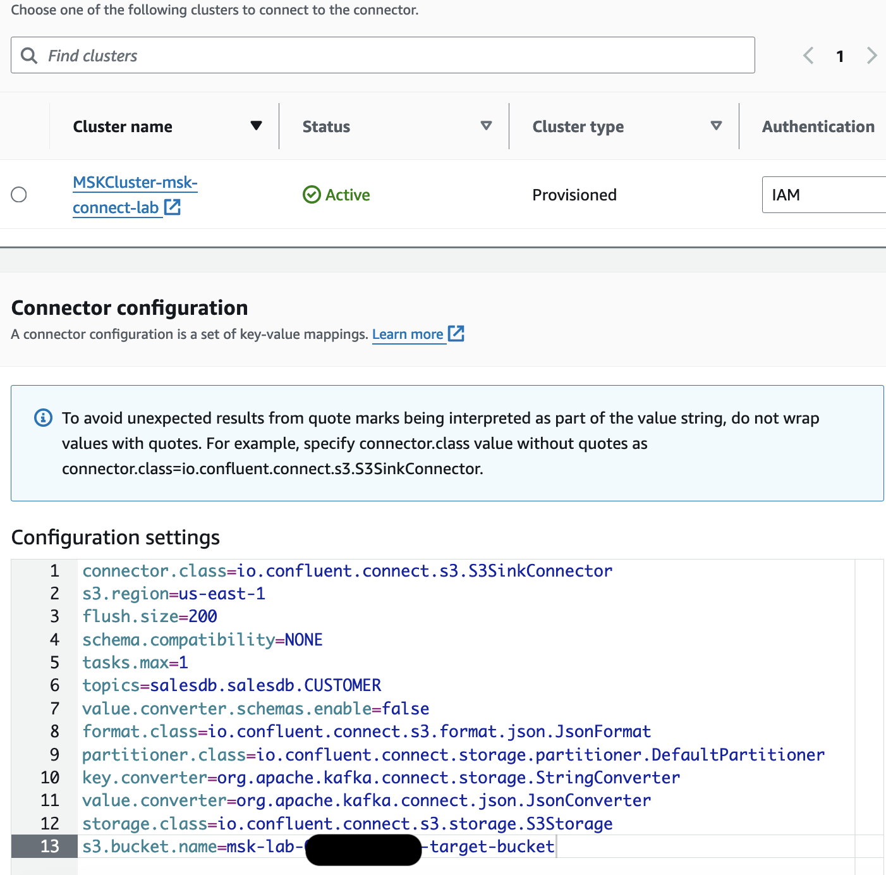

## 4. Amazon S3 Sink

### 4-1. Amazon S3 Sink 컨넥터 설정

Confluent.io Amazon S3 커넥터는 Kafka 클러스터에서 Amazon S3로 데이터를 내보냅니다. 이 커넥터는 exactly-once 전송을 보장하고 Sink 커넥터로만 사용할 수 있습니다. JSON 또는 Avro 형식의 S3 개체 생성을 지원합니다.

Sink 커넥터는 주기적으로 Kafka에서 데이터를 폴링하고 데이터를 Amazon S3 개체에 업로드합니다. 파티셔닝을 지원하여서, 주어진 단일 또는 여러 속성의 조합을 기준으로 Amazon S3에서 데이터를 세분화할 수 있습니다.


    **중요**
    이 커넥터는 Community 커넥터이며 Confluent Community License에 따라 제공된다는 점에 유의하세요.


### 4.2 S3 Sink Custom plugins 생성

- VS-CODE에서 터미널로 접속합니다.
- 아래 명령어를 실행하여, S3 Sink 컨넥터 Lib를 다운 받아 s3에 업로드합니다.

```shell
cd ~
mkdir kafka-connect-s3 && cd kafka-connect-s3
wget https://d2p6pa21dvn84.cloudfront.net/api/plugins/confluentinc/kafka-connect-s3/versions/10.5.15/confluentinc-kafka-connect-s3-10.5.15.zip
aws s3 cp ./confluentinc-kafka-connect-s3-10.5.15.zip s3://msk-lab-$ACCOUNT_ID-plugins-bucket/kafka-connect-s3/
cd ..
 
```

- Amazon MSK 콘솔의 MSK Connect > Custom plugins 메뉴로 이동합니다.
- **Create custom plugin** 버튼을 클릭합니다.
- `msk-lab-{ACCOUNT_ID}-plugins-bucket/kafka-connect-s3/` 버킷을 찾아 `confluentinc-kafka-connect-s3-10.5.15.zip` 객체를 선택하고 `Choose` 버튼을 클릭합니다.


- "Custom plugin name" 텍스트 상자에 `confluentinc-kafka-connect-s3-10-5-15`를 입력하고 선택적으로 설명을 추가합니다.
- **Create custom plugin** 버튼을 클릭합니다. 새로운 사용자 정의 플러그인이 생성되고 `Active` 상태가 될 때까지 몇 초 기다립니다.


### 4.3 S3 Sink Connector 생성

- Amazon MSK 콘솔의 MSK Connect > Connectors 메뉴에서 **Create connector** 버튼을 클릭하여 Connector생성화면으로 이동합니다.
- 생성된 custom plugins 목록에서 `confluentinc-kafka-connect-s3-10-5-15`를 선택한 다음 **Next**을 클릭합니다
- **Connector name** 텍스트 상자에 `confluentinc-kafka-connect-s3`를 입력하고 선택적으로 설명을 추가합니다
- "Cluster Type"으로 "MSK Cluster"를 선택하고 사용 가능한 Amazon MSK 클러스터 목록에서 `MSKCluster-mskconnectlab`를 선택합니다
- 드롭다운에서 인증 모드로 **IAM** 을 선택합니다
- 아래의 구성 블록을 복사하여 **Connector configuration** 텍스트 영역에 붙여넣습니다:

```shell
connector.class=io.confluent.connect.s3.S3SinkConnector
s3.region=<YOUR AWS REGION>
flush.size=200
schema.compatibility=NONE
tasks.max=1
topics=salesdb.salesdb.CUSTOMER
value.converter.schemas.enable=false
format.class=io.confluent.connect.s3.format.json.JsonFormat
partitioner.class=io.confluent.connect.storage.partitioner.DefaultPartitioner
key.converter=org.apache.kafka.connect.storage.StringConverter
value.converter=org.apache.kafka.connect.json.JsonConverter
storage.class=io.confluent.connect.s3.storage.S3Storage
s3.bucket.name=msk-lab-<ACCOUNT_ID>-target-bucket
```

- `<YOUR AWS REGION>`을 스택을 시작한 리전으로 교체합니다h. ex) us-east-2
- `<ACCOUNT_ID>`를 귀하의 AWS 계정 ID로 교체합니다



- **Connector capacity** 설정은 기본값으로 둡니다
- **Worker configuration** 섹션에서 `
Use a custom configuration` 옵션을 선택합니다. 
- 드롭다운에서 **SourceAuroraDebeziumConnectorConfig**를 선택합니다. 이렇게 하면 컨슈머에 대해 동일한 키/값 변환기 형식을 사용할 수 있습니다
- **Access Permissions section**에서 드롭다운의 사용 가능한 옵션 중 `mskconnectlab-S3ConnectorIAMRole-*`로 시작하는 IAM 역할을 선택합니다


- **Next**을 클릭합니다
- **Security** 설정은 기본값으로 둡니다
- `Log delivery` 옵션에서 **Deliver to Amazon Cloudwatch Logs**을 선택합니다
- **Browse** 버튼을 클리하고, 팝업 목록에서 `/msk-lab-target-s3sink-connector`를 찾아 선택합니다
- 설정을 검토하고 **Create Connector**을 클릭합니다
- 상태가 **Creating**에서 **Running**으로 변경될 때까지 기다립니다

### 4.4 s3 Sink Connector 정상여부 확인
 
- 싱크 커넥터가 실행되기 시작하고 몇 분 후, msk-lab-{AccountId}-target-bucket에 Json 형식의 데이터가 업로드되는 것을 볼 수 있습니다.
- S3콘솔에서 msk-lab-{AccountId}-target-bucket 버킷으로 이동합니다. Confluent S3 싱크 커넥터는 기본적으로 모든 개체에 대해 토픽/접두사를 생성합니다.
- 또한 S3 개체의 보조 접두사로 Kafka 주제 이름 **salesdb.salesdb.CUSTOMER** 가 표시됩니다.
- 기본적으로 데이터는 Kafka 파티션을 기반으로 파티션이 분할됩니다. 파티션이 하나뿐이므로 모든 Json 개체에 대해 partition=0/ 접두사가 표시됩니다.


- 파일 중 하나를 클릭하고 우측 상단에 **Objects actions > Query with S3 Selec**t 를 클릭한 후 **Run SQL query** 버튼을 클릭하면 간단하게 데이터 내용을 확인할 수 있습니다.


