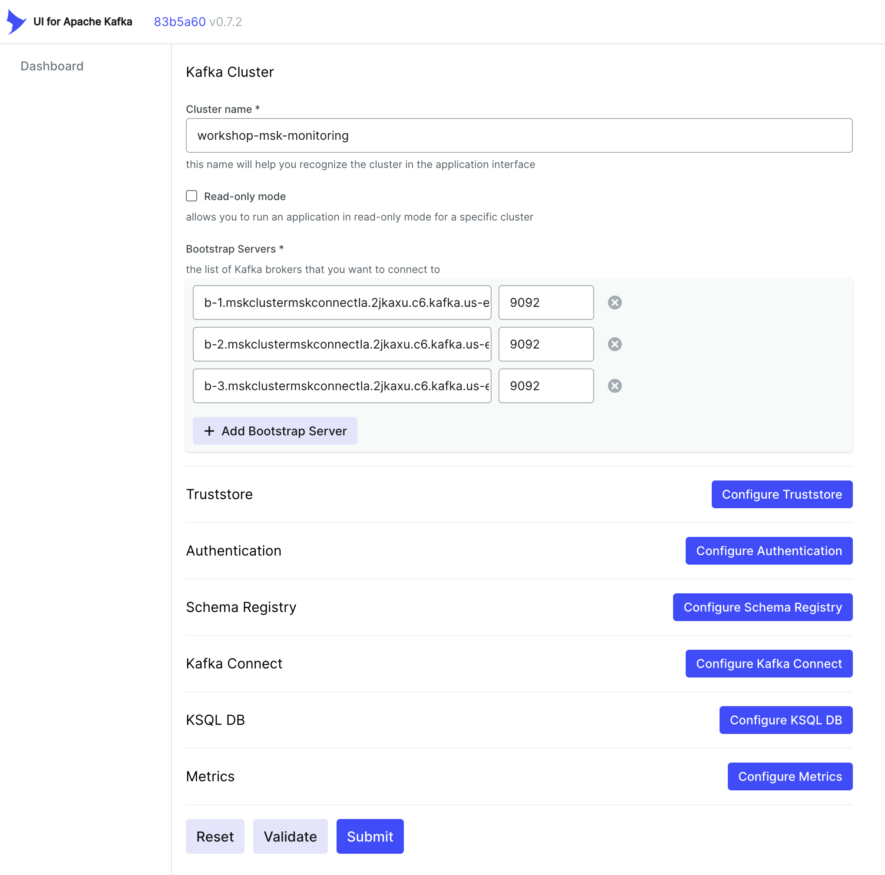

## 5. UI For Apache Kafka 설치 및 설정 가이드

### 5.1 UI For Apache Kafka 설치

- VS-CODE 터미널에서 작업 
- docker 서비스 구동중인지 확인

```bash
docker ps
 
```
- (Optional) Docker 서비스가 기동중이 아니라면 다음 명령어 수행

```bash
sudo systemctl status docker
sudo systemctl start docker 
sudo systemctl status docker
 
```

- (Optional) 기존 docker 삭제 (8080 port 충돌 방지를 위해)
```bash
docker ps -a
sudo docker stop $(sudo docker ps -aq)
docker rm $(docker ps -a -q)
docker ps -a
 
```

- ui_for_apach_kafka docker run 실행

```bash
docker run -d \
-p 8080:8080  \
-v /home/ec2-user/ui_for_apach_kafka:/etc/ui_for_apach_kafka  \
-e DYNAMIC_CONFIG_ENABLED=true  \
provectuslabs/kafka-ui
 
```

### 5-2 설정 및 사용

1. ui_for_apach_kafka 실행 : 브라우저에서 http://공인IP:8080 로 접속하면
UI For Apache Kafka 웹화면을 확인할 수 있습니다.

2. **Configure new cluster** 버튼을 클릭합니다.

3. 아래와 같이 입력 후 Validate 버튼 클릭 그리고, Submit 버튼을 클릭합니다.
   - Cluster name : workshop-msk-monitoring
   - Bootstrap Servers : $brokers
   - Port : 9092 ( Plain Text )

```bash
# brokers 주소 확인
aws kafka list-nodes --cluster-arn $CLUSTER_ARN --region $AWS_REGION  | jq '.NodeInfoList[].BrokerNodeInfo.Endpoints[]'
  
```
  - 아래 그림처럼 입력하여야 합니다.



4. 대시보드에 등록된 것을 확인할 수 있습니다.

5. Brokers 메뉴를 클릭하여 Broker 정보를 확인합니다.

6. Topics 메뉴에서 ***salesdb.salesdb.CUSTOMER*** 를 클릭합니다.

7. Overview, Message, Consuers, Settings, Statistics 탭을 통해 다양한 Topic 정보를 확인할 수 있습니다.

8. MySQL 소스 웹화면에서 주문 버튼을 클릭하여 데이터를 발생시켜 봅니다.

9. kafka 로 produce 된 데이터를 확인할 수 있습니다.