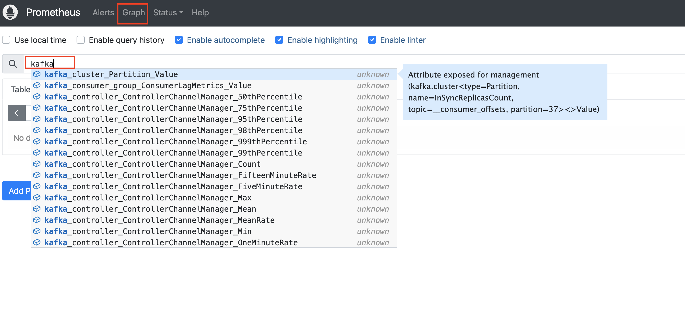

## 6. Open Monitoring with Prometheus 개용

Kafka는 JMX를 통해 매우 많은 메트릭을 방출하며, 이 중 다수는 클러스터, 생산자, 소비자의 성능을 조정하는 데 유용할 수 있습니다. 그러나 이렇게 많은 양을 전송하면 모니터링이 복잡해집니다.

기본적으로 Amazon MSK 클러스터에는 필수 메트릭에 대한 Cloudwatch 모니터링이 함께 제공되지만, 전체 메트릭에 액세스하려면 이제 Prometheus에서 Open Monitoring을 사용할 수 있습니다. 

이 기능을 사용하면 Prometheus 친화적인 API를 스크래핑하여 모든 JMX 메트릭을 수집하고 인기 있는 오픈 소스 모니터링 도구인 Prometheus에서 데이터로 작업할 수 있습니다.

### 6.1 사전 준비

#### (선택사항) 단계 1 - 기존 클러스터에서 오픈 모니터링 활성화

오픈 모니터링을 사용하기 위한 중요한 단계는 이를 활성화하는 것입니다. 모든 클러스터에서 기본적으로 활성화되어 있지 않기 때문에, 클러스터 생성 시 활성화하지 않았다면 켜야 합니다.

1. Amazon MSK 클러스터 콘솔을 엽니다 
2. 모니터링을 활성화하고자 하는 Amazon MSK 클러스터( **MSKCluster-mskconnectlab** )를 클릭합니다
3. **Properties** 탭을 클릭하고 **Monitoring metrics** 섹션까지 아래로 스크롤합니다


4. 오픈 모니터링 활성화 - 활성화되어 있지 않으므로, 켜보겠습니다!
   - **Monitoring** 헤더 오른쪽에 있는 **Edit** 버튼을 클릭합니다
   - **Enable open monitoring with Prometheus** 체크박스를 선택합니다
   - **JMX Exporter**와 **Node Exporter** 체크박스를 선택합니다
   - **Save Changes**을 클릭합니다


클러스터에서 적용하는 데 약 15 분이 소요됩니다.작업이 진행 중임을 나타내는 파란색 막대가 표시되고. 완료되면 막대가 녹색으로 변하여 작업이 완료되었음을 나타냅니다.

준비 완료! 이제 단계 2로 넘어가서 모니터링 포트를 접근 가능하게 만들 수 있습니다.

#### 단계 2 - MSK Cluster에 모니터링 접근을 허용하는 보안 그룹 규칙 생성

1. Amazon MSK 클러스터 콘솔을 엽니다 
2. Amazon MSK 클러스터( **MSKCluster-mskconnectlab** )를 클릭합니다
3. **Properties** 탭을 클릭하고 **Networking settings** 섹션까지 아래로 스크롤합니다
4. Security groups applied 하단에 **Security group** 을 클릭합니다.


5. **Edit inbound rules** 버튼을 클릭하고 아래와 같이 룰 입력
- **Add Rule** 버튼 클릭
    - Type: Custom TCP
    - Port range: 11001-11002
    - Source: "KafkaClientInstance" 검색해서 나오는 SG 선택
    - Description: Prometheus monitoring


6. **Save rules** 버튼을 클릭하고 저장

### 6.2 Docker를 사용한 Prometheus 설치

Docker를 사용하여 Prometheus 설치를 단순화할 것입니다. Config 파일을 생성한 다음 서비스를 시작하기 위한 `docker` 명령을 실행하는 것만큼 간단합니다.

1. VS-CODE로 이동하여 Terminal을 엽니다.

2. prometheus.yml과 targets.json 파일 생성
```shell
cd ~
mkdir prometheus
cat <<EOF > ./prometheus/prometheus.yml
# file: prometheus.yml
# my global config
global:
  scrape_interval: 30s

# A scrape configuration containing exactly one endpoint to scrape:
# Here it's Prometheus itself.
scrape_configs:
# The job name is added as a label `job=<job_name>` to any timeseries scraped from this config.
- job_name: 'prometheus'
  static_configs:
  # 9090 is the prometheus server port
  - targets: ['localhost:9090']
- job_name: 'broker'
  file_sd_configs:
  - files:
    - 'targets.json'
EOF

broker_0=$(aws kafka list-nodes --cluster-arn $CLUSTER_ARN --region $AWS_REGION  | jq -r '.NodeInfoList[0].BrokerNodeInfo.Endpoints[]')
broker_1=$(aws kafka list-nodes --cluster-arn $CLUSTER_ARN --region $AWS_REGION  | jq -r '.NodeInfoList[1].BrokerNodeInfo.Endpoints[]')
broker_2=$(aws kafka list-nodes --cluster-arn $CLUSTER_ARN --region $AWS_REGION  | jq -r '.NodeInfoList[2].BrokerNodeInfo.Endpoints[]')

cat <<EOF > ./prometheus/targets.json
[
  {
    "labels": {
      "job": "jmx"
    },
    "targets": [
      "$broker_0:11001",
      "$broker_1:11001",
      "$broker_2:11001"
    ]
  },
  {
    "labels": {
      "job": "node"
    },
    "targets": [
      "$broker_0:11002",
      "$broker_1:11002",
      "$broker_2:11002"
    ]
  }
]
EOF
 
```

3. 클러스터 ARN이 현재 사용 가능한지 확인하기 위해 아래 코드를 실행합니다

```shell
echo $CLUSTER_ARN
 
```

(Optional) 값이 비어 있는 경우, 클러스터 ARN 가져오기에 설명된 대로 아래 코드를 실행하여 값을 설정할 수 있습니다

```shell
export CLUSTER_ARN=$(aws kafka list-clusters --cluster-name-filter MSKCluster | jq -r '.ClusterInfoList[].ClusterArn')
 
```

4. Prometheus 실행

- Prometheus를 docker로 실행합니다. 이는 컨테이너를 다운로드하여 실행하고, 위에서 생성한 구성 파일을 컨테이너에 마운트하며, 9090 포트에서 서비스를 노출합니다.

```shell
docker run -d -p 9090:9090 --name=prometheus -v /home/ec2-user/prometheus/prometheus.yml:/etc/prometheus/prometheus.yml -v /home/ec2-user/prometheus/targets.json:/etc/prometheus/targets.json prom/prometheus --config.file=/etc/prometheus/prometheus.yml
 
```

- 이 명령은 컨테이너 ID를 반환합니다. 예:

```
db5fa73d5a197935cd7294b1db5b3a4d9057afe0ff2624514d28787fb3f778e6

```

- 참고: 이는 예시입니다 - `docker run` 명령의 실제 출력을 사용하세요.

5. prometheus 실행 : 브라우저에서 http://공인IP:9090 로 접속하면
prometheus 웹화면을 확인할 수 있습니다.



- 오프라인 파티션 그래프를 얻으려면 **kafka_controller_KafkaController_Value{name="OfflinePartitionsCount"}** 를 입력합니다. 
- 표현식 표시줄 아래의 'Graph' 탭을 클릭하고 메트릭의 간단한 그래프를 검토합니다.

### 6.3. Docker로 Grafana를 시작하고 Prometheus에 연결하기

Prometheus에 의해 수집되는 MSK 클러스터 및 토픽 메트릭을 시각화하고 대시보드로 만들기 위해 Grafana를 도구로 사용할 것입니다. Prometheus는 단일 메트릭을 검토하기 위한 기능적 인터페이스를 제공하지만, Amazon MSK를 프로덕션 환경에서 실행하려면 보기 좋은 대시보드가 필요할 것입니다.

VS-CODE 터미널에서 Docker를 사용하여 Grafana를 실행합니다.

1. VS-CODE 터미널로 이동합니다.

2. Docker에서 Grafana 시작:

```shell
docker run -d -p 8090:3000 --name=grafana -e "GF_INSTALL_PLUGINS=grafana-clock-panel" grafana/grafana
 
```

3. 포트 8090에서 KafkaClientInstance 공용 IP 주소에 연결합니다. 브라우저에 http://<공용IP>:8090 입력

4. 사용자 이름 "admin", 비밀번호 "admin"으로 로그인

5. 메시지가 표시되면 원하는 비밀번호로 변경하거나 건너뛰기(Skip)를 누르세요

### 6.4 Grafana 구성

이제 Prometheus에서 시계열 데이터를 가져오기 위한 데이터 소스를 추가해야 합니다.

1. Grafana 홈 화면에서 **Connections > Data Source** 클릭

2.  **Add Data Source** 버튼을 클릭하고 데이터 소스 목록에서 **Prometheus** 클릭

3. Config 작성: KafkaClientInstance의 프라이빗 IP 주소로 변경
   - Name: prometheus
   - URL: http://<KafkaClientInstance 프라이빗 IP 주소>:9090

4. Save and Test 클릭
    - 결과가 녹색으로 나와야 합니다 - 데이터 소스가 작동 중입니다. 
    - 오류가 발생하면 준비 단계에서 Security Group이 올바르게 설정되었는지 확인하세요.

5. 구성 페이지 상단에서 'Dashboards'를 클릭하고 Prometheus 2.0 Stats 옆의 Import를 선택합니다 - 이렇게 하면 Prometheus 서비스 자체를 모니터링하기 위한 사전 구축된 대시보드가 가져와집니다.

### 6.5 사전 구축된 Kafka 대시보드 가져오기

1. Grafana 대시보드 설정 파일을 아래의 주소에서 확인합니다.
    - URL : https://static.us-east-1.prod.workshops.aws/public/2eb67363-24cb-4862-b37d-5ef003e9180f/static/openmonitoring/msk_grafana_dashboard.json
    - GitHub에 ../file 폴더에도 있습니다.
    - Json 파일을 전체 선택해서 복사합니다.

2. 브라우저의 Grafana UI로 돌아갑니다

3. 왼쪽 창에서 대시보드 아이콘(4개의 사각형)을 클릭합니다.

4. 우측 상단에 New 버튼을 누르고 Import 클릭


5. "Import via dashboard JSON model" 복사한 JSON 파일(msk_grafana_dashboard.json)을 붙여 넣습니다.


- 참고: 동일한 UID를 가진 다른 대시보드가 있다는 오류가 표시되면 Change uid 버튼을 클릭하세요.

6. **Import** 클릭.

- 이 대시보드는 Prometheus 서비스를 통해 Amazon MSK 클러스터에서 수집된 메트릭을 표시합니다.

- 각 차트에서 Edit 한번씩 눌러주시면 차트가 정상적으로 보입니다.

## Grafana 대시보드 내용 검토

상단 행에는 8개의 개별 메트릭이 있는 상자가 있습니다:

1. **Offline Partitions**: 읽기/쓰기에 사용할 수 없는 클러스터의 파티션 수입니다. 이 숫자가 0이 아닌 것은 좋지 않습니다.

2. **In-sync replica state change**: 파티션이 리더와 동기화/비동기화되는 경우 이 숫자가 0이 아닐 것입니다. 이는 일반적으로 문제나 클러스터 변경을 나타냅니다.

3. **Log Flush Latency**: 브로커 전체에서 데이터를 디스크에 쓰는 데 걸리는 시간(최대값, ms)입니다.

4. **Total Topics**: 클러스터의 총 토픽 수

5. **Preferred Leader Imbalance**: 리더십을 다른 브로커로 이동해야 하는 것으로 표시되었지만 아직 이동하지 않은 파티션의 수입니다(일반적으로 성능 균형을 위해). 여기서 높은 숫자는 프로세스가 중단되었거나, 브로커가 실패했거나, 다른 이상한 일이 발생했음을 나타낼 수 있습니다.

6. **Total Partitions**: 이 클러스터의 총 파티션 수

7. **Fetch Queue Size**: 복제를 위해 데이터를 가져오기 위한 미처리 요청의 수입니다. 이것이 높아지면 복제가 뒤처지고 있음을 나타냅니다.

그런 다음 기본적인 클러스터 통계가 있습니다:

- **MessagesInPerSec**: MSK 클러스터에 작성되는 총 메시지 수 - 이는 1분 동안의 롤링 비율입니다

- **Replication Bytes In Per Sec**: 각 브로커가 복제하는 바이트 수입니다.

- **Replication Bytes Out Per Sec**: 각 브로커가 복제해 내보내는 바이트 수입니다.

- **Total Produce Requests Per Sec**: 클러스터에 데이터를 생성하기 위해 만들어지는 요청 수입니다.

- **Under Replicated Partitions**: 모든 파티션은 원하는 복제본 수(일반적으로 3)를 가질 것입니다 - 이것은 복제가 뒤쳐진 파티션의 수를 알려줍니다.

- **Zookeeper Disconnects per second**: MSK/Kafka는 메타데이터 조정 및 공유를 위해 Zookeeper에 의존합니다. 브로커가 Zookeeper에 대한 연결을 잃고 있다면, 이는 클러스터의 심각한 문제를 나타냅니다.

마지막으로, 네트워크 데이터가 있습니다:

- **Network Bytes**: 브로커 프로세스에 도달하는 데이터의 양(바이트)

- **Network Requests per sec**: 주어진 시간에 네트워크 요청의 수에 대한 게이지

- **Network CPU Idle Time**: 네트워크 처리 스레드가 유휴 상태로 보내는 시간입니다. 이것이 낮다는 것은 브로커가 네트워크에서 데이터를 충분히 빨리 가져오는 데 어려움을 겪고 있다는 의미이며, 네트워크 IO를 개선하거나(인스턴스 유형 업그레이드), 브로커의 부하를 줄이기 위해 클러스터를 재조정해야 할 수 있습니다.

- **Network Errors Per sec**: 네트워크에서 데이터를 가져오는 동안 브로커가 발생시킨 오류입니다. 가끔의 오류는 문제가 되지 않습니다. requests/sec가 떨어지는 동안 오류가 급증/증가하는 것을 볼 때 조사가 필요합니다.
