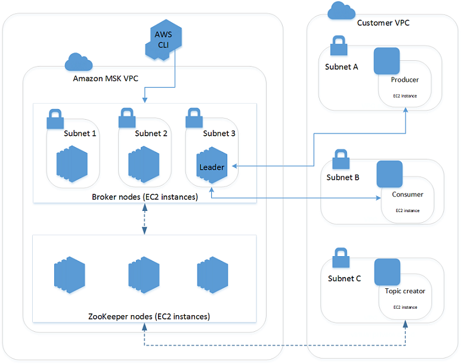
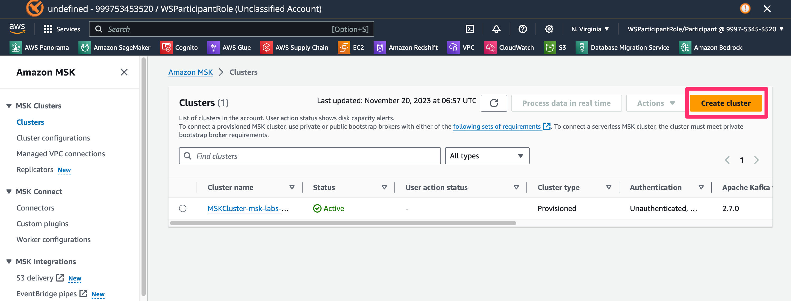

## MSK 클러스터 생성

### MSK Architecture 

### 클러스터 생성
- MSK의 Cluster메뉴로 이동하여 우측상단 "Create Cluster" 버튼 클릭
- URL : https://us-east-1.console.aws.amazon.com/msk/home?region=us-east-1#/clusters

### 클러스터 셋팅 정보

1. Cluster settings
    - Cluster creation method : __Custom create__
    - Cluster name : __MSKWorkshopCluster__
    - Cluster type : __Provisioned__
    - Apache Kafka version : __2.8.1(recommended)__
    - Broker type : __kafka.m5.large__
    - Number of zones : 3
    - Brokers per zone : 1
    - 나머지 Default 설정 후 Next

2. Networking
    - VPC : __MSKVPC__
    - First Zone
        - Zone : __us-east-1a__
        - Subnet : __PrivateSubnetMSKOne__
    - Second Zone
        - Zone : __us-east-1b__
        - Subnet : __PrivateSubnetMSKTwo__
    - Second Zone
        - Zone : __us-east-1c__
        - Subnet : __PrivateSubnetMSKThree__
    - Security groups in Amazon EC2 : __msk-labs-default-MSKSecurityGroup-xxxx__
    - 기존 Default Security Group은 삭제(Remove) 하고 Next

3. Security
    - Access control methods : __Unauthenticated access, 
IAM role-based authentication, SASL/SCRAM authentication__ 
    - Encryption : __Plaintext__ 
    - 나머지는 Default로 하고 Next

4. Monitoring and tags
    - Amazon CloudWatch metrics for this cluster : __Enhanced partition-level monitoring__
    - Enable open monitoring with Prometheus 체크
    - JMX Exporter, Node Exporter 체크
    - 나머지는 Default로 하고 Next

5. Review and create
    - 설정정보 확인 후 우측하단 "Create Cluster" 버튼 클릭

