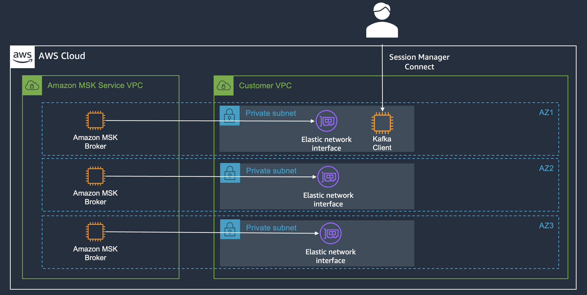
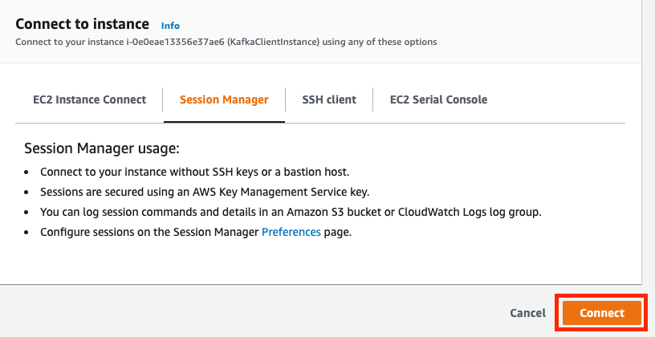

## EC2 인스턴스를 통한 MSK 클러스터 접속
### 워크샵 아키텍처



### EC2 SSM Manager 접속
1. Amazon EC2 콘솔로 이동하여 KafkaClientInstance 인스턴스를 선택합니다. 
2. "Connect" 버튼을 클릭합니다.
3. 사용 가능한 옵션에서 "Session Manager" 탭을 선택합니다. 
4. "Connect" 버튼이 회색에서 활성으로 바뀔 때까지 몇 초간 기다립니다.



5. "Connect" 버튼을 클릭하면 브라우저 기반 터미널이 있는 새 브라우저 창이 열립니다.
6. 사용자를 ec2-user로 전환합니다.

```bash
sudo -u ec2-user -i

```

7. 아래 bash 스크립트를 복사하여 열린 터미널에 붙여넣습니다. 이렇게 하면 일부 Amazon MSK 환경 변수가 설정됩니다. 
- 최초 1번만 수행하면 됩니다.

```bash
export AWS_REGION=$(TOKEN=`curl -s -X PUT "http://169.254.169.254/latest/api/token" -H "X-aws-ec2-metadata-token-ttl-seconds: 21600"` \
&& curl -s -H "X-aws-ec2-metadata-token: $TOKEN" http://169.254.169.254/latest/meta-data/placement/availability-zone | sed 's/[a-z]$//')
export ACCOUNT_ID=$(aws sts get-caller-identity --output text --query Account)
test -n "$AWS_REGION" && echo AWS_REGION is "$AWS_REGION" || echo AWS_REGION is not set
echo "export ACCOUNT_ID=${ACCOUNT_ID}" | tee -a ~/.bash_profile
echo "export AWS_REGION=${AWS_REGION}" | tee -a ~/.bash_profile
echo "export AWS_DEFAULT_REGION=${AWS_REGION}" | tee -a ~/.bash_profile
export stack_name=msk-labs-default # IMPORTANT: If running in your own account, set MSK_STACK=MSK
cd /tmp/kafka
python3 ./setup-env.py --stackName $stack_name --region $AWS_REGION
. ./setup_env $stack_name
source ~/.bash_profile

```