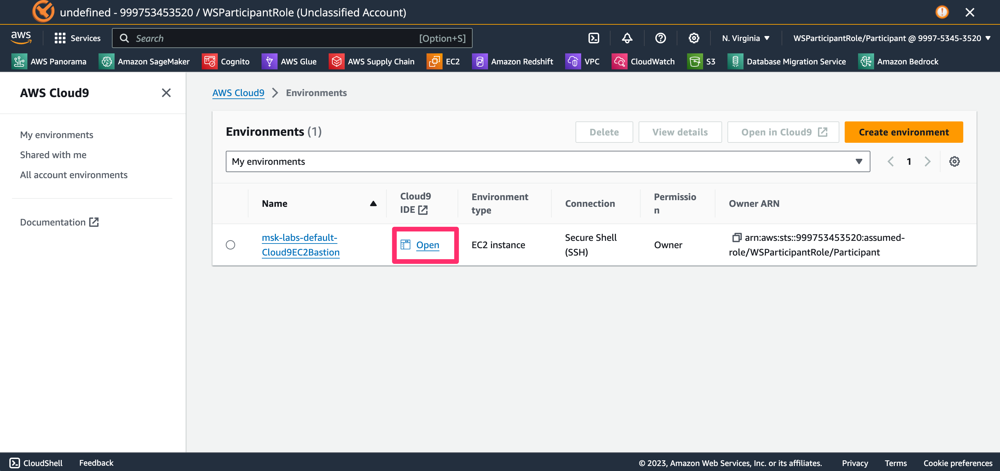
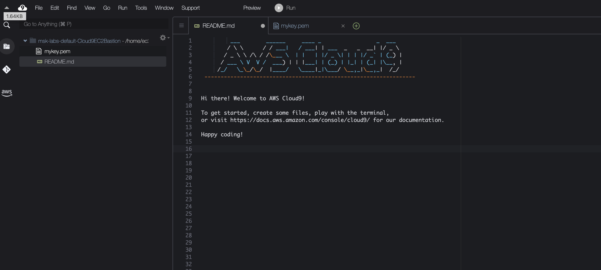
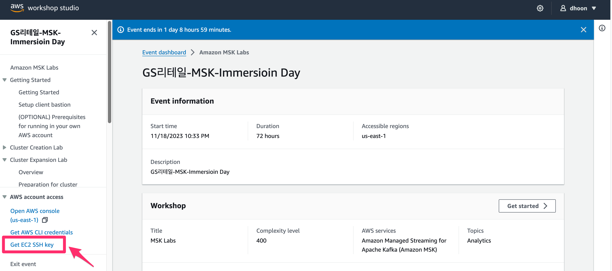
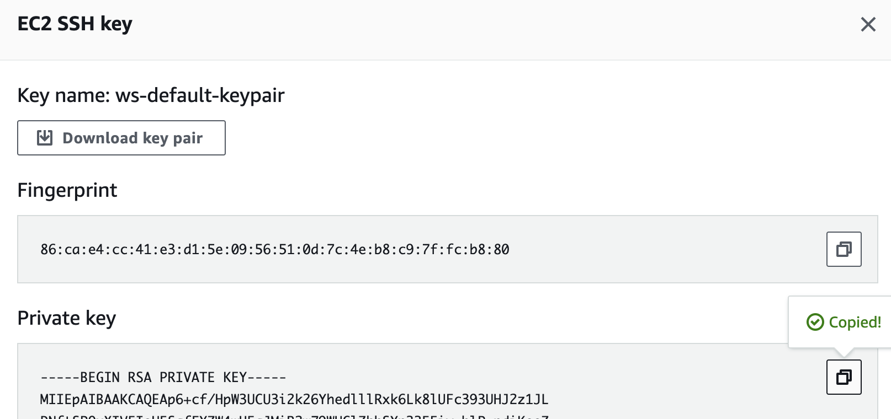
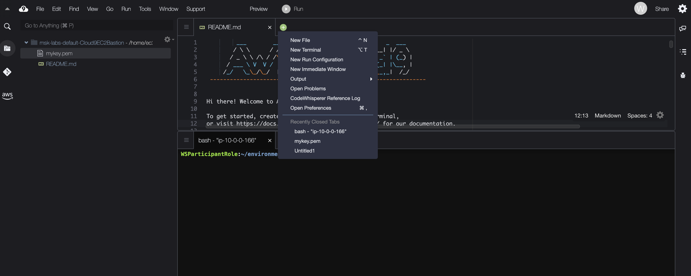
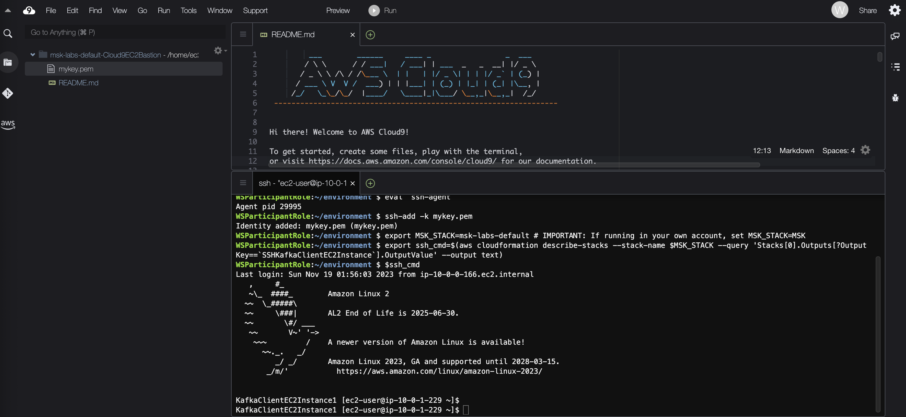

## Workshop 환경셋팅
### 워크샵 아키텍처


### SSH Key 셋팅
1. 다음 링크를 통해 Cloud9 접속 후 "Open" 버튼 클릭
- URL : https://us-east-1.console.aws.amazon.com/cloud9control/home?region=us-east-1#/



2. SSH Key 파일생성
- Cloud9 좌측 패널에서 빈 파일을 생성하고 "mykey.pem"으로 파명 저장
- 메뉴 > File > New File



3. SSH Key 복사
- 워크샵 소개 페이지로 돌아가서 아래 링크를 클릭한다.



- Private Key를 복사한다. (우측상단 복사버튼)



- 복사한 키를 Cloud9으로 돌아가서 "mykey.pem"파일에 붙여넣은 후 저장

### Kafka Client EC2 접속
1. Cloud9 하단 터미널 창 Open 
- 터미널 창이 안보이면 탭에서 연두색 + 버튼 클릭 하여 New Terminal 선택



2. SSH 기본설정
- mykey.pem파일의 권한 변경
- 기본 환경변수 셋팅
- ssh 에 pem파일 등록

```bash
chmod 600 mykey.pem
eval `ssh-agent`
ssh-add -k mykey.pem

```

3. SSH를 통해 Kafka Client EC2 접속
- Kafka Client EC2 주소를 MSK CloudFormation Stack에서 불러옴
- 해당 주소를 가지고 ssh 커맨드 자동 생성

```bash
export MSK_STACK=msk-labs-default # IMPORTANT: If running in your own account, set MSK_STACK=MSK
export ssh_cmd=$(aws cloudformation describe-stacks --stack-name $MSK_STACK --query 'Stacks[0].Outputs[?OutputKey==`SSHKafkaClientEC2Instance`].OutputValue' --output text)
$ssh_cmd

```



4. Kakfa Client에서 기본 환경 자동 셋팅
- python 프로그램 수행을 통해 자동 셋팅합니다.
- brokers 정보, zookeeper 정보 등을 export 명령어를 통해 셋팅합니다.

```bash
export stack_name=msk-labs-default # IMPORTANT: If running in your own account, set MSK_STACK=MSK
cd /tmp/kafka
export region=$(curl http://169.254.169.254/latest/meta-data/placement/region)
python3 ./setup-env.py --stackName $stack_name --region $region
. ./setup_env $stack_name
```


