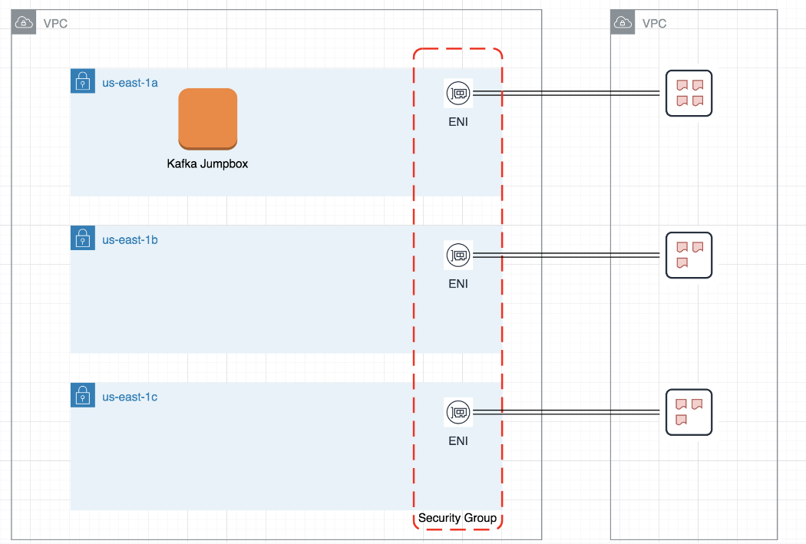
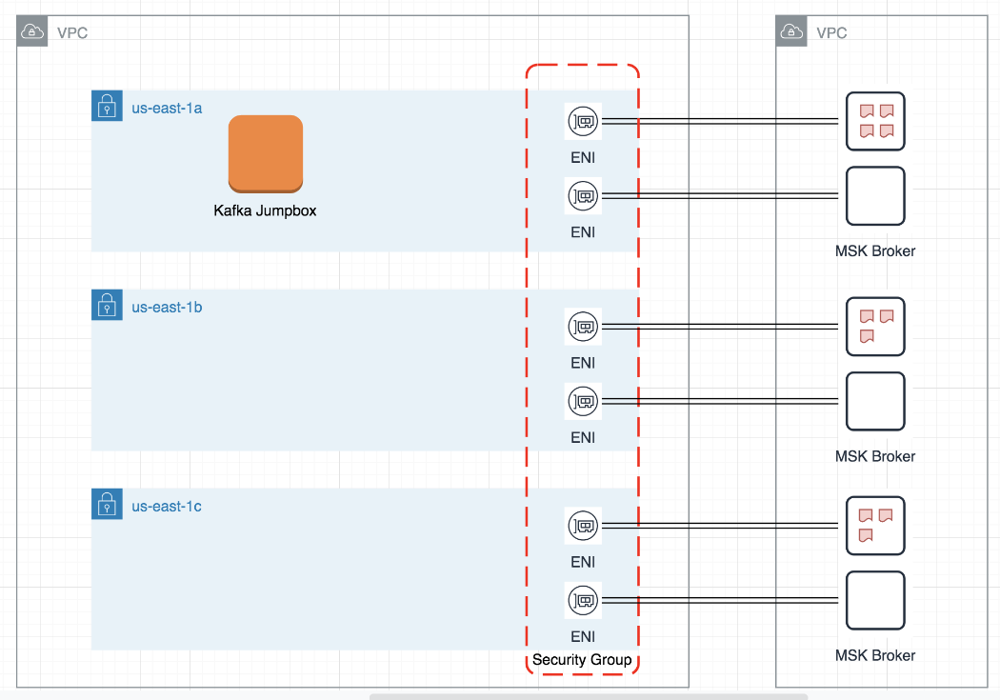
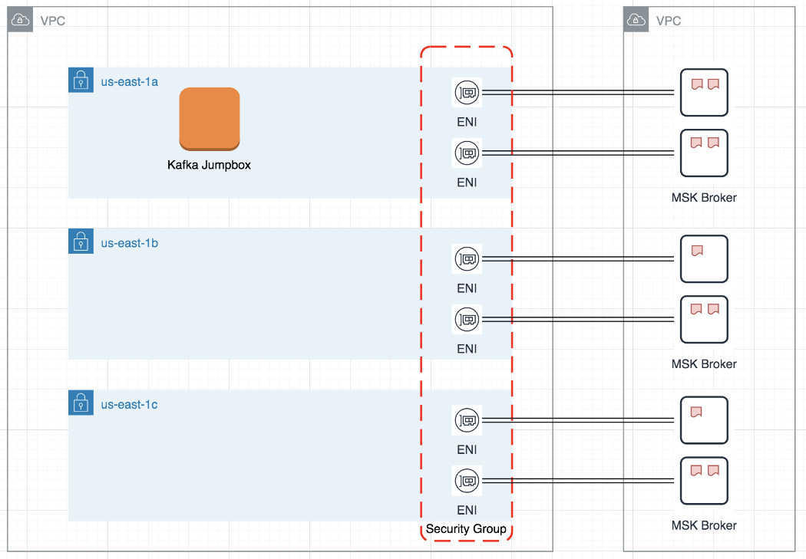
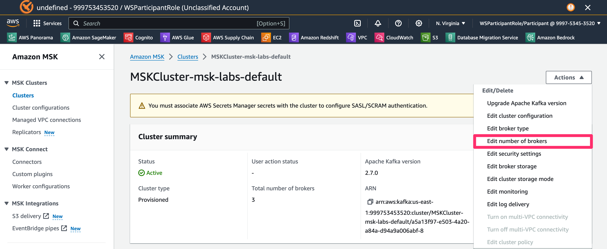

## Cluster 확장 
### Overview
1. 현재 3 Brokers에 10개의 파티션을 가진 토픽을 생성합니다.



2. Broker 수를 3개에서 6개로 확장합니다.



3. 10개의 파티션을 6개의 브로커로 재할당합니다.




### 10개의 파티션을 가진 토픽 생성
1. ec2 session manager 이동 
- 새로 창을 열었다면 사용자를 ec2-user로 전환합니다.
```bash
sudo -u ec2-user -i

```

2. Terminal에서 다음 명령어 수행

- Topic 명 "test10"이라는 Topic을 10개 파티션 2개 Replica로 생성
```bash
/home/ec2-user/kafka/bin/kafka-topics.sh \
--bootstrap-server $brokers \
--create \
--topic test10 \
--partitions 10 \
--replication-factor 2

```

- 생성 후 결과 확인
```bash
/home/ec2-user/kafka/bin/kafka-topics.sh \
--bootstrap-server $brokers \
--list

```

- Topic 상세 조회 : 10개의 partition이 Broker(Leader) 1,2,3에 골고루 나누어져 있는 것 확인
```bash
/home/ec2-user/kafka/bin/kafka-topics.sh \
--bootstrap-server $brokers \
--topic test10 \
--describe 

```

### Broker 수 3개에서 6개로 확장

1. MSK 콘솔로 이동
- URL : https://us-east-1.console.aws.amazon.com/msk/home?region=us-east-1#/clusters 

2. Cluster 명 "MSKCluster-msk-labs-default" 클릭 후 이동
3. 우측 상단 Actions > Edit number of brokers 선택



4. The number of brokers to add 값을 "1"을 입력하고 "Save changes" 버튼 클릭

### 클러스터 사이즈 수정 후 10개의 파티션 재할당

0. ec2 session manager 이동 
- 새로 창을 열었다면 사용자를 ec2-user로 전환합니다.
```bash
sudo -u ec2-user -i

```

1. 토픽 현황 확인 : 3개 브로커로 10개 파티션 분배되어있는 내용 확인
```bash
/home/ec2-user/kafka/bin/kafka-topics.sh \
--bootstrap-server $brokers \
--describe \
--topic test10

```

2. 이동할 토픽 정보 json으로 저장
```bash
cat <<EOF > topics-to-move.json
{ "topics": [ { "topic" : "test10"}], "version":1}
EOF

```

3. 새로운 Partition configuration 파일 생성

```bash
/home/ec2-user/kafka/bin/kafka-reassign-partitions.sh \
--bootstrap-server $brokers \
--topics-to-move-json-file topics-to-move.json \
--broker-list "1,2,3,4,5,6" \
--generate | awk -F: '/Proposed partition reassignment configuration/ { getline; print $0 }' | jq . > expand-cluster-reassignment.json

```

- 생성된 새로운 configuration 정보 확인

```bash
cat expand-cluster-reassignment.json | jq "."

```

4. 파티션 재할당 수행

```bash
/home/ec2-user/kafka/bin/kafka-reassign-partitions.sh \
--bootstrap-server $brokers \
--reassignment-json-file expand-cluster-reassignment.json \
--execute

```

- 진행사항 확인 : 6개의 브로커로 파티션이 재할당된 내역 확인

```bash
/home/ec2-user/kafka/bin/kafka-topics.sh \
--bootstrap-server $brokers \
--describe \
--topic test10

```
