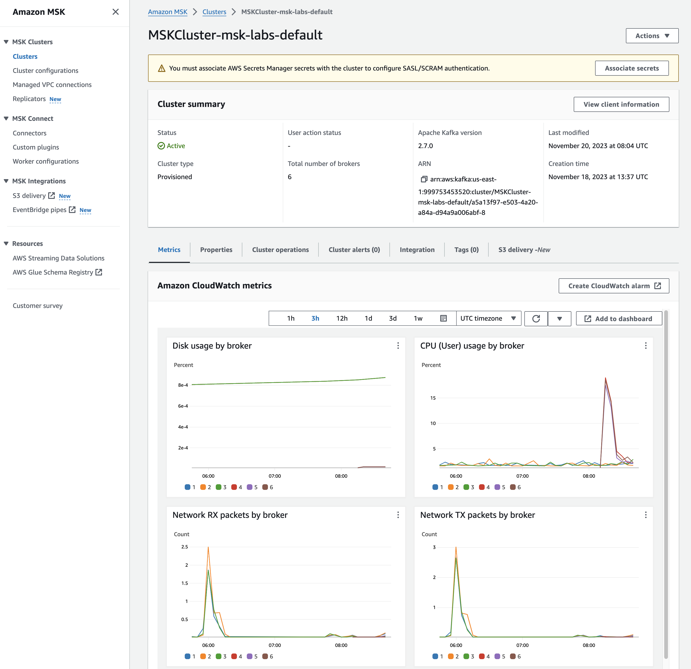
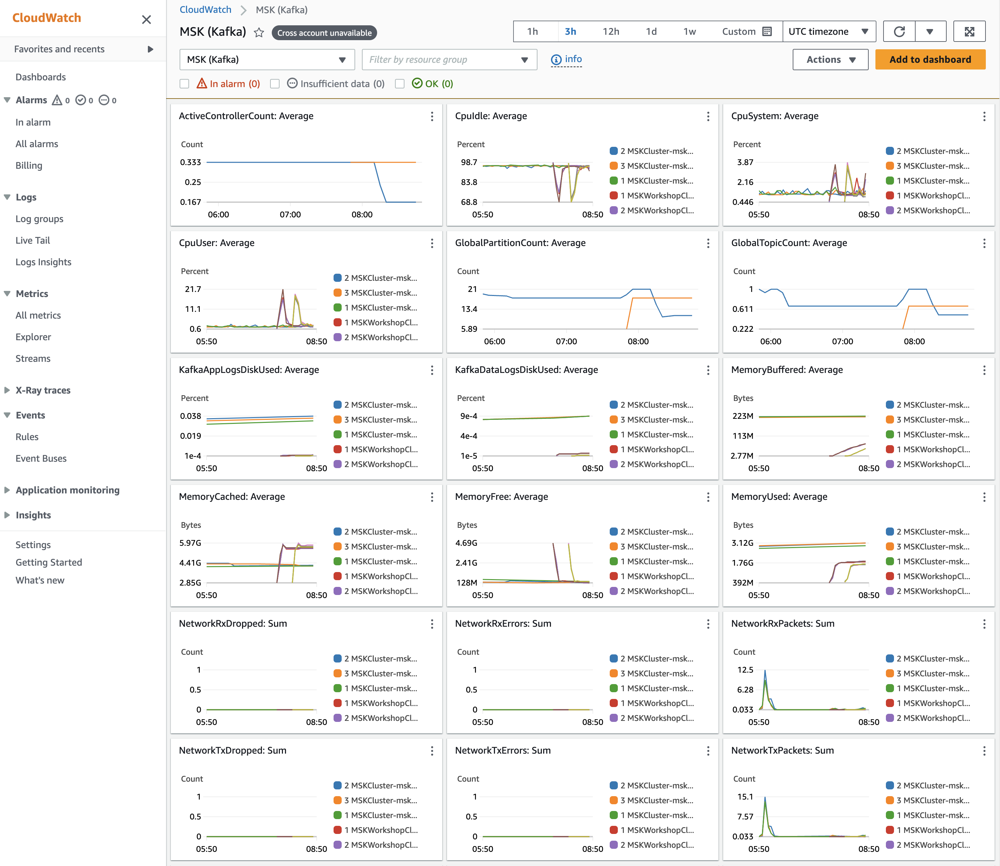
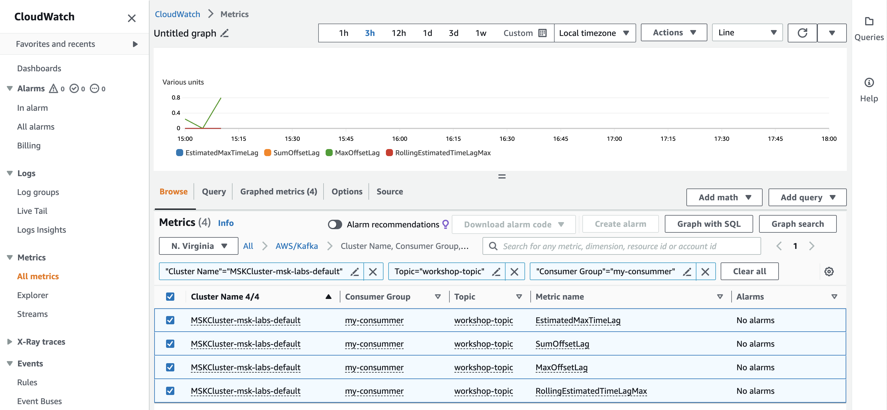

## Cluster 모니터링 
### MSK 콘솔 모니터링
1. MSK 콘솔로 이동
- URL : https://us-east-1.console.aws.amazon.com/msk/home?region=us-east-1#/clusters 

2. Cluster 명 "MSKCluster-msk-labs-default" 클릭 후 이동
3. 아래 Tab Metrics 확인

### Cloud Watch 모니터링
1. Cloud Watch 콘솔 접속 
- URL : https://us-east-1.console.aws.amazon.com/cloudwatch/home?region=us-east-1#home:

2. 좌측메뉴 > Metrics > All Metrics 이동
3. AWS/Kafka 의 View automatic dashboard 를 클릭

4. 좌측메뉴 > Metrics > All Metrics > AWS/Kafka 이동
- 원하는 지표 검색 후 모니터링 및 Custom Dashboard 생성 가능
- __Cluster Name, Consumer Group, Topic__ 선택
- 조회 조건에 아래 입력
    - "Cluster Name"="MSKCluster-msk-labs-default"
    - Topic="workshop-topic"
    - "Consumer Group"="my-consummer"
- 출력 리스트에 좌측 체크박스 선택

