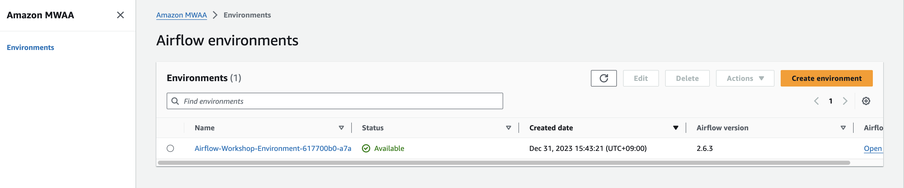

## Airflow 기본 DAG 실행

### 00. MWAA 기본 환경 탐색
1. [MWAA 콘솔](https://us-east-1.console.aws.amazon.com/mwaa/home?region=us-east-1#environments)로 이동



2. environments name을 클릭하여 설정 정보 확인
3. create environment를 클릭하여, 설정 정보 확인 ( 실제 생성은 권한이 없어 불가능합니다.)
4. "Open Airflow UI" 를 클릭하여 Airflow UI 탐색

### 01. Cloud9 기본 NPM Library 설치
- [Cloud9 콘솔](https://us-east-1.console.aws.amazon.com/cloud9control/home?region=us-east-1#/)로 이동 후 UI 접속을 위한 Open 버튼 클릭


- Cloud9 기본 NPM Library 설치

```bash
npm install --location=global c9
```

### 02. Hello Workld DAG 생성
- Cloud9 터미널에서 아래 명령어 실행
1. dags 폴더 생성
2. hello_world.py 파일 생성
3. hello_world.py 파일 Open
```bash
mkdir ~/environment/dags
touch ~/environment/dags/hello_world.py
c9 ~/environment/dags/hello_world.py
```

- 아래 소스 붙여 넣기
```python
from datetime import datetime, timedelta
from airflow import DAG
from airflow.operators.bash import BashOperator
from airflow.operators.python import PythonOperator
import os

with DAG(
        dag_id=os.path.basename(__file__).replace(".py", ""),
        # These args will get passed on to each operator
        default_args={
            # the number of retries that should be performed before failing the task
            'retries': 1
        },
        description='A simple DAG to print information on terminal',
        # Your schedule will start from following start_date, and run as per schedule_interval
        start_date=datetime(2022, 6, 1),
        schedule_interval=timedelta(seconds=60),
        #the scheduler creates a DAG run only for the latest interval
        catchup=False,
) as dag:

    # t1, t2 and t3 are examples of tasks created by instantiating operators
    task1 = BashOperator(
        task_id='print_date',
        bash_command='date'
    )

    task2 = BashOperator(
        task_id='print_text',
        depends_on_past=False,
        bash_command='echo HELLO',
        retries=3
    )

    #def _my_func(**kwargs):
    #    print('current_datetime: {0}'.format(datetime.now() ))
    
    # task3 = PythonOperator(
    #     task_id='python_task',
    #     python_callable=_my_func
    # )

    
    task1 >> task2     
    #Uncomment task3 and _my_func before uncommenting following sequence
    #task1 >> task2 >> task3
```

### 03. 생성한 DAG을 S3에 업로드
- 버컷명을 조회 해서 환경변수로 등록
```bash
BUCKET_NAME=`aws s3 ls  | grep -i airflow | awk '{print $3}'`
echo "export BUCKET_NAME=\"${BUCKET_NAME}\"" >> /home/ec2-user/.bashrc
source /home/ec2-user/.bashrc
echo ${BUCKET_NAME}
```

- hello_world.py 파일을 s3에 dags폴더로 복사 - 터미널에서 아래 실행
```bash
aws s3 cp ~/environment/dags/hello_world.py s3://${BUCKET_NAME}/dags/
```

- Airflow UI 로 이동하여 DAG 등록 및 실행 확인
1. 신규 DAG 등록 확인
2. 좌측 토글 버튼으로 Dag 활성화 시키기
3. Dag Runs와 Recent Tasks 확인
4. 상세보기 들어가서 Grid / Code 탐색
5. 그 외 상세한 내용 탐색

### 04. DAG을 수정하여 S3에 재 업로드
- 기존 hello_world.py 마지막 부분에 주석을 해지하고 저장
```python
    ## 주석해지
    #def _my_func(**kwargs):
    #    print('current_datetime: {0}'.format(datetime.now() ))
    
    ## 주석해지
    # task3 = PythonOperator(
    #     task_id='python_task',
    #     python_callable=_my_func
    # )

    
    task1 >> task2 ## 이 부분은 주석처리
    #Uncomment task3 and _my_func before uncommenting following sequence

    # 주석해지
    #task1 >> task2 >> task3
```

- hello_world.py 파일을 s3에 dags폴더로 복사 - 터미널에서 아래 실행
```bash
aws s3 cp ~/environment/dags/hello_world.py s3://${BUCKET_NAME}/dags/
```

- Airflow UI 로 이동하여 변경된 DAG 등록 및 실행 확인
