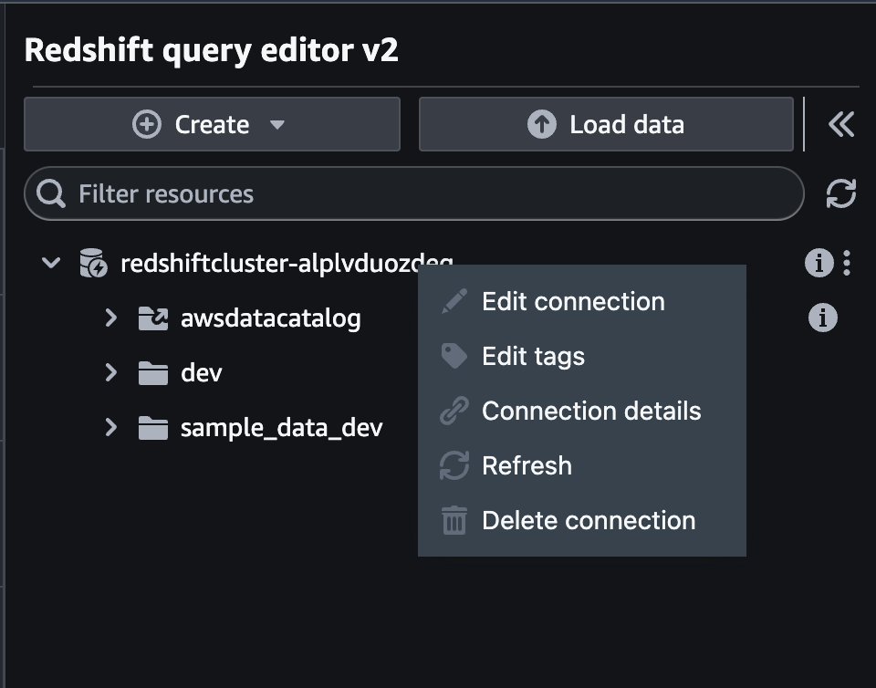

## 데이터 파이프라인 DAG


### 00. 기본 변수 조회 및 저장

- S3_BUCKET_NAME과 GLUE_ROLE_ARN을 조회하여 별도 메모장에 저장 (다음 단계 사용)
1. S3_BUCKET_NAME 확인
```bash
aws s3 ls  | grep -i airflow | awk '{print $3}'
```
2. GLUE_ROLE_ARN 확인
```bash
aws iam get-role --role-name AWSGlueServiceRoleDefault --query 'Role.[Arn]' --output text
```

### 01. glue, emr, redshift 기본설정
- glue 소스 다운로드 / 수정 / 업로드
1. glue & emr 소스 다운로드 및 glue script 파일 열기
```bash
wget -O ~/environment/scripts.zip https://ws-assets-prod-iad-r-iad-ed304a55c2ca1aee.s3.us-east-1.amazonaws.com/795e88bb-17e2-498f-82d1-2104f4824168/scripts.zip
unzip -o ~/environment/scripts.zip -d ~/environment
c9 ~/environment/scripts/glue/nyc_raw_to_transform.py
```

2. nyc_raw_to_transform.py 파일에 "airflow-yourname-bucket" 수정


3. s3로 Glue Script 파일 복사
```bash
aws s3 sync ~/environment/scripts/glue s3://${BUCKET_NAME}/scripts/glue/
```

- emr 소스 업로드
```bash
c9 ~/environment/scripts/emr/nyc_aggregations.py
aws s3 sync ~/environment/scripts/emr s3://${BUCKET_NAME}/scripts/emr/
```

- redshift 설정
1. 다음 링크로 [Redshift Query Editor](https://console.aws.amazon.com/sqlworkbench/home) 로 이동

2. 오류 메시지는 무시하고 "Configure account" 버튼을 눌러 Editor로 이동


3. 좌측에 ___redshiftcluster-ID___ 우클릭 후 Edit Connection 클릭



4. ___redshiftcluster-ID___ 는 복사하여 별도 메모장에 저장

5. 접속정보는 다음과 같이 "Temporary credentials using a database user name" 를 선택 후 Database에 "dev" User name에 "admin" 입력


6. Database와 Table 생성 쿼리 수행

```sql
--    Create nyc schema.
CREATE schema nyc;

--    Create agg_green_rides table.
CREATE TABLE IF not EXISTS nyc.green (
  pulocationid      bigint,
  trip_type         bigint,
  payment_type        bigint,
  total_fare_amount    float
);

```

7. airflow UI 접속 후 Admin > Connections 이동 후 ___redshift_default___ 정보 수정
8. user에 반드시 ___admin___ 입력
9. 아래 ___redshiftcluster-id___ 를 수정하여 json  저장 

```json
{
  "iam": true,
  "cluster_identifier": "redshiftcluster-xxxxxxxx",
  "port": 5439,
  "db_user": "admin",
  "database": "dev"
}
```

### 02. data_pipeline DAG 생성
- Cloud9 터미널에서 아래 명령어 실행
1. dags 폴더 생성
2. data_pipeline.py 파일 생성
3. data_pipeline.py 파일 Open
```bash
mkdir ~/environment/dags
touch ~/environment/dags/data_pipeline.py
c9 ~/environment/dags/data_pipeline.py
```

- 아래 소스 붙여 넣기  
___[중요]___ S3_BUCKET_NAME, GLUE_ROLE_ARN 부분 소스 수정

```python
from os import path
from datetime import timedelta  
import airflow  
from airflow import DAG  
from airflow.providers.amazon.aws.operators.emr import (
    EmrAddStepsOperator,
    EmrCreateJobFlowOperator,
    EmrTerminateJobFlowOperator,
)
from airflow.providers.amazon.aws.sensors.s3 import S3KeySensor
from airflow.providers.amazon.aws.sensors.emr import EmrStepSensor
from airflow.providers.amazon.aws.operators.glue import GlueJobOperator
from airflow.providers.amazon.aws.operators.glue_crawler import GlueCrawlerOperator
from airflow.providers.amazon.aws.transfers.s3_to_redshift import S3ToRedshiftOperator

## [중요] 반드시 확인하여 수정하기
S3_BUCKET_NAME = "<airflow-yourname-bucket>"
GLUE_ROLE_ARN = "<glue-role-arn>"

dag_name = 'data-pipeline'
# Unique identifier for the DAG
correlation_id = "{{ run_id }}"
  
default_args = {  
    'owner': 'airflow',
    'depends_on_past': False,
    'start_date': airflow.utils.dates.days_ago(1),
    'retries': 0,
    'retry_delay': timedelta(minutes=2),
    'provide_context': True,
    'email': ['airflow@example.com'],
    'email_on_failure': False,
    'email_on_retry': False
}

dag = DAG(  
    dag_name,
    default_args=default_args,
    dagrun_timeout=timedelta(hours=2),
    schedule_interval='0 3 * * *'
)

s3_sensor = S3KeySensor(  
  task_id='s3_sensor',  
  bucket_name=S3_BUCKET_NAME,  
  bucket_key='data/raw/green*', 
  wildcard_match=True, 
  dag=dag  
)

glue_crawler_config = {
        "Name": "airflow-workshop-raw-green-crawler",
        "Role": GLUE_ROLE_ARN,
        "DatabaseName": "default",
        "Targets": {"S3Targets": [{"Path": f"{S3_BUCKET_NAME}/data/raw/green"}]},
    }
    
glue_crawler = GlueCrawlerOperator(
    task_id="glue_crawler",
    config=glue_crawler_config,
    dag=dag)

glue_job = GlueJobOperator(
    task_id="glue_job",
    job_name="nyc_raw_to_transform",
    script_location=f"s3://{S3_BUCKET_NAME}/scripts/glue/nyc_raw_to_transform.py",
    s3_bucket=S3_BUCKET_NAME,
    iam_role_name="AWSGlueServiceRoleDefault",
    create_job_kwargs={"GlueVersion": "4.0", "NumberOfWorkers": 2, "WorkerType": "G.1X"},
    script_args={'--dag_name': dag_name,
                 '--task_id': 'glue_task',
                 '--correlation_id': correlation_id},
    dag=dag  
)


## Override values for task Id 'create_emr_cluster'
JOB_FLOW_OVERRIDES = {
    "Name": dag_name + ".create_emr_cluster-" + correlation_id,
    "ReleaseLabel": "emr-6.13.0",
    "LogUri": "s3://{}/logs/emr/{}/create_emr_cluster/{}".format(S3_BUCKET_NAME, dag_name, correlation_id), 
    "Instances": {
        "InstanceGroups": [
            {
                "Name": "Leader node",
                "Market": "ON_DEMAND",
                "InstanceRole": "MASTER",
                "InstanceType": "m7g.xlarge",
                "InstanceCount": 1
            },
            {
                "Name": "Core nodes",
                "Market": "ON_DEMAND",
                "InstanceRole": "CORE",
                "InstanceType": "m7g.xlarge",
                "InstanceCount": 2
            }
        ],
        "TerminationProtected": False,
        "KeepJobFlowAliveWhenNoSteps": True
    },
    "Tags": [ 
      { 
         "Key": "correlation_id",
         "Value": correlation_id
      },
      { 
         "Key": "dag_name",
         "Value": dag_name
      }
   ]
}

S3_URI = "s3://{}/scripts/emr/".format(S3_BUCKET_NAME)  

## Steps for task Id 'add_steps'
SPARK_TEST_STEPS = [
  {
      'Name': 'setup - copy files',
      'ActionOnFailure': 'CANCEL_AND_WAIT',
      'HadoopJarStep': {
          'Jar': 'command-runner.jar',
          'Args': ['aws', 's3', 'cp', '--recursive', S3_URI, '/home/hadoop/']
      }
  },
  {
      'Name': 'Run Spark',
      'ActionOnFailure': 'CANCEL_AND_WAIT',
      'HadoopJarStep': {
          'Jar': 'command-runner.jar',
          'Args': ['spark-submit',
                   '/home/hadoop/nyc_aggregations.py',
                   's3://{}/data/transformed/green'.format(S3_BUCKET_NAME),
                   's3://{}/data/aggregated/green'.format(S3_BUCKET_NAME),
                    dag_name,
                    'add_steps',
                    correlation_id]
      }
  }
]

cluster_creator = EmrCreateJobFlowOperator(
    task_id='create_emr_cluster',
    job_flow_overrides=JOB_FLOW_OVERRIDES,
    aws_conn_id='aws_default',
    emr_conn_id='emr_default',
    dag=dag
)

step_adder = EmrAddStepsOperator(
    task_id='add_steps',
    job_flow_id="{{ task_instance.xcom_pull('create_emr_cluster', key='return_value') }}",
    aws_conn_id='aws_default',
    steps=SPARK_TEST_STEPS,
    dag=dag
)

step_checker1 = EmrStepSensor(
    task_id='watch_step1',
    job_flow_id="{{ task_instance.xcom_pull('create_emr_cluster', key='return_value') }}",
    step_id="{{ task_instance.xcom_pull('add_steps', key='return_value')[0] }}",
    aws_conn_id='aws_default',
    dag=dag
)

step_checker2 = EmrStepSensor(
    task_id='watch_step2',
    job_flow_id="{{ task_instance.xcom_pull('create_emr_cluster', key='return_value') }}",
    step_id="{{ task_instance.xcom_pull('add_steps', key='return_value')[1] }}",
    aws_conn_id='aws_default',
    dag=dag
)

cluster_remover = EmrTerminateJobFlowOperator(
    task_id='remove_cluster',
    job_flow_id="{{ task_instance.xcom_pull('create_emr_cluster', key='return_value') }}",
    aws_conn_id='aws_default',
    dag=dag
)

copy_to_redshift = S3ToRedshiftOperator(
    task_id='copy_to_redshift',
    schema='nyc',
    table='green',
    s3_bucket=S3_BUCKET_NAME,
    s3_key='data/aggregated',
    copy_options=["FORMAT AS PARQUET"],
    dag=dag,
)

s3_sensor >> glue_crawler >> glue_job >> cluster_creator >> step_adder >> step_checker1 >> step_checker2 >> cluster_remover >> copy_to_redshift
```

### 03. 생성한 DAG을 S3에 업로드

- hello_world.py 파일을 s3에 dags폴더로 복사 - 터미널에서 아래 실행
```bash
aws s3 cp ~/environment/dags/data_pipeline.py s3://${BUCKET_NAME}/dags/
```

### 04. 데이터 파이프라인 DAG 확인 및 활성화
- Airflow UI 로 접근하여 데이터 파이프라인 DAG 등록 확인
- 데이터 파이프라인 DAG 토글을 통해 활성화
- s3_sensor Task 대기중인것 확인

### 05. s3 sensor 를 통한 DAG 실행
- s3에 뉴욕택시 데이터 업로드
```bash
aws s3 cp s3://ws-assets-prod-iad-r-iad-ed304a55c2ca1aee/795e88bb-17e2-498f-82d1-2104f4824168/data/raw/green/green_tripdata_2020-06.csv s3://${BUCKET_NAME}/data/raw/green/
```
- Airflow UI 로 접근하여 데이터 파이프라인 DAG 실행 여부 확인

