[사전정의사항]
1. EFS는 이미 만들어져있다고 가정 * EFS 생성시 Network 셋팅에  Security Group 셋팅 유의
2. Posix 설정을 위한 Bastion Host는 미리 만들어져 있다고 가정 ( 여기선 Cloud 9 사용)

## 01. SFTP + Identity provider type (Service Managed)

### PKI 방식 로그인을 위하여 PKI 키 생성
    
    ssh-keygen -t rsa -b 4096 -f transfer-key

* 참조 : https://docs.aws.amazon.com/transfer/latest/userguide/key-management.html#macOS-linux-unix-ssh

### Transfer Family 환경 생성

#### Choose_protocols
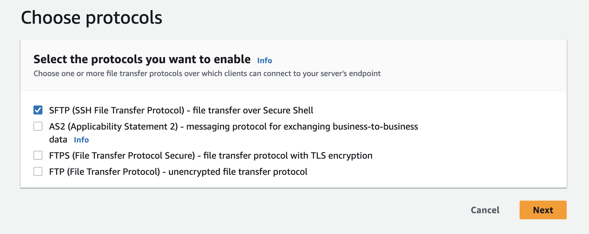

#### Choose_an_identity_provider
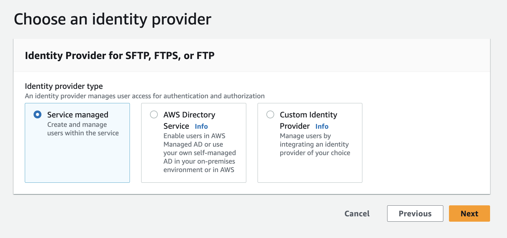

#### Choose_an_endpoint
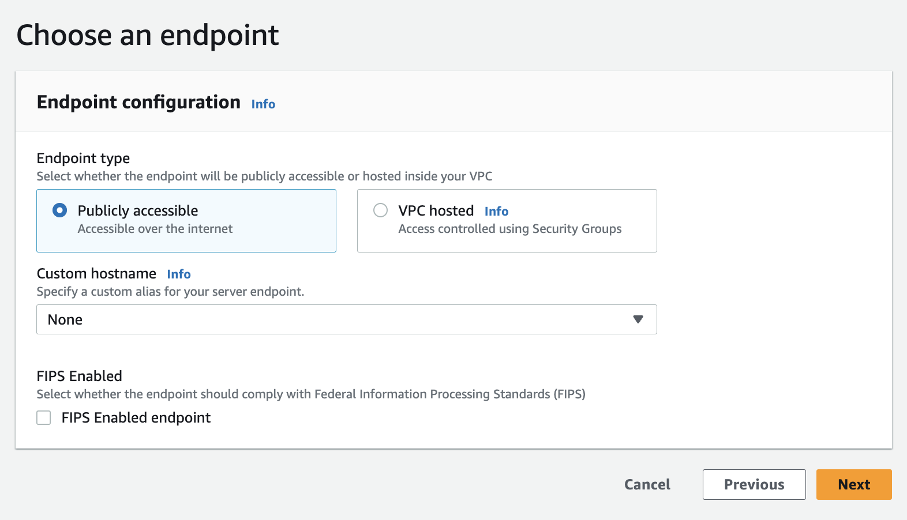

#### Choose_a_domain
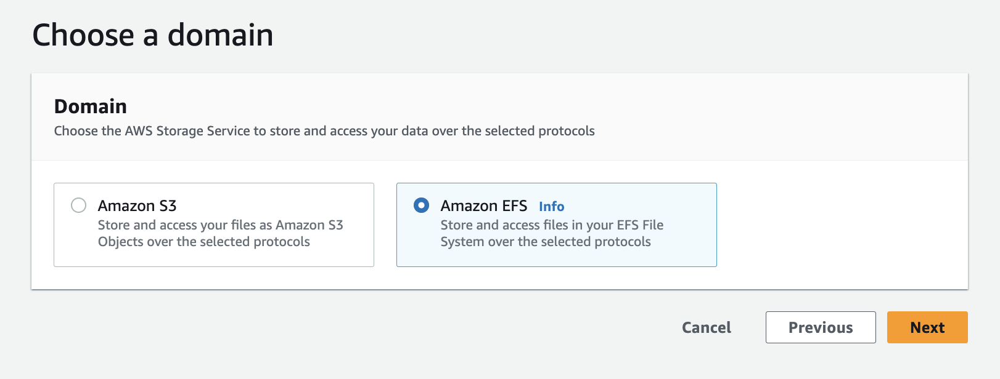

#### Configure_additional_details

- 모든 항목 Default로 선택 후 Next

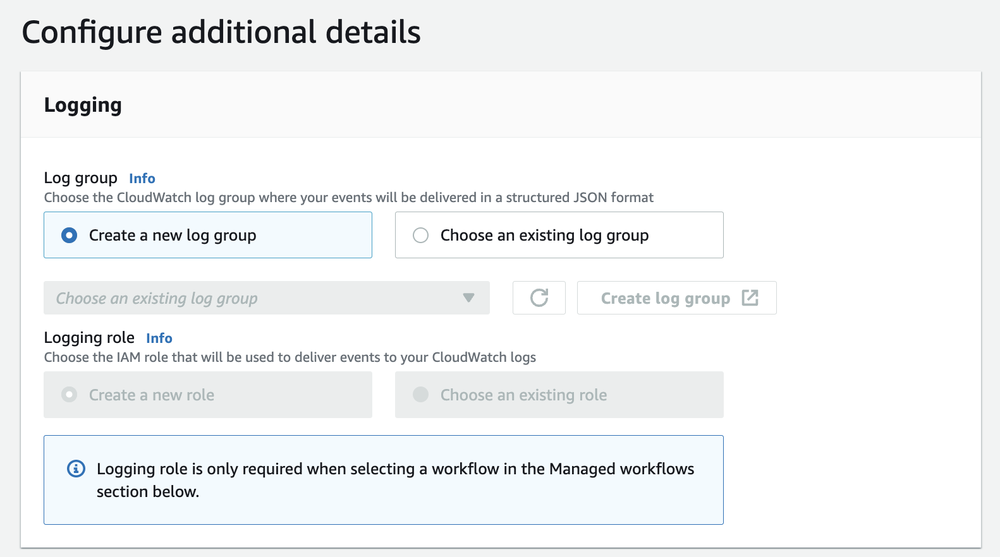

### Cloud9(or Bastion Host)에서 mount 하여, 필요한 폴더 생성 및 파일 권한 작업을 한다.

#### Install dependencies
    sudo yum install jq amazon-efs-utils -y

#### 마운트 생성
    sudo mkdir [마운트_폴더]
    ex) sudo mkdir /mnt/efs

    sudo mount -t efs -o tls,mounttargetip=[EFS_MOUNT_TARGET_IP] [EFS_FILESYSTEM]:/ [마운트폴더]
    ex) sudo mount -t efs -o tls,mounttargetip=10.0.2.27 fs-09f9ab6c8a690f21c:/ /mnt/efs

#### 폴더 생성 및 권한 셋팅

    sudo mkdir -p [마운트폴더]/[업체코드]
    sudo chmod 751 [마운트폴더]/[업체코드]*
    sudo chgrp -R [GID] [마운트폴더]/[업체코드]
    sudo chown [UID] [마운트폴더]/[업체코드]

    ex)
    sudo mkdir -p /mnt/efs/vendorA
    sudo chmod 751 /mnt/efs/vendorA*
    sudo chgrp -R 3000 /mnt/efs/vendorA
    sudo chown 3001 /mnt/efs/vendorA

- UID/GID를 업체마다 고유하게 생성하여 폴더 권한관리

### Transfer Family User 생성

#### IAM Role 생성
    {
        "Version": "2012-10-17",
        "Statement": [
            {
                "Effect": "Allow",
                "Action": [
                    "elasticfilesystem:ClientMount",
                    "elasticfilesystem:ClientWrite",
                    "elasticfilesystem:DescribeFileSystems"
                ],
                "Resource": [
                    "[EFS_ARN]"
                ]
            }
        ]
    }

    ex)
    {
        "Version": "2012-10-17",
        "Statement": [
            {
                "Effect": "Allow",
                "Action": [
                    "elasticfilesystem:ClientMount",
                    "elasticfilesystem:ClientWrite",
                    "elasticfilesystem:DescribeFileSystems"
                ],
                "Resource": [
                    "arn:aws:elasticfilesystem:us-east-1:028697689548:file-system/fs-09f9ab6c8a690f21c"
                ]
            }
        ]
    }


#### 업체 User 생성

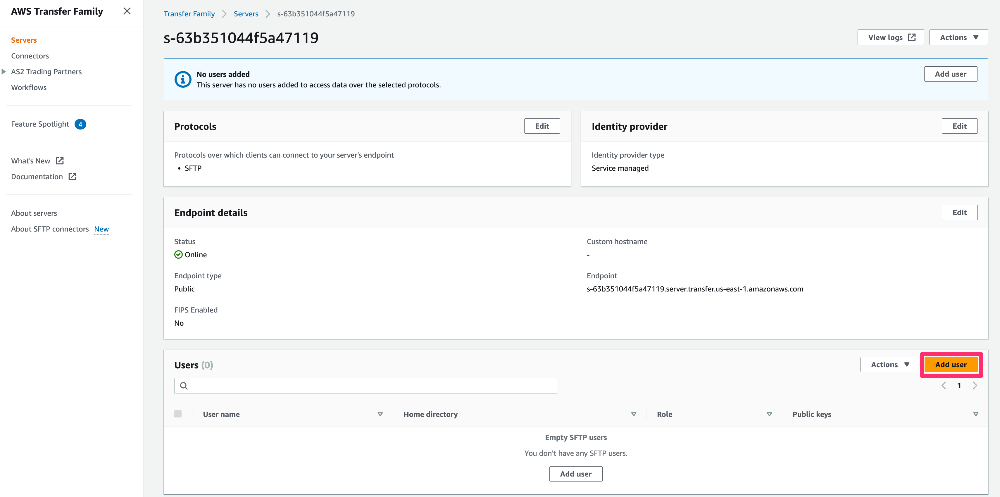
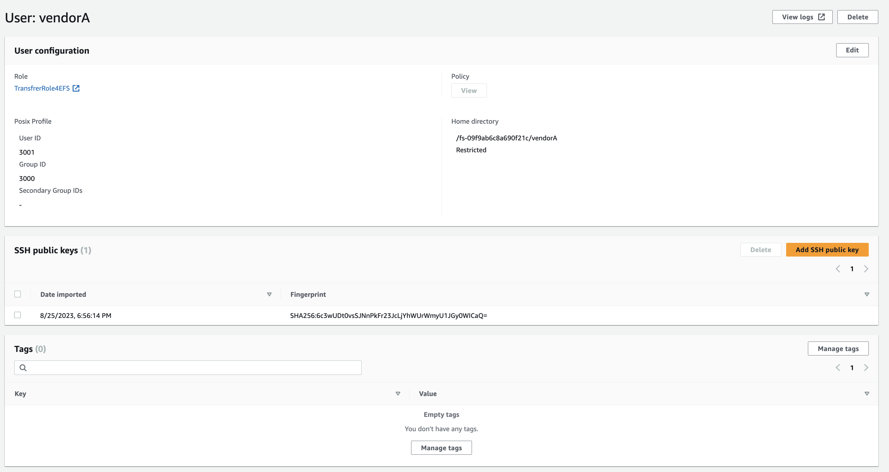

- User ID : EFS에 셋팅한 업체 POSIX UID ex) 3001
- Group ID : EFS에 셋팅한 업체 POSIX GID ex) 3000
- Role : 위에서 생성한 IAM Role 
- Home Directory : EFS 선택 & 업체가 접근가능한 이전에 생성한 폴더명 기재 ex) vendorA
- Restriced : 체크 - 체크하면 다른 폴더 접근이 안됨. 
  ex) sftp로 접근하면 vendorA 폴더가 root로 보임. 상위 폴더로 이동 불가능
- SSH public key : 공개키 파일 열어 내용 복사해서 입력 ex) transfer-key.pub 

#### SFTP 테스트 ( 맥환경 )

    sftp -i [개인키파일] [업체ID]@[Transfer_Family_Endpoint]

    ex)
    sftp -i transfer-key vendorA@s-63b351044f5a47119.server.transfer.us-east-1.amazonaws.com

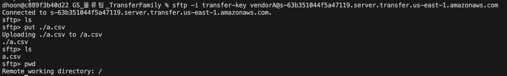

- put 명령어 수행 하여 파일 업로드 성공한 화면 

## 02. FTP + SecretManager_Private

### Secret Manager 셋팅
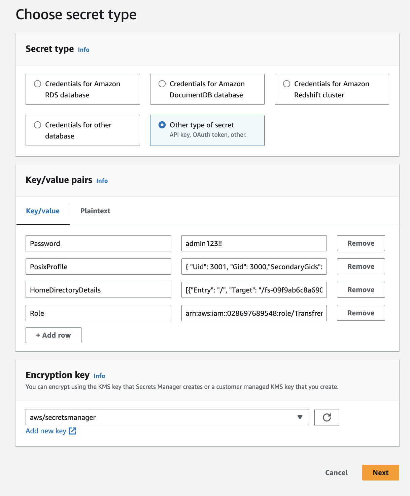

ID/PW 로그인을 위한 구성 - 사실상 Transfer Famaily의 User Add의 필요한 항목을 모두 저장!! 
- Password : admin123!! 
- PosixProfile : { "Uid": 3001, "Gid": 3000,"SecondaryGids": []}
- HomeDirectoryDetails : [{"Entry": "/", "Target": "/fs-09f9ab6c8a690f21c/vendorA"}]
- Role : arn:aws:iam::028697689548:role/TransfrerRole4EFS

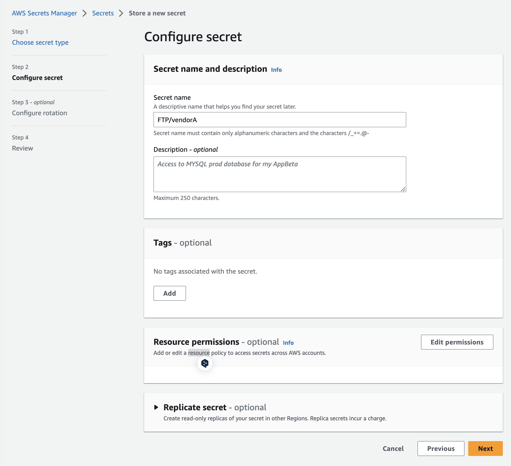

- Secret Manager 이름 저장 ex) FTP/vendorA
- 현재 Lambda 소스 룰셋은 FTP/[벤더명] 이지만, 고객사에 맞게 수정가능.
- 이후 항목은 Default로 설정 후 Next > Next 후 생성

### Lambda 셋팅

#### Lambda 생성
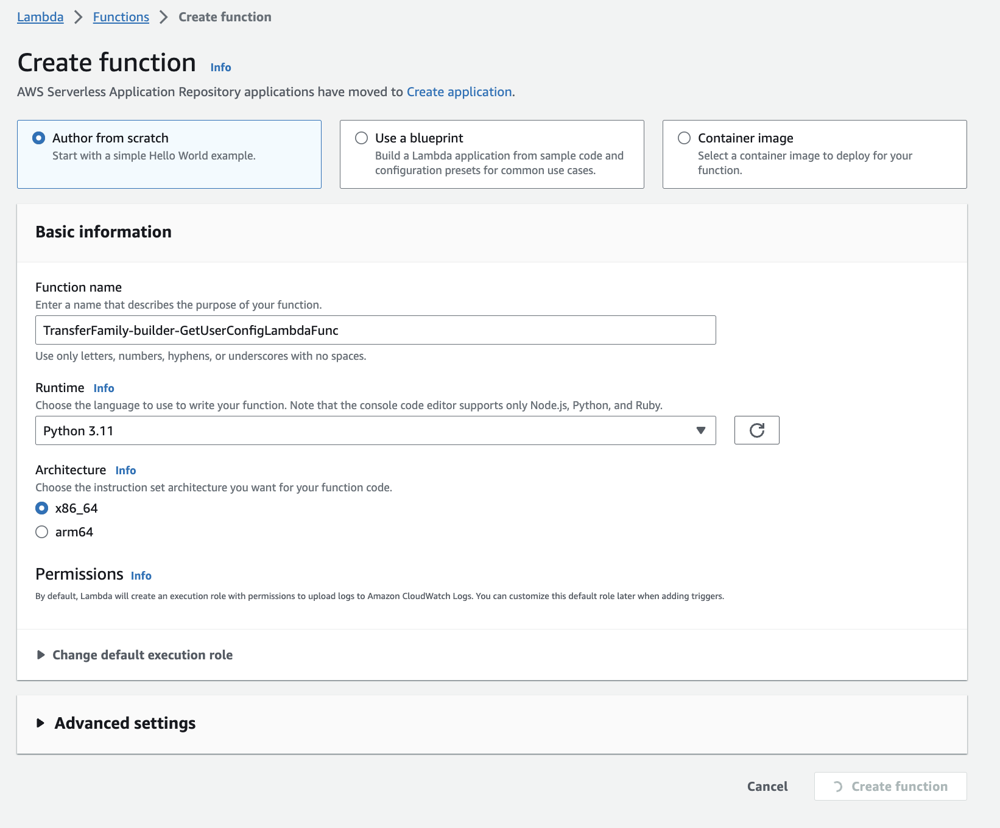

- Lambda 소스는 동일폴더에 lambda_function.py 내용 복사하여 붙여넣기
- 소스내 region 변경 (그 외 소스도 상황에 맞게 수정가능)

#### Lambda Role에 Secret Manager 접근 Policy 입력 ( inline 입력 )
- Lambda가 Secret Manager를 접근하기 위한 
- Configuration Tab에서 좌측 Permissions 선택
- 상단 RoleName을 클릭하여 Role 설정으로 이동

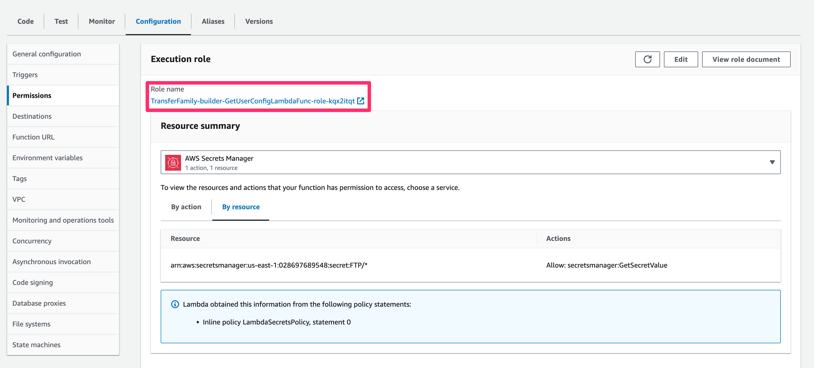


    {
        "Version": "2012-10-17",
        "Statement": [
            {
                "Action": [
                    "secretsmanager:GetSecretValue"
                ],
                "Resource": "arn:aws:secretsmanager:us-east-1:028697689548:secret:FTP/*",
                "Effect": "Allow"
            }
        ]
    }

- 위 Policy를 inline으로 Role에 추가
- Secret Manager Resource ARN 값 확인
- Policy Name : LambdaSecretsPolicy (임의 가능)

### Transfer Family 셋팅

#### Choose_protocols
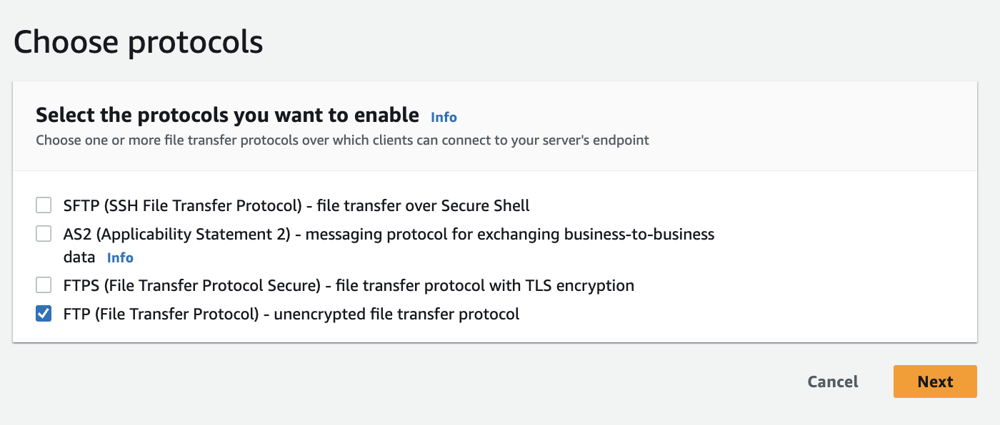

#### Choose_an_identity_provider
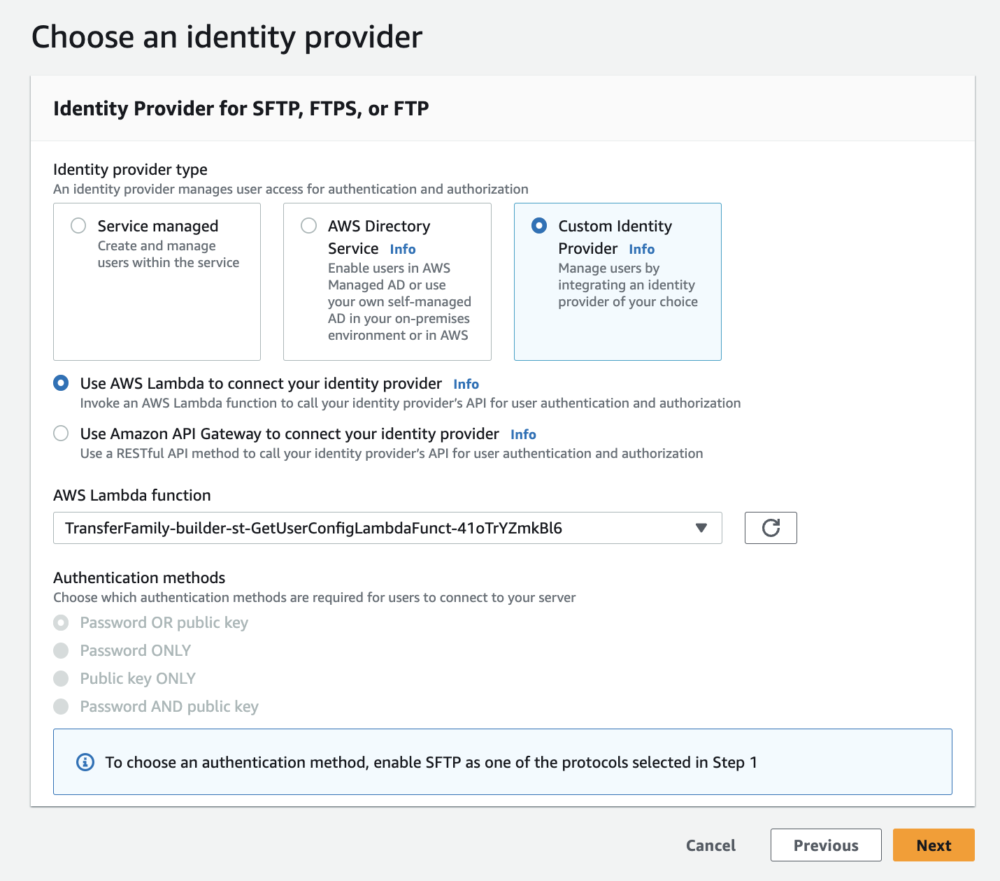

- 앞서 생성한 Lambda 선택

#### Choose_an_endpoint
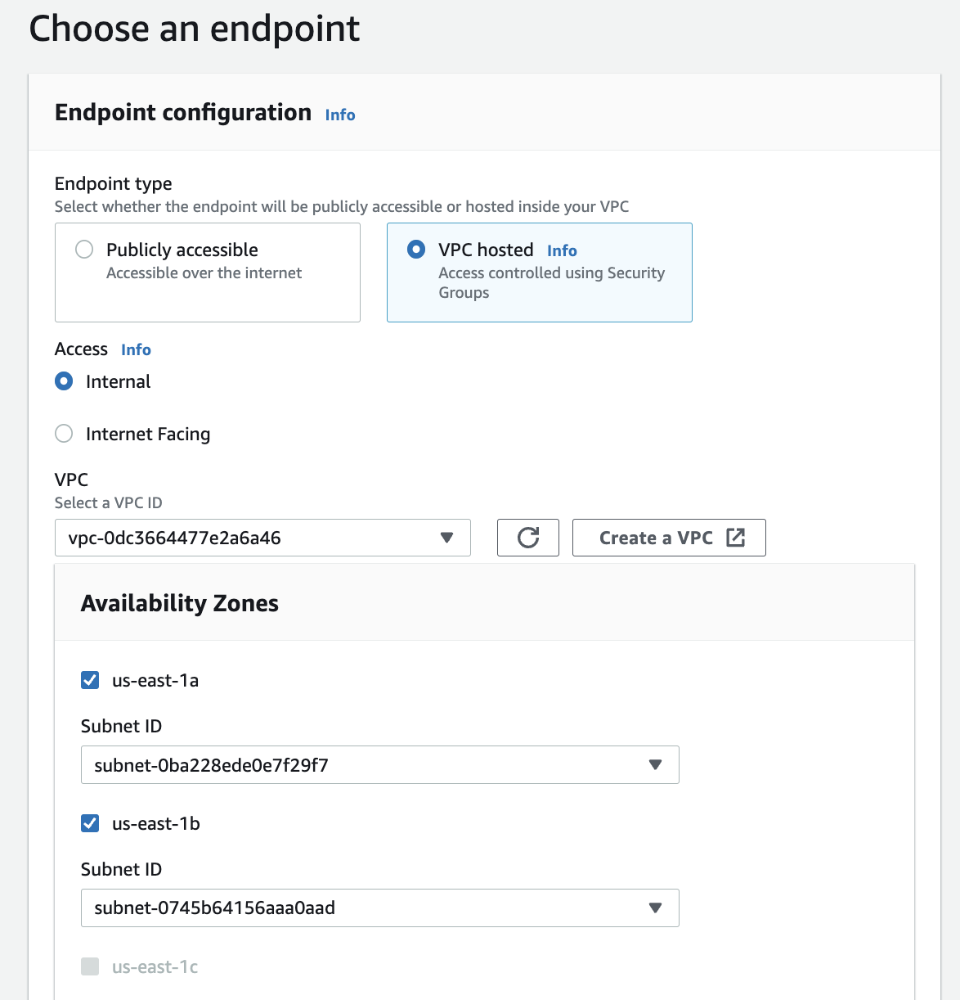

- FTP는 VPC hosted와 internal만 선택가능합니다.
- Subnet은 private subnet을 구성합니다.
  ( 테스트에서는 Cloud9 에서 접근이 가능한 public subnet으로 구성하였습니다.)

#### Choose_a_domain


#### Configure_additional_details

- 모든 항목 Default로 선택 후 Next


#### VPC Endpoint 에서 Security Group 유의요망
    inbound Rule에 VPC 대역 ( ex. 10.0.0.0/16 ) 모두 허락하도록 Security Group 수정 하는 등, Bastion Host와 NLB에서 접근가능한 설정 필요

#### Transfer Family가 Lambda를 호출 가능하도록 Lambda permission 입력

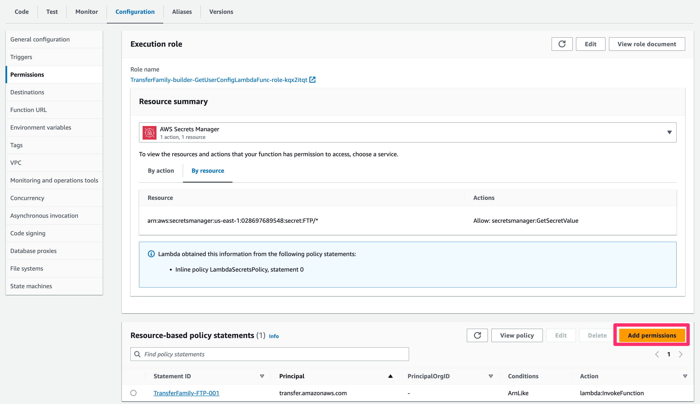

- Lambda 화면에서 위와 Configurtaion Tab에서 좌측 Permissions 선택

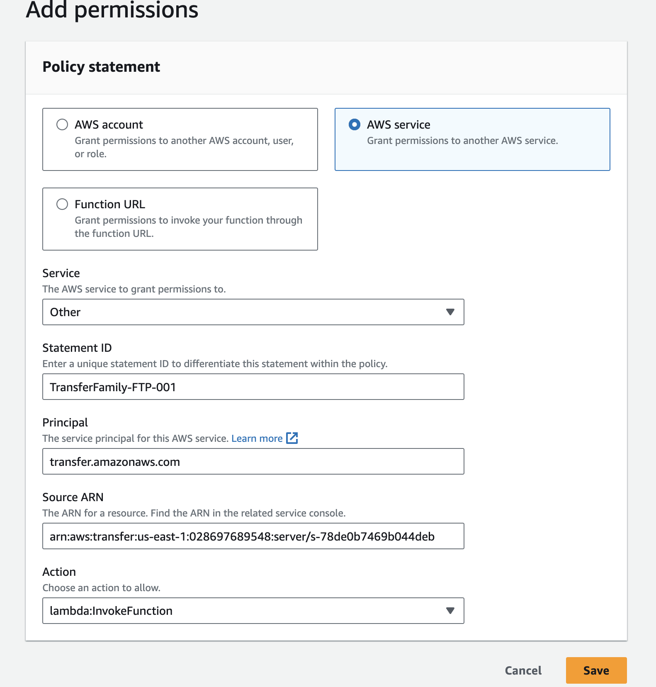

- Policy statement : AWS service
- Service : Other
- Statement ID : TransferFamily-FTP-001 (임의 가능)
- Principal : transfer.amazonaws.com
- Source ARN : arn:aws:transfer:us-east-1:028697689548:server/s-78de0b7469b044deb
  * 정확한 ARN은 Cloud9 에서 다음 명령어 입력하여 확인 가능 \
    ```aws transfer describe-server --server-id [TransferFamily_서버ID]```
- Action : lambda:InvokeAction

### Cloud9 에서 FTP 접속확인
- ID/PW 입력

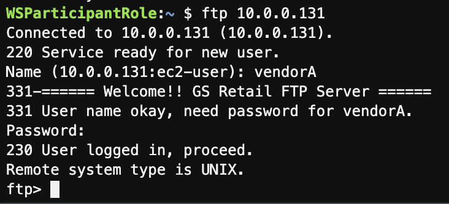

### NLB의 중요한 셋팅
- 리스너/타켓그룹 Port 21번과 8192 ~ 8200 모두 등록 필요
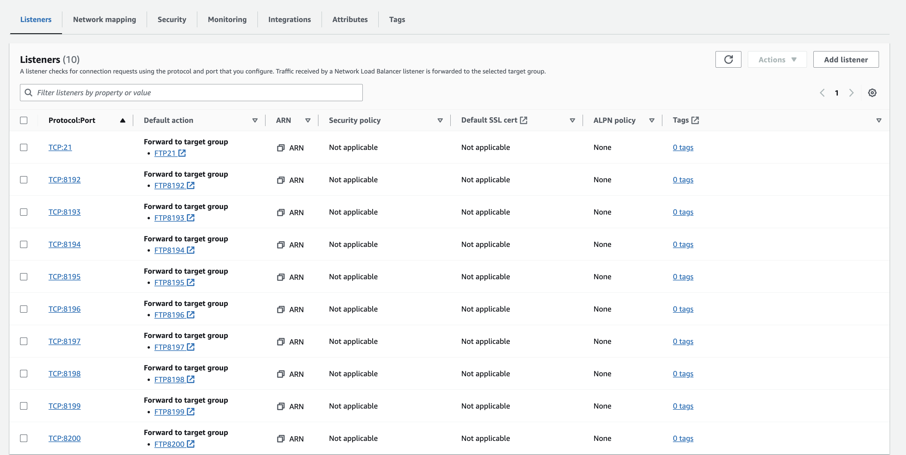
- 참고 : https://docs.aws.amazon.com/ko_kr/transfer/latest/userguide/create-server-ftp.html

### Local Mac 에서 FTP 접속확인
- NLB 셋팅을 하고 테스트한 결과입니다.

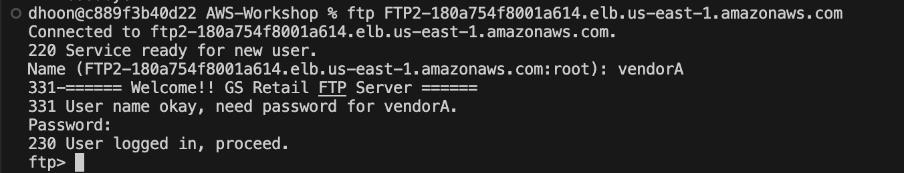

- Filezilla로 파일업로드
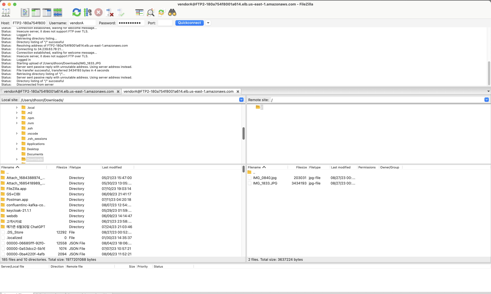

- LFTP로 파일업로드한 화면
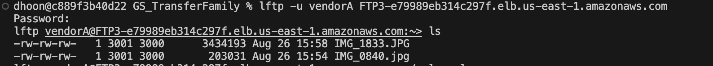

