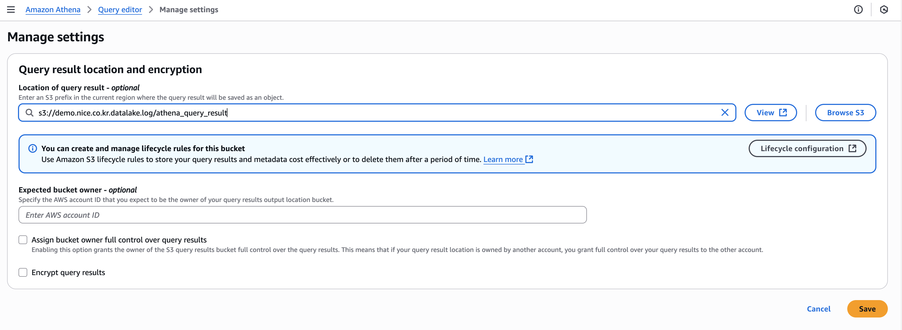

# HDFS 데이터베이스 테이블 생성하고 Productioin 테이블에 Athena로 Migration하는 가이드입니다.

## Athena Log 저장을 위한 Log용 버킷 생성 
- (선택사항) 기존 s3버킷에 폴더를 추가해도 가능
- S3버킷명 : demo.nice.co.kr.datalake.log
- 폴더 생성 : athena_query_result
    - 최종 s3uri : s3://demo.nice.co.kr.datalake.log/athena_query_result/

## Athena 최초 접근시 쿼리 로그 설정
- Before you run your first query, you need to set up a query result location in Amazon S3. 메시지에 Edit settings 버튼 클릭
- Location of query result 설정 : s3://demo.nice.co.kr.datalake.log/athena_query_result
- Save로 저장




## HDFS 테이블 생성
- projection.yyyymm.range 설정만 유의해주세요.

```sql
CREATE EXTERNAL TABLE hdfs_database.tbkbcard_medi_store (
    KEY STRING COMMENT 'KEY', 
    STORE_NM STRING COMMENT '가맹점명', 
    ADDR STRING COMMENT '주소', 
    UPJONG3_CD STRING COMMENT 'ZINI소분류업종코드', 
    MEGA_CD STRING COMMENT '시도코드', 
    CTY_CD STRING COMMENT '시군구코드', 
    ADMI_CD STRING COMMENT '행정동코드', 
    BLK_CD_V3 STRING COMMENT '42만블록코드', 
    SALE_CNT STRING COMMENT '매출건수_개인', 
    SALE_AMT STRING COMMENT '매출금액_개인', 
    CNT_M_20UNDER STRING COMMENT '매출건수_20세미만남', 
    CNT_M_2024 STRING COMMENT '매출건수_2024세남', 
    CNT_M_2529 STRING COMMENT '매출건수_2529세남', 
    CNT_M_3034 STRING COMMENT '매출건수_3034세남', 
    CNT_M_3539 STRING COMMENT '매출건수_3539세남', 
    CNT_M_4044 STRING COMMENT '매출건수_4044세남', 
    CNT_M_4549 STRING COMMENT '매출건수_4549세남', 
    CNT_M_5054 STRING COMMENT '매출건수_5054세남', 
    CNT_M_5559 STRING COMMENT '매출건수_5559세남', 
    CNT_M_6064 STRING COMMENT '매출건수_6064세남', 
    CNT_M_6569 STRING COMMENT '매출건수_6569세남', 
    CNT_M_70OVER STRING COMMENT '매출건수_70세이상남', 
    CNT_W_20UNDER STRING COMMENT '매출건수_20세미만여', 
    CNT_W_2024 STRING COMMENT '매출건수_2024세여', 
    CNT_W_2529 STRING COMMENT '매출건수_2529세여', 
    CNT_W_3034 STRING COMMENT '매출건수_3034세여', 
    CNT_W_3539 STRING COMMENT '매출건수_3539세여', 
    CNT_W_4044 STRING COMMENT '매출건수_4044세여', 
    CNT_W_4549 STRING COMMENT '매출건수_4549세여', 
    CNT_W_5054 STRING COMMENT '매출건수_5054세여', 
    CNT_W_5559 STRING COMMENT '매출건수_5559세여', 
    CNT_W_6064 STRING COMMENT '매출건수_6064세여', 
    CNT_W_6569 STRING COMMENT '매출건수_6569세여', 
    CNT_W_70OVER STRING COMMENT '매출건수_70세이상여', 
    SALE_M_20UNDER STRING COMMENT '매출금액_20세미만남', 
    SALE_M_2024 STRING COMMENT '매출금액_2024세남', 
    SALE_M_2529 STRING COMMENT '매출금액_2529세남', 
    SALE_M_3034 STRING COMMENT '매출금액_3034세남', 
    SALE_M_3539 STRING COMMENT '매출금액_3539세남', 
    SALE_M_4044 STRING COMMENT '매출금액_4044세남', 
    SALE_M_4549 STRING COMMENT '매출금액_4549세남', 
    SALE_M_5054 STRING COMMENT '매출금액_5054세남', 
    SALE_M_5559 STRING COMMENT '매출금액_5559세남', 
    SALE_M_6064 STRING COMMENT '매출금액_6064세남', 
    SALE_M_6569 STRING COMMENT '매출금액_6569세남', 
    SALE_M_70OVER STRING COMMENT '매출금액_70세이상남', 
    SALE_W_20UNDER STRING COMMENT '매출금액_20세미만여', 
    SALE_W_2024 STRING COMMENT '매출금액_2024세여', 
    SALE_W_2529 STRING COMMENT '매출금액_2529세여', 
    SALE_W_3034 STRING COMMENT '매출금액_3034세여', 
    SALE_W_3539 STRING COMMENT '매출금액_3539세여', 
    SALE_W_4044 STRING COMMENT '매출금액_4044세여', 
    SALE_W_4549 STRING COMMENT '매출금액_4549세여', 
    SALE_W_5054 STRING COMMENT '매출금액_5054세여', 
    SALE_W_5559 STRING COMMENT '매출금액_5559세여', 
    SALE_W_6064 STRING COMMENT '매출금액_6064세여', 
    SALE_W_6569 STRING COMMENT '매출금액_6569세여', 
    SALE_W_70OVER STRING COMMENT '매출금액_70세이상여', 
    CNT_MON STRING COMMENT '매출건수_월', 
    CNT_TUE STRING COMMENT '매출건수_화', 
    CNT_WED STRING COMMENT '매출건수_수', 
    CNT_THU STRING COMMENT '매출건수_목', 
    CNT_FRI STRING COMMENT '매출건수_금', 
    CNT_SAT STRING COMMENT '매출건수_토', 
    CNT_SUN STRING COMMENT '매출건수_일', 
    SALE_MON STRING COMMENT '매출금액_월', 
    SALE_TUE STRING COMMENT '매출금액_화', 
    SALE_WED STRING COMMENT '매출금액_수', 
    SALE_THU STRING COMMENT '매출금액_목', 
    SALE_FRI STRING COMMENT '매출금액_금', 
    SALE_SAT STRING COMMENT '매출금액_토', 
    SALE_SUN STRING COMMENT '매출금액_일', 
    CNT_0003 STRING COMMENT '매출건수_0003', 
    CNT_0306 STRING COMMENT '매출건수_0306', 
    CNT_0609 STRING COMMENT '매출건수_0609', 
    CNT_0912 STRING COMMENT '매출건수_0912', 
    CNT_1215 STRING COMMENT '매출건수_1215', 
    CNT_1518 STRING COMMENT '매출건수_1518', 
    CNT_1821 STRING COMMENT '매출건수_1821', 
    CNT_2124 STRING COMMENT '매출건수_2124', 
    SALE_0003 STRING COMMENT '매출금액_0003', 
    SALE_0306 STRING COMMENT '매출금액_0306', 
    SALE_0609 STRING COMMENT '매출금액_0609', 
    SALE_0912 STRING COMMENT '매출금액_0912', 
    SALE_1215 STRING COMMENT '매출금액_1215', 
    SALE_1518 STRING COMMENT '매출금액_1518', 
    SALE_1821 STRING COMMENT '매출금액_1821', 
    SALE_2124 STRING COMMENT '매출금액_2124', 
    CNT_12M STRING COMMENT '기존12M_매출건수', 
    SALE_12M STRING COMMENT '기존12M_매출금액', 
    CNT_6M STRING COMMENT '기존6M_매출건수', 
    SALE_6M STRING COMMENT '기존6M_매출금액', 
    CNT_3M STRING COMMENT '기존3M_매출건수', 
    SALE_3M STRING COMMENT '기존3M_매출금액', 
    CNT_1M STRING COMMENT '기존1M_매출건수', 
    SALE_1M STRING COMMENT '기존1M_매출금액', 
    CNT_NEW STRING COMMENT '신규_매출건수', 
    SALE_NEW STRING COMMENT '신규_매출금액', 
    TERM_MONTH STRING COMMENT '영업기간', 
    TERM_1_UNDER INT COMMENT '영업 1년 미만', 
    TERM_1_2 INT COMMENT '영업 1~2년', 
    TERM_2_3 INT COMMENT '영업 2~3년', 
    TERM_3_4 INT COMMENT '영업 3~4년', 
    TERM_4_5 INT COMMENT '영업 4~5년', 
    TERM_5_OVER INT COMMENT '영업 5년 이상', 
    AREA1_NM STRING COMMENT '유입지역1_지역명', 
    AREA1_RATIO STRING COMMENT '유입지역1_비율', 
    AREA2_NM STRING COMMENT '유입지역2_지역명', 
    AREA2_RATIO STRING COMMENT '유입지역2_비율', 
    AREA3_NM STRING COMMENT '유입지역3_지역명', 
    AREA3_RATIO STRING COMMENT '유입지역3_비율', 
    AREA4_NM STRING COMMENT '유입지역4_지역명', 
    AREA4_RATIO STRING COMMENT '유입지역4_비율', 
    AREA5_NM STRING COMMENT '유입지역5_지역명', 
    AREA5_RATIO STRING COMMENT '유입지역5_비율', 
    AREA6_NM STRING COMMENT '유입지역6_지역명', 
    AREA6_RATIO STRING COMMENT '유입지역6_비율', 
    AREA7_NM STRING COMMENT '유입지역7_지역명', 
    AREA7_RATIO STRING COMMENT '유입지역7_비율', 
    AREA8_NM STRING COMMENT '유입지역8_지역명', 
    AREA8_RATIO STRING COMMENT '유입지역8_비율', 
    AREA9_NM STRING COMMENT '유입지역9_지역명', 
    AREA9_RATIO STRING COMMENT '유입지역9_비율', 
    AREA10_NM STRING COMMENT '유입지역10_지역명', 
    AREA10_RATIO STRING COMMENT '유입지역10_비율'
)
PARTITIONED BY (
    YYYYMM STRING COMMENT '기준년월'
)
STORED AS PARQUET
LOCATION 's3://demo.nice.co.kr.hdfs.datalake/DW/CARD/KB_MEDI/TBKBMEDI_STORE_TMP/'
TBLPROPERTIES (
    'projection.enabled' = 'true',
    'projection.yyyymm.type' = 'date',
    'projection.yyyymm.format' = 'yyyyMM',
    'projection.yyyymm.range' = '202001,NOW',
    'projection.yyyymm.interval' = '1',
    'projection.yyyymm.interval.unit' = 'MONTHS',
    'storage.location.template' = 's3://demo.nice.co.kr.hdfs.datalake/DW/CARD/KB_MEDI/TBKBMEDI_STORE_TMP/${yyyymm}/'
);
```

## Production 테이블 생성

- Iceberg 테이블을 저장하기 위한 Production s3 폴더 생성
    - 예시 : s3://demo.nice.co.kr.datalake/DW/CARD/KB_MEDI/TBKBMEDI_STORE_TMP/
    - 이번 기회에 폴더구성을 다시 한번 생각해보는 것도 좋은 방법입니다.
- 주의1 : Iceberg에서는 partition 컬럼은 소문자여야 합니다.
- 주의2 : 향후 운영시 Vacuum과 Optimize를 주기적으로 실행해주어야 합니다.

```sql
CREATE TABLE nice_database.tbkbcard_medi_store (
    yyyymm STRING COMMENT '기준년월',
    KEY STRING COMMENT 'KEY', 
    STORE_NM STRING COMMENT '가맹점명', 
    ADDR STRING COMMENT '주소', 
    UPJONG3_CD STRING COMMENT 'ZINI소분류업종코드', 
    MEGA_CD STRING COMMENT '시도코드', 
    CTY_CD STRING COMMENT '시군구코드', 
    ADMI_CD STRING COMMENT '행정동코드', 
    BLK_CD_V3 STRING COMMENT '42만블록코드', 
    SALE_CNT STRING COMMENT '매출건수_개인', 
    SALE_AMT STRING COMMENT '매출금액_개인', 
    CNT_M_20UNDER STRING COMMENT '매출건수_20세미만남', 
    CNT_M_2024 STRING COMMENT '매출건수_2024세남', 
    CNT_M_2529 STRING COMMENT '매출건수_2529세남', 
    CNT_M_3034 STRING COMMENT '매출건수_3034세남', 
    CNT_M_3539 STRING COMMENT '매출건수_3539세남', 
    CNT_M_4044 STRING COMMENT '매출건수_4044세남', 
    CNT_M_4549 STRING COMMENT '매출건수_4549세남', 
    CNT_M_5054 STRING COMMENT '매출건수_5054세남', 
    CNT_M_5559 STRING COMMENT '매출건수_5559세남', 
    CNT_M_6064 STRING COMMENT '매출건수_6064세남', 
    CNT_M_6569 STRING COMMENT '매출건수_6569세남', 
    CNT_M_70OVER STRING COMMENT '매출건수_70세이상남', 
    CNT_W_20UNDER STRING COMMENT '매출건수_20세미만여', 
    CNT_W_2024 STRING COMMENT '매출건수_2024세여', 
    CNT_W_2529 STRING COMMENT '매출건수_2529세여', 
    CNT_W_3034 STRING COMMENT '매출건수_3034세여', 
    CNT_W_3539 STRING COMMENT '매출건수_3539세여', 
    CNT_W_4044 STRING COMMENT '매출건수_4044세여', 
    CNT_W_4549 STRING COMMENT '매출건수_4549세여', 
    CNT_W_5054 STRING COMMENT '매출건수_5054세여', 
    CNT_W_5559 STRING COMMENT '매출건수_5559세여', 
    CNT_W_6064 STRING COMMENT '매출건수_6064세여', 
    CNT_W_6569 STRING COMMENT '매출건수_6569세여', 
    CNT_W_70OVER STRING COMMENT '매출건수_70세이상여', 
    SALE_M_20UNDER STRING COMMENT '매출금액_20세미만남', 
    SALE_M_2024 STRING COMMENT '매출금액_2024세남', 
    SALE_M_2529 STRING COMMENT '매출금액_2529세남', 
    SALE_M_3034 STRING COMMENT '매출금액_3034세남', 
    SALE_M_3539 STRING COMMENT '매출금액_3539세남', 
    SALE_M_4044 STRING COMMENT '매출금액_4044세남', 
    SALE_M_4549 STRING COMMENT '매출금액_4549세남', 
    SALE_M_5054 STRING COMMENT '매출금액_5054세남', 
    SALE_M_5559 STRING COMMENT '매출금액_5559세남', 
    SALE_M_6064 STRING COMMENT '매출금액_6064세남', 
    SALE_M_6569 STRING COMMENT '매출금액_6569세남', 
    SALE_M_70OVER STRING COMMENT '매출금액_70세이상남', 
    SALE_W_20UNDER STRING COMMENT '매출금액_20세미만여', 
    SALE_W_2024 STRING COMMENT '매출금액_2024세여', 
    SALE_W_2529 STRING COMMENT '매출금액_2529세여', 
    SALE_W_3034 STRING COMMENT '매출금액_3034세여', 
    SALE_W_3539 STRING COMMENT '매출금액_3539세여', 
    SALE_W_4044 STRING COMMENT '매출금액_4044세여', 
    SALE_W_4549 STRING COMMENT '매출금액_4549세여', 
    SALE_W_5054 STRING COMMENT '매출금액_5054세여', 
    SALE_W_5559 STRING COMMENT '매출금액_5559세여', 
    SALE_W_6064 STRING COMMENT '매출금액_6064세여', 
    SALE_W_6569 STRING COMMENT '매출금액_6569세여', 
    SALE_W_70OVER STRING COMMENT '매출금액_70세이상여', 
    CNT_MON STRING COMMENT '매출건수_월', 
    CNT_TUE STRING COMMENT '매출건수_화', 
    CNT_WED STRING COMMENT '매출건수_수', 
    CNT_THU STRING COMMENT '매출건수_목', 
    CNT_FRI STRING COMMENT '매출건수_금', 
    CNT_SAT STRING COMMENT '매출건수_토', 
    CNT_SUN STRING COMMENT '매출건수_일', 
    SALE_MON STRING COMMENT '매출금액_월', 
    SALE_TUE STRING COMMENT '매출금액_화', 
    SALE_WED STRING COMMENT '매출금액_수', 
    SALE_THU STRING COMMENT '매출금액_목', 
    SALE_FRI STRING COMMENT '매출금액_금', 
    SALE_SAT STRING COMMENT '매출금액_토', 
    SALE_SUN STRING COMMENT '매출금액_일', 
    CNT_0003 STRING COMMENT '매출건수_0003', 
    CNT_0306 STRING COMMENT '매출건수_0306', 
    CNT_0609 STRING COMMENT '매출건수_0609', 
    CNT_0912 STRING COMMENT '매출건수_0912', 
    CNT_1215 STRING COMMENT '매출건수_1215', 
    CNT_1518 STRING COMMENT '매출건수_1518', 
    CNT_1821 STRING COMMENT '매출건수_1821', 
    CNT_2124 STRING COMMENT '매출건수_2124', 
    SALE_0003 STRING COMMENT '매출금액_0003', 
    SALE_0306 STRING COMMENT '매출금액_0306', 
    SALE_0609 STRING COMMENT '매출금액_0609', 
    SALE_0912 STRING COMMENT '매출금액_0912', 
    SALE_1215 STRING COMMENT '매출금액_1215', 
    SALE_1518 STRING COMMENT '매출금액_1518', 
    SALE_1821 STRING COMMENT '매출금액_1821', 
    SALE_2124 STRING COMMENT '매출금액_2124', 
    CNT_12M STRING COMMENT '기존12M_매출건수', 
    SALE_12M STRING COMMENT '기존12M_매출금액', 
    CNT_6M STRING COMMENT '기존6M_매출건수', 
    SALE_6M STRING COMMENT '기존6M_매출금액', 
    CNT_3M STRING COMMENT '기존3M_매출건수', 
    SALE_3M STRING COMMENT '기존3M_매출금액', 
    CNT_1M STRING COMMENT '기존1M_매출건수', 
    SALE_1M STRING COMMENT '기존1M_매출금액', 
    CNT_NEW STRING COMMENT '신규_매출건수', 
    SALE_NEW STRING COMMENT '신규_매출금액', 
    TERM_MONTH STRING COMMENT '영업기간', 
    TERM_1_UNDER INT COMMENT '영업 1년 미만', 
    TERM_1_2 INT COMMENT '영업 1~2년', 
    TERM_2_3 INT COMMENT '영업 2~3년', 
    TERM_3_4 INT COMMENT '영업 3~4년', 
    TERM_4_5 INT COMMENT '영업 4~5년', 
    TERM_5_OVER INT COMMENT '영업 5년 이상', 
    AREA1_NM STRING COMMENT '유입지역1_지역명', 
    AREA1_RATIO STRING COMMENT '유입지역1_비율', 
    AREA2_NM STRING COMMENT '유입지역2_지역명', 
    AREA2_RATIO STRING COMMENT '유입지역2_비율', 
    AREA3_NM STRING COMMENT '유입지역3_지역명', 
    AREA3_RATIO STRING COMMENT '유입지역3_비율', 
    AREA4_NM STRING COMMENT '유입지역4_지역명', 
    AREA4_RATIO STRING COMMENT '유입지역4_비율', 
    AREA5_NM STRING COMMENT '유입지역5_지역명', 
    AREA5_RATIO STRING COMMENT '유입지역5_비율', 
    AREA6_NM STRING COMMENT '유입지역6_지역명', 
    AREA6_RATIO STRING COMMENT '유입지역6_비율', 
    AREA7_NM STRING COMMENT '유입지역7_지역명', 
    AREA7_RATIO STRING COMMENT '유입지역7_비율', 
    AREA8_NM STRING COMMENT '유입지역8_지역명', 
    AREA8_RATIO STRING COMMENT '유입지역8_비율', 
    AREA9_NM STRING COMMENT '유입지역9_지역명', 
    AREA9_RATIO STRING COMMENT '유입지역9_비율', 
    AREA10_NM STRING COMMENT '유입지역10_지역명', 
    AREA10_RATIO STRING COMMENT '유입지역10_비율'
)
PARTITIONED BY (yyyymm)
LOCATION 's3://demo.nice.co.kr.datalake/DW/CARD/KB_MEDI/TBKBMEDI_STORE_TMP/'
TBLPROPERTIES (
    'table_type' = 'ICEBERG',
    'format'='parquet'
);
```


## Select - Insert 구문으로 Migration 수행
```sql
INSERT INTO nice_database.tbkbcard_medi_store
SELECT 
    yyyymm,
    key,
    store_nm,
    addr,
    upjong3_cd,
    mega_cd,
    cty_cd,
    admi_cd,
    blk_cd_v3,
    sale_cnt,
    sale_amt,
    cnt_m_20under,
    cnt_m_2024,
    cnt_m_2529,
    cnt_m_3034,
    cnt_m_3539,
    cnt_m_4044,
    cnt_m_4549,
    cnt_m_5054,
    cnt_m_5559,
    cnt_m_6064,
    cnt_m_6569,
    cnt_m_70over,
    cnt_w_20under,
    cnt_w_2024,
    cnt_w_2529,
    cnt_w_3034,
    cnt_w_3539,
    cnt_w_4044,
    cnt_w_4549,
    cnt_w_5054,
    cnt_w_5559,
    cnt_w_6064,
    cnt_w_6569,
    cnt_w_70over,
    sale_m_20under,
    sale_m_2024,
    sale_m_2529,
    sale_m_3034,
    sale_m_3539,
    sale_m_4044,
    sale_m_4549,
    sale_m_5054,
    sale_m_5559,
    sale_m_6064,
    sale_m_6569,
    sale_m_70over,
    sale_w_20under,
    sale_w_2024,
    sale_w_2529,
    sale_w_3034,
    sale_w_3539,
    sale_w_4044,
    sale_w_4549,
    sale_w_5054,
    sale_w_5559,
    sale_w_6064,
    sale_w_6569,
    sale_w_70over,
    cnt_mon,
    cnt_tue,
    cnt_wed,
    cnt_thu,
    cnt_fri,
    cnt_sat,
    cnt_sun,
    sale_mon,
    sale_tue,
    sale_wed,
    sale_thu,
    sale_fri,
    sale_sat,
    sale_sun,
    cnt_0003,
    cnt_0306,
    cnt_0609,
    cnt_0912,
    cnt_1215,
    cnt_1518,
    cnt_1821,
    cnt_2124,
    sale_0003,
    sale_0306,
    sale_0609,
    sale_0912,
    sale_1215,
    sale_1518,
    sale_1821,
    sale_2124,
    cnt_12m,
    sale_12m,
    cnt_6m,
    sale_6m,
    cnt_3m,
    sale_3m,
    cnt_1m,
    sale_1m,
    cnt_new,
    sale_new,
    term_month,
    term_1_under,
    term_1_2,
    term_2_3,
    term_3_4,
    term_4_5,
    term_5_over,
    area1_nm,
    area1_ratio,
    area2_nm,
    area2_ratio,
    area3_nm,
    area3_ratio,
    area4_nm,
    area4_ratio,
    area5_nm,
    area5_ratio,
    area6_nm,
    area6_ratio,
    area7_nm,
    area7_ratio,
    area8_nm,
    area8_ratio,
    area9_nm,
    area9_ratio,
    area10_nm,
    area10_ratio
FROM hdfs_database.tbkbcard_medi_store
WHERE yyyymm <= '202506';
```

## Row수 확인
```
SELECT count(1) FROM "nice_database"."tbkbcard_medi_store"
union all
SELECT count(1) FROM "hdfs_database"."tbkbcard_medi_store"
;
```