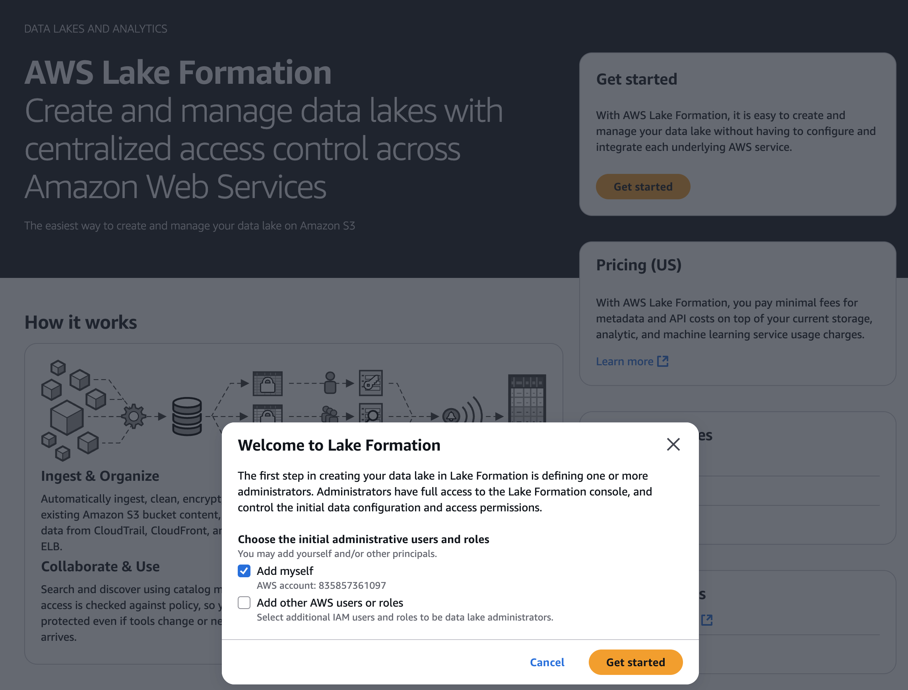
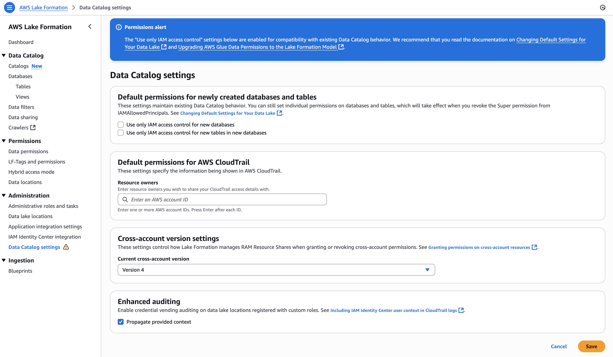
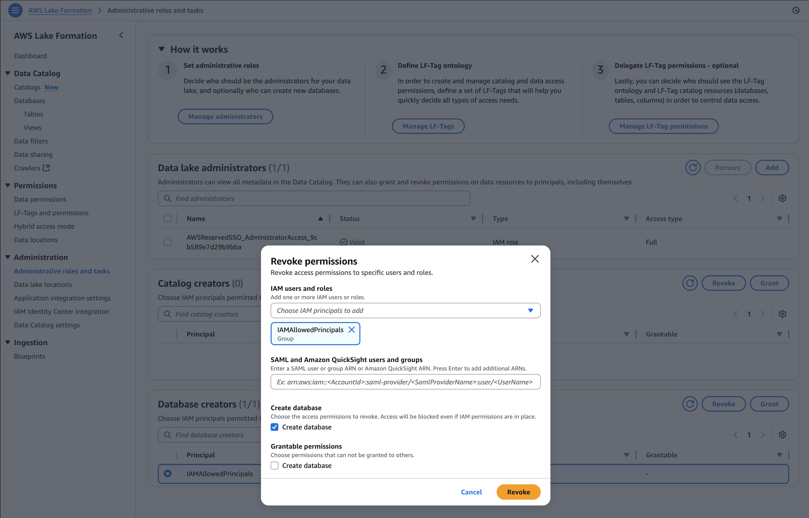
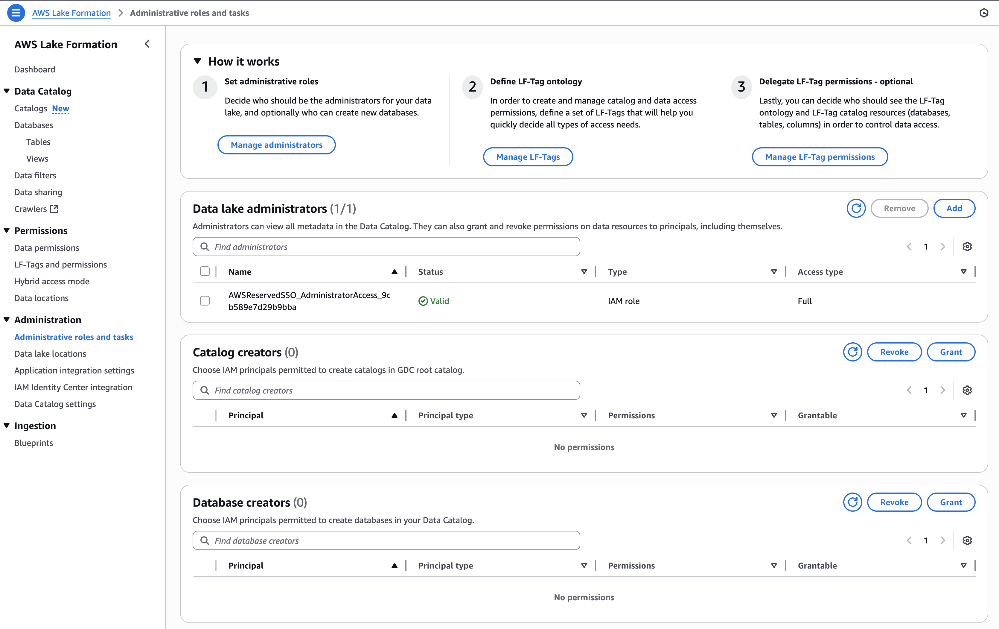
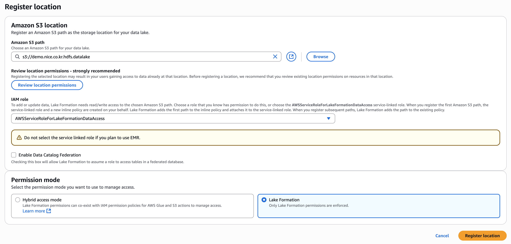
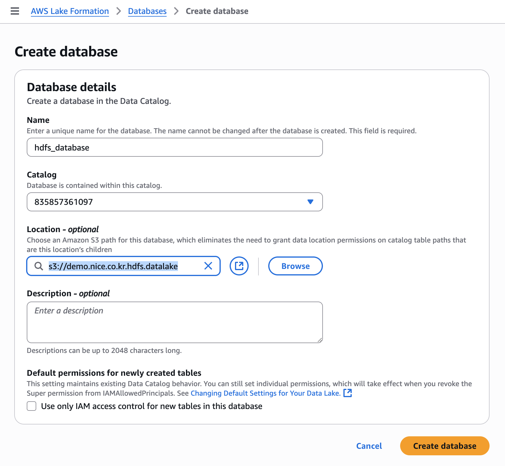

# AWS Lake Formation 초기 설정 가이드

새 AWS 계정에서 Lake Formation을 처음부터 설정하여 IAM 권한을 완전히 비활성화하고 Lake Formation 권한만 사용하는 방법입니다.

## 1. Lake Formation 콘솔 접속

- AWS 콘솔에서 **Lake Formation** 서비스 검색 후 접속
- Welcome 화면에서 Add myself (현재접속자가 데이터 관리자이어야 함) 로 데이터 관리자 추가



## 2. Data Lake Administrator 설정 
- 1번 단계에서 이미 추가하였으면 Skip
- 왼쪽 네비게이션에서 **Administration** → **Administrative roles and tasks** 클릭
- **Data lake administrators** 섹션에서 **Add** 버튼 클릭
- **Access type**에서 **Data lake administrator** 선택
- **IAM users and roles**에서 관리자로 지정할 IAM 사용자 또는 역할 선택
- **Save** 클릭

## 3. 기본 권한 설정 변경 (핵심 단계)

- 왼쪽 네비게이션에서 **Administration** → **Data Catalog settings** 클릭
- **Default permissions for newly created databases and tables** 섹션에서:
  - 두 개의 체크박스 모두 **해제** (Clear both check boxes)
- **Save** 클릭



## 4. IAMAllowedPrincipals 권한 제거

### 4.1 Database creators 권한 제거
- **Administration** → **Administrative roles and tasks** 클릭
- **Database creators** 섹션에서 `IAMAllowedPrincipals` 그룹 선택
- **Revoke** 버튼 클릭
- **Revoke** 확인

### 4.2 Catalog creators 권한 제거
- 같은 페이지의 **Catalog creators** 섹션에서 `IAMAllowedPrincipals` 그룹 선택
- **Revoke** 버튼 클릭
- **Revoke** 확인



- 설정 후 화면



## 5. S3 데이터 위치 등록

- 왼쪽 네비게이션에서 **Administration** → **Data lake locations** 클릭
- **Register location** 버튼 클릭
- **Browse**를 클릭하여 S3 경로 선택 (예: `s3://demo.nice.co.kr.hdfs.datalake/, s3://demo.nice.co.kr.datalake/`)
- **IAM role**에서 `AWSServiceRoleForLakeFormationDataAccess` 선택 (기본값)
- Enable Data Catalog Federation은 비활성화
- Permission mode는 **Lake Formation 선택**
- **Register location** 클릭



## 6. 데이터베이스 생성

- 왼쪽 네비게이션에서 **Data catalog** → **Databases** 클릭
- **Create database** 버튼 클릭 
- 데이터베이스 이름 입력 예) hdfs_database, nice_database
- 데이터베이스 생성될 S3 Bucket이나 폴더 선택 (예: `s3://demo.nice.co.kr.hdfs.datalake/, s3://demo.nice.co.kr.datalake/`)
- **Use only IAM access control for new tables in this database** 체크박스 **해제**
- **Create database** 클릭



## 7. 사용자 권한 부여

- 왼쪽 네비게이션에서 **Permissions** → **Data permissions** 클릭
- **Grant** 버튼 클릭
- **Principals**: 권한을 부여할 IAM 사용자/역할 선택
- **LF-Tags or catalog resources**: **Named data catalog resources** 선택
- 데이터베이스 또는 테이블 선택
- **Permissions**: 필요한 권한 선택 (SELECT, INSERT, CREATE_TABLE 등)
- **Grant** 클릭

## 8. 설정 확인

설정이 완료되면 다음을 확인:

- **Data Catalog settings**에서 기본 권한이 비활성화되어 있는지 확인
- **Administrative roles and tasks**에서 `IAMAllowedPrincipals`가 제거되었는지 확인
- 모든 데이터 액세스가 Lake Formation 권한으로만 제어됨

## 주의사항

- 이 설정을 완료하면 IAM 정책은 데이터 액세스에 영향을 주지 않습니다
- 사용자는 Lake Formation에서 명시적으로 부여받은 권한만으로 데이터에 접근할 수 있습니다
- 기존 자동화나 ETL 작업이 있다면 Lake Formation 권한을 별도로 부여해야 합니다

## CLI 명령어 (선택사항)

콘솔 대신 CLI를 사용하려면:

```bash
# 기본 설정 변경
aws lakeformation put-data-lake-settings \
  --data-lake-settings '{
    "DataLakeAdmins": [
      {
        "DataLakePrincipalIdentifier": "arn:aws:iam::YOUR-ACCOUNT-ID:user/YOUR-USERNAME"
      }
    ],
    "CreateDatabaseDefaultPermissions": [],
    "CreateTableDefaultPermissions": []
  }'

# S3 위치 등록
aws lakeformation register-resource \
  --resource-arn arn:aws:s3:::your-data-lake-bucket \
  --use-service-linked-role

# 권한 부여 예시
aws lakeformation grant-permissions \
  --principal DataLakePrincipalIdentifier=arn:aws:iam::ACCOUNT-ID:user/USERNAME \
  --resource Database='{Name=YOUR-DATABASE}' \
  --permissions CREATE_TABLE,ALTER,DROP
```
