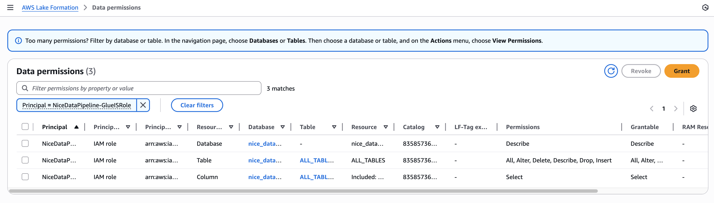

# MWAA + Glue 설정 가이드

- 2025년 7월부터 신규 데이터가 들어온다는 가정하에 진행할 예정
- 이번 가이드는 S023.py DAG 파일 내용 중 아래 DAG Task에 대해서 진행

```python
sensor_kbmedi >> get_raw >> get_raw_2 >> get_raw_3 >> prep_hospital >> target_revision >> union_raw >> multiplication >> merge_raw
get_raw_3 >> prep_pharmacy >> multiplication_p >> merge_raw
get_raw_3 >> prep_dentist >> merge_raw
```

1. 데이터 입수 로직을 한 개의 Glue JOB으로
```
sensor_kbmedi >> get_raw >> get_raw_2
```

2. 데이터 처리 & 저장 로직을 한 개의 Glue Job으로
```
get_raw_3 >> prep_hospital >> target_revision >> union_raw >> multiplication >> merge_raw
get_raw_3 >> prep_pharmacy >> multiplication_p >> merge_raw
get_raw_3 >> prep_dentist >> merge_raw
```

기존 소스에 튜닝을 포함하였습니다.
- 튜닝 포인트 1 : tmp 저장하는 로직은 불필요해 보여서 없앴습니다.
- 튜닝 포인트 2 : Scala소스를 Pyspark로 변경하였습니다.
- 튜닝 포인트 3 : 경로를 수정하였습니다.
    - BEFORE : /DATA/DI/CARD/KB_MEDI/RAW/"+ YYYY + "/" + MM + "/GAIN_2"
    - AFTER : /DATA/DI/CARD/KB_MEDI/RAW/GAIN_2/"+ YYYY + "/" + MM
- 튜닝 포인트 4 : 가중치 정보 for 루프를 없애고 분산 병렬처리로 속도 개선하였습니다.
- 총 Spark 소스를 2개로 만들어 최적화 하였습니다.

## 1. s3에 초기데이터 입력

- s3에 DI폴더에 입력데이터 업로드
- 해당 폴더에 _SUCCESS 파일 들어오면 Sensor로 시작하는 것으로 가정


## 2. Glue Job 준비

- Glue Notebook으로 진행
- IAM 정책 설정
    - NAME : NiceGlueInteractiveSessionPassRolePolicy
```json
{
    "Version": "2012-10-17",
    "Statement": [
        {
            "Effect": "Allow",
            "Action": "iam:PassRole",
            "Resource": "arn:aws:iam::835857361097:role/NiceDataPipeline-GlueISRole"
        }
    ]
}
```

- IAM 권한 설정
    - NAME : NiceDataPipeline-GlueISRole
    - 정책
        - AmazonS3FullAccess (실제로는 데이터레이크만 대상으로 조정 / 입력/수정권한 필요)
        - AWSGlueServiceRole
        - AwsGlueSessionUserRestrictedNotebookPolicy
        - NiceGlueInteractiveSessionPassRolePolicy


- LakeFormation 권한할당
    - LakeFormation 서비스로 이동하여 NiceDataPipeline-GlueISRole 에 nice_databse databse 권한 할당
    - Table권한은 all table에 대한 all 권한 (All, Alter, Delete, Describe, Drop, Insert) 할당 (데이터 입력/수정 필요)




## 4. Glue Job 생성
- 메뉴 AWS Glue > ETL jobs > Notebook 버튼 클릭
    - Options : Start fresh
    - IAM role : NiceDataPipeline-GlueISRole
    - Jupyter Notebook이 생성이 되면 이름을 입력하고 저장 ( ex. S023-getraw )

- Glue Job 2개 예시 첨부
    - [S023-getraw-Demo](./demo_file/S023-getraw.ipynb)
    - [S023-dataprocessing](./demo_file/S023-dataprocessing.ipynb)

- GLUE Job 테스트용 CLI
```bash
aws glue start-job-run --job-name S023-dataprocessing --arguments='--yyyymm=202507'
```

## 3. MWAA Job 준비
- MWAA를 위한 Bucket 생성
    - ex) demo.nice.co.kr.datalake.mwaa
    - Bucket Versioning 활성화
    - dags 폴더 생성

- MWAA environment 생성
    - MWAA 서비스로 이동하여 Create environment 를 누르고 이동
    - Step 1
        - Name : NiceAirflowEnvironment
        - S3 bucket : s3://demo.nice.co.kr.datalake.mwaa
        - DAGS folder : s3://demo.nice.co.kr.datalake.mwaa/dags/
        - Next
    - Step 2
        - Virtual private cloud (VPC) : SageMaker Unified Studio VPC
        - subet 1/2 : Private Subet 2개 선택
        - Web server access : Public network (Internet accessible)
        - Security group(s) : Create new security group
        - Endpoint management : Service managed endpoints (Recommended)
        - Environment class : mw1.small (고객사 환경에 따라 small or medium 권고)
        - Monitoring : Task는 높이고 나머진 Warning 정도 권고 (비용이라 적당히 조정 필요)
        - Permissions : Create a new role : NiceDatalakeMWAARole

- NiceDatalakeMWAARole에 정책 추가
    - AmazonS3ReadOnlyAccess
    - AWSGlueServiceRole
    - AWSGlueConsoleFullAccess

- DAG 작성 예시
    - [S023 DAG 예시](./demo_file/S023_AWS.py)


