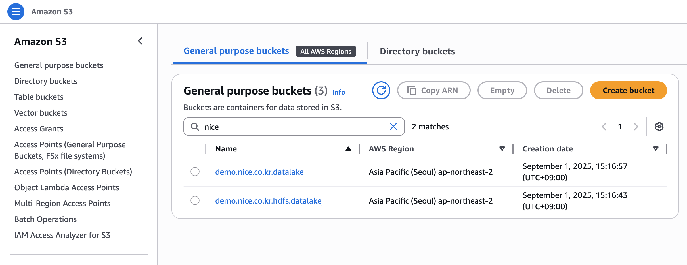
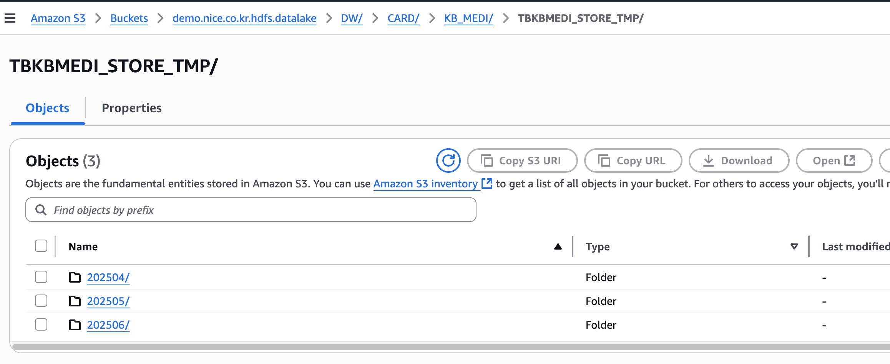

# 사전 설정 가이드

현재 DataSync로 On-Prem HDFS를 동기화가 완료되었다고 가정하고 진행되는 과정입니다.
- 현재 DataSync를 통해 HDFS -> S3로 데이터 마이그레이션이 완료되어 있다는 것으로 가정
- Migration S3 버킷 명 : demo.nice.co.kr.hdfs.datalake
- Production S3 버킷 명 : demo.nice.co.kr.datalake

# 현재 테스트는 다음 S3경로에 TBKBMEDI_STORE_TMP를 Migration 한다고 가정
- S3 URI : s3://demo.nice.co.kr.hdfs.datalake/DW/CARD/KB_MEDI/TBKBMEDI_STORE_TMP/

