# SageMaker Unified Stuio(이하 SMUS) 구성 가이드

Migration 이후 향후 데이터 분석가들이 사용할 환경에 대해서 셋팅합니다.

## 1. IAM Identity Center

- 해당 부분은 MSP 업체와 운영방안 협의가 필요합니다.
- 현재 가이드는 Organization이 아닌 Single Instance의 IAM Identity Center를 사용한다고 가정하고 진행합니다.
- IAM Identity Center가 관리 계정과 하위 계정이 같은 Region이면 둘 다 사용 가능합니다.

- (Single Instnace 필요시) 관리 계정(Organization)에서:
    - IAM Identity Center 콘솔 → Settings → Management 탭
    - Account instances of IAM Identity Center 섹션
    - Enable account instances of IAM Identity Center 클릭
    - Enable 확인 

- (Single Instnace 필요시) 하위 계정(SMUS 사용 고객 계정):
    - 하위 계정에서 AWS Concole에서 **IAM Identity Center**로 검색하고 이동
    - 첫 화면에서 **Enable** 버튼 클릭

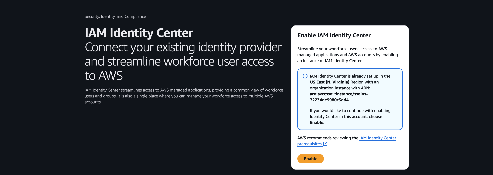

- **Enable an account instance of IAM Identity Center** 화면에서 **Enable** 버튼 클릭

## 2. VPC 생성
- Jupyter 노트북은 Private Subnet에서만 구동되고, 고객사 내부 자원(ex. EDB)에 접근하기 위한 VPC 생성이 필수입니다.
- AWS Concole에서 **SaeMaker**로 검색하고 이동
- **Create a Unified Studio domain** 를 클릭
- **Quick setup** 이 선택된 상태에서 화면 가운데 노란색 대화창에 **Create VPC** 선택

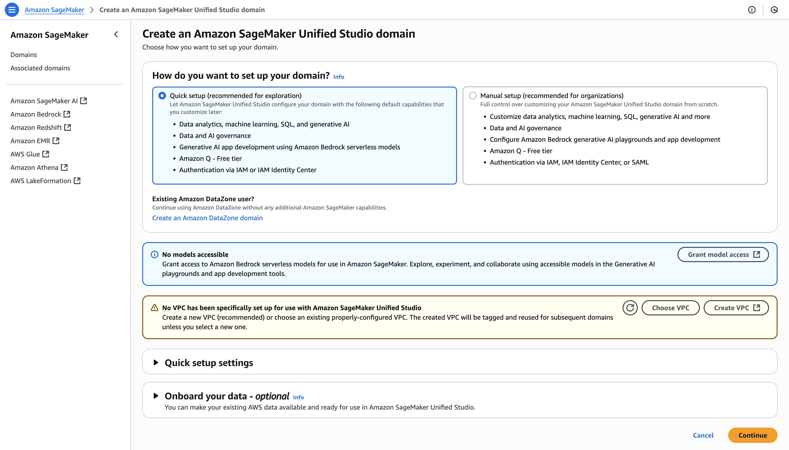

- CloudFormation 화면에서 모든 설정을 Default로 하고 **Create stack** 버튼을 눌러서 VPC 생성
- VPC생성이 완료될때까지 대기 필요

## 3. SMUS 도메인 생성
AWS Concole에서 **SageMaker**로 검색하고 이동
- **Create a Unified Studio domain** 를 클릭
- How do you want to set up your domain? 에서 **Quick setup** 선택 (Manual Setup도 가능)
- **Quick setup settings** 창을 열어서 Name(예. Nice-Domain ) 입력
- **Onboard your data - optional Info** 에서 AWS Glue 선택 해제, 나머진 Default로 두고 **Continue** 버튼 클릭
- Create IAM Identity Center user 에서 Admin User 등록

- **Create domain** 버튼 클릭 

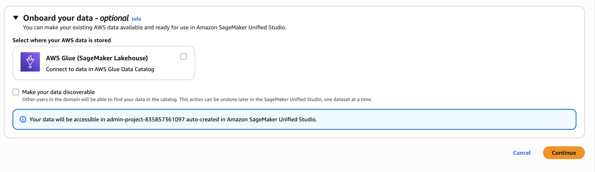

## 4. SSO 설정 (Quick Setup인경우 Skip)
- Domain 생성 후 첫 화면 하단에 노란색 팝업에서 **Configure SSO user access** 버튼 클릭

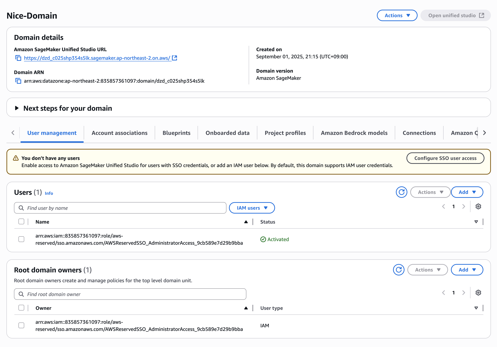

- Step 1. Choose user authentication method : IAM Identity Center 선택
- Step 2. Connect to account instance of IAM Identity Center 선택 (organization instance 선택가능)

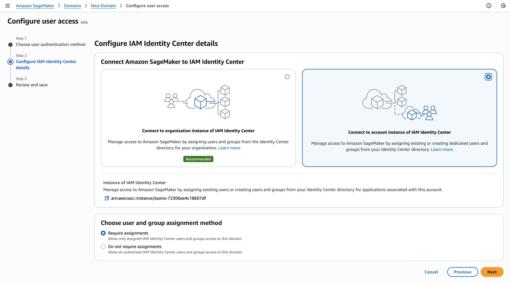

- Step 3. Review and save : Save 버튼 확인

- IAM Identity Center에 User / Group 관리 설명은 생략

## 5. SMUS 도메인 유저 등록 (Quick Setup인경우 Skip)
- AWS Concole에서 **SageMaker**로 검색하고 이동
- 생성된 도메인 이름을 누르고 첫 화면 접근
- 하단 첫번째 탭 **User management** 에서 **Users** 우측 **Add** > **Add SSO users and groups** 선택 후 user 등록 (이후 분석가들 group이나 user로 추가)
- **Root domain owners** 에도 관리자 User 추가

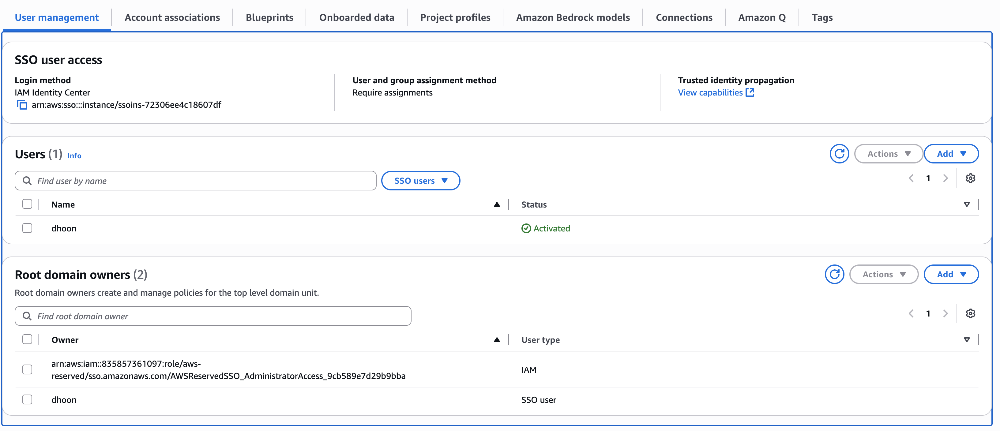

## 6. Project Profile 생성 (Quick Setup인경우 Skip)
- 도메인 하단 3번째 탭 **Blueprints** 이동 후 Tooling blueprint와 모든 Blueprints 활성화 (커스터마이징가능합니다.)
- 도메인 하단 5번째 탭 **Project profiles** 이동 후 **Create** 버튼 클릭
- Project profile name : All capabilities 입력
- Project profile templates : All capabilities 선택
- Authorization : admin 유저 추가
- Enable project profile on creation : 활성화 체크
- 나머지는 Default로 하고 생성

- (권고1) 향후 Nice 환경에 맞춰서 Custom하게 설정 가능
- (권고2) All capabilities - Blueprint 중에 RedshiftServerless를 On create에서 On demand로 변경

## 7. SMUS 로그인
- IAM Identity Center 에서 AWS access portal URL 을 통해 접근

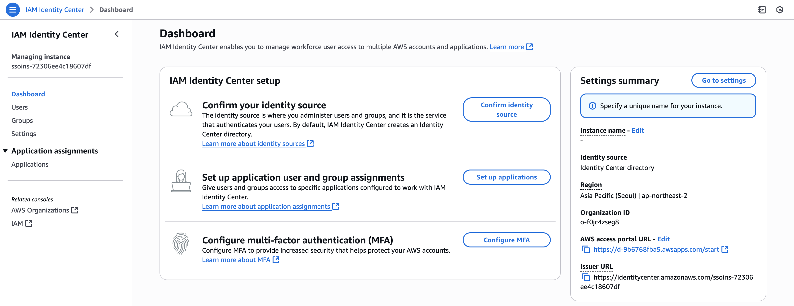

- Admin User로 로그인 후 AWS 액세스 포털 > 애플리케이션 에서 SageMaker 확인 후 클릭 하여 로그인

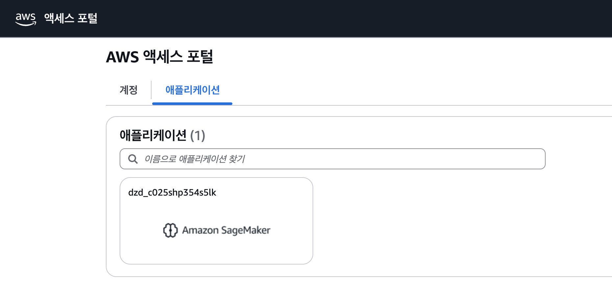

## 7. SMUS 프로젝트 생성
- 해당 프로젝트에서 모든 Database / Asset 관리하는 Admin Project입니다.
- Step1. Project name : IT_Team, Project profile : All capabilities 선택

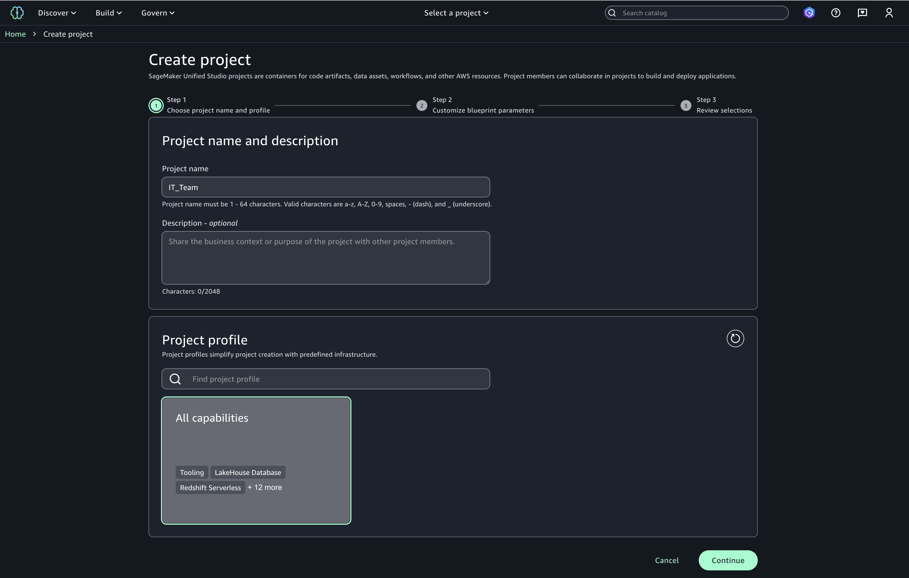

- Step2. glueDbName : it_team_db

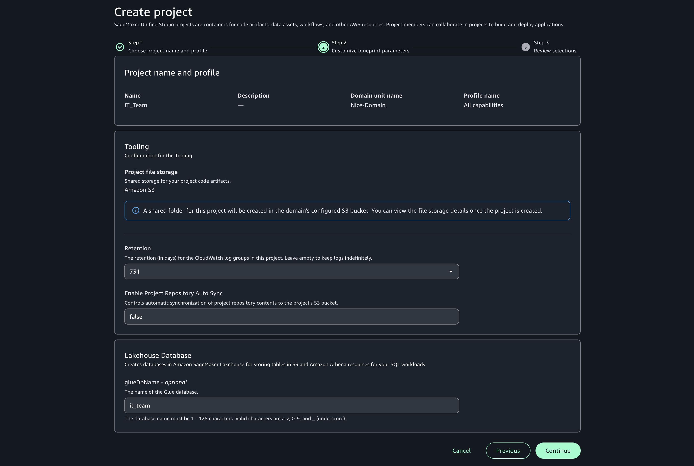

- Step3. **Create project** 누르고 프로젝트 생성

## 8. SMUS 프로젝트에 LakeFomration 권한 등록
- 해당 프로젝트 첫 화면에 Project role ARN 확인
    - ex) datazone_usr_role_460zft6y2vswig_4z3ontbnm6zswo

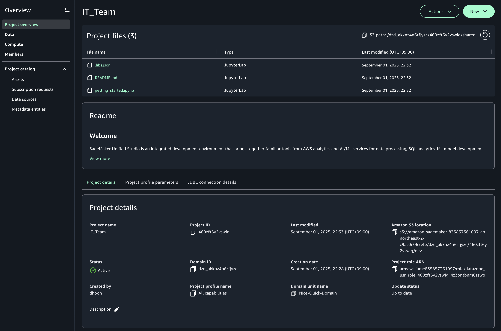

- AWS Concole에서 **LakeFormation**로 검색하고 이동
- Data Catalog > Databases 메뉴 클릭
- nice_database 를 선택하고 우측 상단 Actions > Permissions > Grant 선택

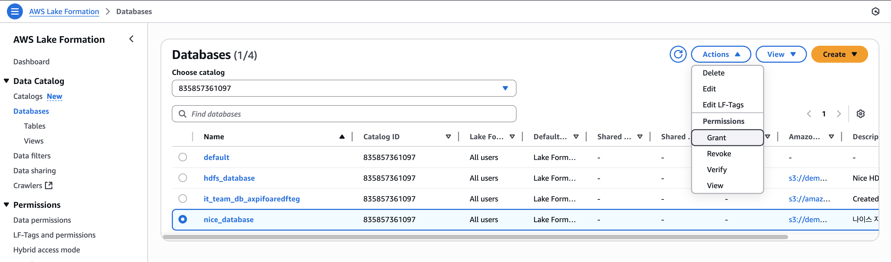

- IAM users and roles 에 SMUS Project Role 설정
- Tables에 All Tables 설정
- Table permissions 에 Select / Describe 선택 
- Grantable permissions 에도 동일하게 Select / Describe 선택 후 **Grant** 버튼 클릭

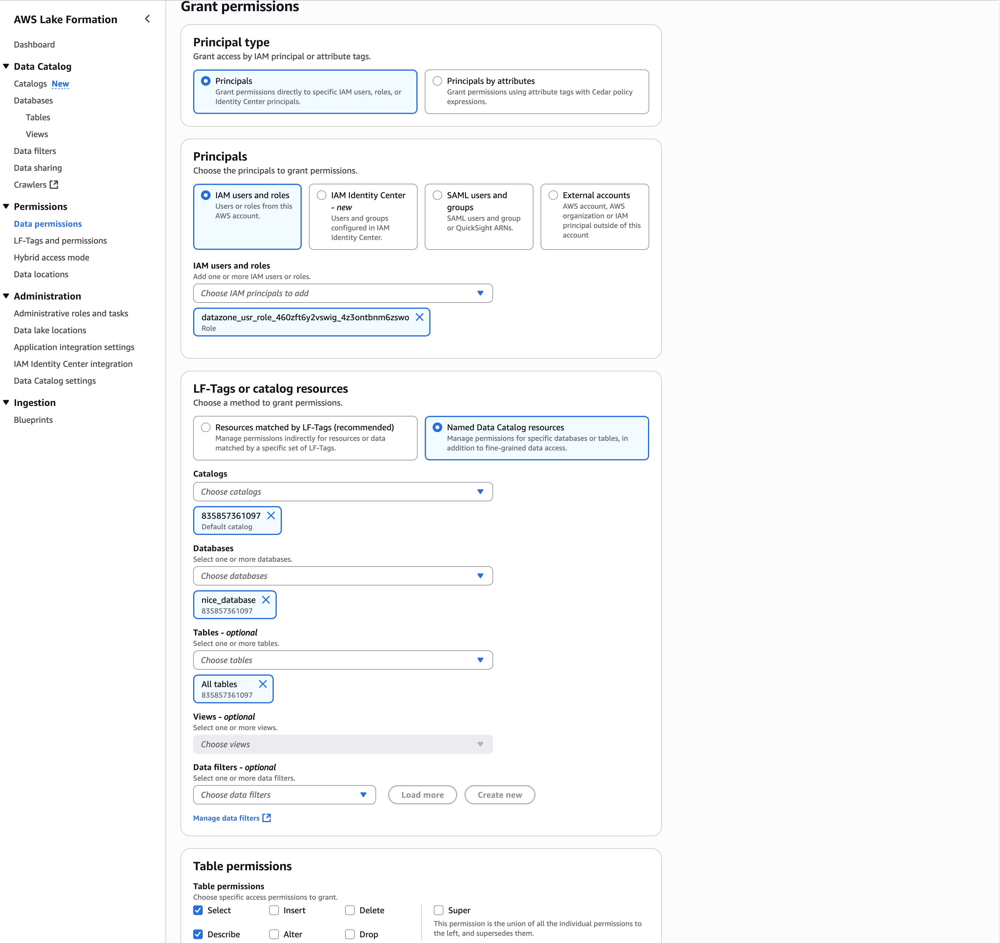

- 다시 한번 Data Catalog > Databases 메뉴 클릭
- nice_database 를 선택하고 우측 상단 Actions > Permissions > Grant 선택
- IAM users and roles 에 SMUS Project Role 설정
- Database permission 에 Describe 선택 
- Grantable permissions 에도 동일하게 Describe 선택 후 **Grant** 버튼 클릭

## 9. SMUS Project로 돌아가서 Table 조회 확인
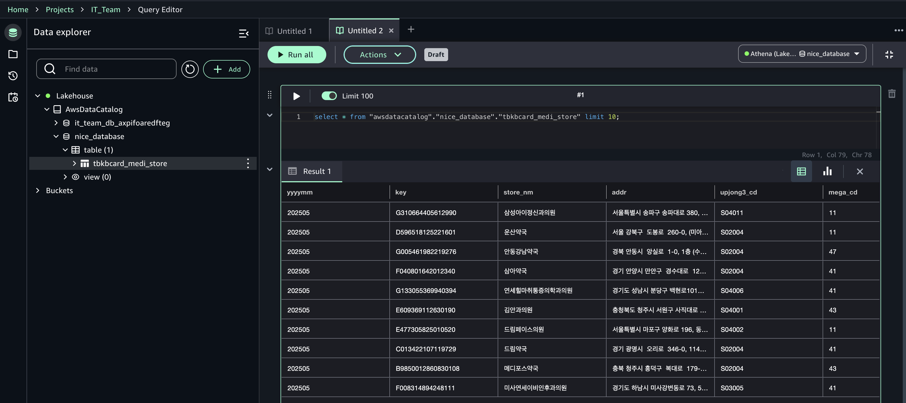

