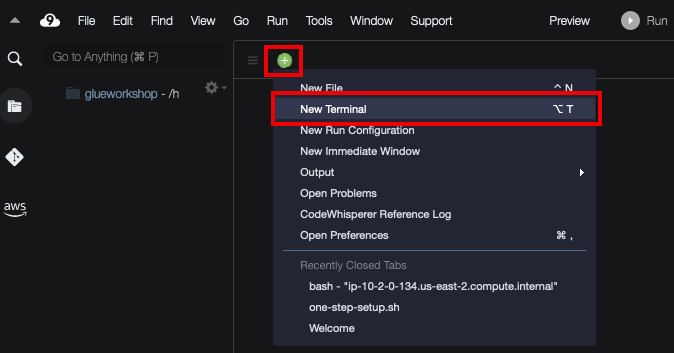

### 1. Cloud9 생성 : [Cloud9 바로가기](https://console.aws.amazon.com/cloud9/)
- AWS Cloud9 콘솔로 이동 후 "환경생성" 버튼을 누릅니다.
- 이름은 "sagemaker_workshop"을 입력합니다.
- 시간제한은 "4시간"으로 설정합니다.
- 나머지 설정은 유지하고 "생성"버튼을 눌러 합니다.
- 약 1~2분 후 Cloud9 IDE 환경으로 진입하려면 'Open IDE' 버튼을 클릭하여 접근합니다.

- Cloud9이 열리면 + 버튼을 눌러 New Terminal을 열고 이후 실습을 진행합니다. 


### 2. Data파일 S3에 업로드 

- Github에서 필요한 소스&데이터 clone 
```code
git clone https://github.com/nuno1111/AWS-Workshop.git
cd AWS-Workshop/SageMaker_IMD_GSD/

```
- 초기 버킷 생성 및 s3파일 업로드
```code
chmod 500 ./init.sh
./init.sh
```
- 잠시 후 S3 콘솔로 이동합니다. [클릭하세요](https://s3.console.aws.amazon.com/s3/home?region=us-east-1) 
- 이동 : sagemaker-immersion-day-${ACCOUNT_ID} 
- /dataset 폴더 밑에 hotel_bookings.csv가 정상적으로 업로드 되었는지 확인합니다.